# KOMPENDIUM Q&A — v12.5

### PLC Programmer / Commissioner / Automatyk

### Siemens TIA Portal · Safety PLC · ET200 · Napędy SINAMICS · Robot ABB · SICAR

### Pytania + odpowiedzi zweryfikowane pod kątem rozmów kwalifikacyjnych.

### Źródła: Siemens App. Example 21064024 (E-Stop SIL3 V7.0.1), Wiring Examples 39198632, SIMATIC Safety Integrated, ControlByte Transkrypcje.

### Wersja: v12.5 | Data: 2026-04-11 13:48 | Pytania: 178

---

## SPIS TREŚCI

### Sekcje
- [1. PODSTAWY PLC I AUTOMATYKI](#1-podstawy-plc-i-automatyki)
- [2. ARCHITEKTURA SIMATIC SAFETY INTEGRATED](#2-architektura-simatic-safety-integrated)
- [3. MODUŁY F-DI / F-DO — OKABLOWANIE I PARAMETRY](#3-moduły-f-di--f-do--okablowanie-i-parametry)
- [4. STRUKTURY GŁOSOWANIA — 1oo1/1oo2/2oo2/2oo3](#4-struktury-głosowania--1oo11oo22oo22oo3)
- [5. PASSIVATION, REINTEGRATION, ACK](#5-passivation-reintegration-ack)
- [6. SAFE STATE — BEZPIECZNY STAN](#6-safe-state--bezpieczny-stan)
- [7. PROFISAFE — KOMUNIKACJA SAFETY](#7-profisafe--komunikacja-safety)
- [8. NAPĘDY SAFETY — SINAMICS Z WBUDOWANYM SAFETY](#8-napędy-safety--sinamics-z-wbudowanym-safety)
- [9. TIA PORTAL — SAFETY PRAKTYKA](#9-tia-portal--safety-praktyka)
- [10. ROBOT ABB IRC5 — INTEGRACJA Z PLC](#10-robot-abb-irc5--integracja-z-plc)
- [11. COMMISSIONING I DIAGNOSTYKA](#11-commissioning-i-diagnostyka)
- [12. NAPĘDY SINAMICS](#12-napędy-sinamics)
- [13. E-STOP — NORMY, IMPLEMENTACJA I OBLICZENIA BEZPIECZEŃSTWA](#13-e-stop--normy-implementacja-i-obliczenia-bezpieczeństwa)
- [14. PROFINET — TOPOLOGIA, DIAGNOSTYKA I ZAAWANSOWANE FUNKCJE](#14-profinet--topologia-diagnostyka-i-zaawansowane-funkcje)
- [15. KURTYNY BEZPIECZEŃSTWA I MUTING](#15-kurtyny-bezpieczeństwa-i-muting)
- [16. MOTION CONTROL I SINAMICS — PRAKTYKA COMMISSIONING](#16-motion-control-i-sinamics--praktyka-commissioning)
- [17. REALNE SCENARIUSZE COMMISSIONING](#17-realne-scenariusze-commissioning)
- [18. TIA PORTAL — ZAAWANSOWANE FUNKCJE](#18-tia-portal--zaawansowane-funkcje)
- [19. COMMISSIONING — DODAWANIE STACJI I URZĄDZEŃ DO PROJEKTU](#19-commissioning--dodawanie-stacji-i-urządzeń-do-projektu)
- [20. SCHEMATY ELEKTRYCZNE — CZYTANIE, ANALIZA I PRAKTYKA COMMISSIONING](#20-schematy-elektryczne--czytanie-analiza-i-praktyka-commissioning)
- [21. SICAR@TIA — STANDARD AUTOMATYKI AUTOMOTIVE](#21-sicartia--standard-automatyki-automotive)

### Pytania

**1. PODSTAWY PLC I AUTOMATYKI**
- [1.1. Co to jest PLC i czym różni się od zwykłego komputera?](#11-co-to-jest-plc-i-czym-różni-się-od-zwykłego-komputera--)
- [1.2. Co to jest scan cycle i ile trwa?](#12-co-to-jest-scan-cycle-i-ile-trwa--)
- [1.3. Co to jest OB1, OB35, OB100 — kiedy każdego używasz?](#13-co-to-jest-ob1-ob35-ob100--kiedy-każdego-używasz)
- [1.4. Co to jest FB, FC, DB — kiedy używasz każdego?](#14-co-to-jest-fb-fc-db--kiedy-używasz-każdego--)
- [1.5. Co to jest UDT i po co go używasz?](#15-co-to-jest-udt-i-po-co-go-używasz)
- [1.6. Co to są języki programowania PLC — LAD, FBD, SCL, GRAPH?](#16-co-to-są-języki-programowania-plc--lad-fbd-scl-graph)
- [1.7. Co to jest sygnał 4-20mA i dlaczego nie 0-20mA?](#17-co-to-jest-sygnał-4-20ma-i-dlaczego-nie-0-20ma)
- [1.8. Co to jest PROFINET i czym różni się od PROFIBUS?](#18-co-to-jest-profinet-i-czym-różni-się-od-profibus--)
- [1.9. Jakie są główne rodziny sterowników PLC Siemens i do jakich zastosowań są dedykowane?](#19-jakie-są-główne-rodziny-sterowników-plc-siemens-i-do-jakich-zastosowań-są-dedykowane)
- [1.10. Jakie są kluczowe aspekty pamięci sterownika PLC Siemens S7-1200/1500?](#110-jakie-są-kluczowe-aspekty-pamięci-sterownika-plc-siemens-s7-12001500)
- [1.11. Jakie są warianty CPU S7-1200 i jakie mają możliwości rozbudowy?](#111-jakie-są-warianty-cpu-s7-1200-i-jakie-mają-możliwości-rozbudowy)
- [1.12. Czym jest enkoder i jaka jest różnica między inkrementalnym a absolutnym?](#112-czym-jest-enkoder-i-jaka-jest-różnica-między-inkrementalnym-a-absolutnym--)
- [1.13. Co to jest IO-Link i jakie korzyści daje względem klasycznych wejść analogowych PLC?](#113-co-to-jest-io-link-i-jakie-korzyści-daje-względem-klasycznych-wejść-analogowych-plc--)
- [1.14. Co to jest przerzutnik SR i RS w TIA Portal i jaka jest różnica w priorytecie?](#114-co-to-jest-przerzutnik-sr-i-rs-w-tia-portal-i-jaka-jest-różnica-w-priorytecie--)
- [1.15. Czym różni się Dominacja SET od Dominacji RESET w układzie samopodtrzymania LAD?](#115-czym-różni-się-dominacja-set-od-dominacji-reset-w-układzie-samopodtrzymania-lad--)
- [1.16. Jaką typową pułapkę w obwodzie samopodtrzymania LAD pokazuje zadanie „Znajdź różnice"?](#116-jaką-typową-pułapkę-w-obwodzie-samopodtrzymania-lad-pokazuje-zadanie-znajdź-różnice--)

**2. ARCHITEKTURA SIMATIC SAFETY INTEGRATED**
- [2.1. Co to jest SIMATIC Safety Integrated i co oznacza 'wszystko w jednym sterowniku'?](#21-co-to-jest-simatic-safety-integrated-i-co-oznacza-wszystko-w-jednym-sterowniku--)
- [2.2. Co to jest F-CPU i jak działa dual-channel processing?](#22-co-to-jest-f-cpu-i-jak-działa-dual-channel-processing--)
- [2.3. Jakie sterowniki Siemens obsługują funkcje Safety?](#23-jakie-sterowniki-siemens-obsługują-funkcje-safety)
- [2.4. Co to jest F-DB i dlaczego nie można go edytować ręcznie?](#24-co-to-jest-f-db-i-dlaczego-nie-można-go-edytować-ręcznie)
- [2.5. Co to jest F-signature i collective signature?](#25-co-to-jest-f-signature-i-collective-signature--)
- [2.6. Jakie są tryby pracy Safety CPU i jak się przełącza?](#26-jakie-są-tryby-pracy-safety-cpu-i-jak-się-przełącza)
- [2.7. Co to jest STEP 7 Safety Advanced vs Safety Basic?](#27-co-to-jest-step-7-safety-advanced-vs-safety-basic)
- [2.8. Jakie są podstawowe komponenty i zasady programowania sterowników bezpieczeństwa Pilz PNOZmulti?](#28-jakie-są-podstawowe-komponenty-i-zasady-programowania-sterowników-bezpieczeństwa-pilz-pnozmulti)
- [2.9. Co to jest S7-1500H (Hot Standby) i kiedy go stosujesz?](#29-co-to-jest-s7-1500h-hot-standby-i-kiedy-go-stosujesz--)

**3. MODUŁY F-DI / F-DO — OKABLOWANIE I PARAMETRY**
- [3.1. Co to jest F-DI i jak różni się od standardowego DI?](#31-co-to-jest-f-di-i-jak-różni-się-od-standardowego-di--)
- [3.2. Co to jest VS* (pulse testing) i jak wykrywa usterki?](#32-co-to-jest-vs-pulse-testing-i-jak-wykrywa-usterki--)
- [3.3. Dlaczego czujniki Safety podłącza się jako NC (normalnie zamknięty)?](#33-dlaczego-czujniki-safety-podłącza-się-jako-nc-normalnie-zamknięty--)
- [3.4. Co to jest discrepancy time i jak go konfigurujesz?](#34-co-to-jest-discrepancy-time-i-jak-go-konfigurujesz--)
- [3.5. Co to jest substitute value na F-DO i kto decyduje o jego wartości?](#35-co-to-jest-substitute-value-na-f-do-i-kto-decyduje-o-jego-wartości)
- [3.6. Co to jest pm switching i pp switching — różnica?](#36-co-to-jest-pm-switching-i-pp-switching--różnica--)
- [3.7. Co to jest F-PM-E i do czego służy?](#37-co-to-jest-f-pm-e-i-do-czego-służy)
- [3.8. Jak bezpiecznie wyłączyć standardowe moduły wyjść przez Safety?](#38-jak-bezpiecznie-wyłączyć-standardowe-moduły-wyjść-przez-safety)
- [3.9. Jak F-CPU reaguje na typowe awarie wejść dwukanałowych (1oo2)?](#39-jak-f-cpu-reaguje-na-typowe-awarie-wejść-dwukanałowych-1oo2)
- [3.10. Jakie parametry są kluczowe przy konfiguracji wejść dwukanałowych w sterowniku bezpieczeństwa?](#310-jakie-parametry-są-kluczowe-przy-konfiguracji-wejść-dwukanałowych-w-sterowniku-bezpieczeństwa)

**4. STRUKTURY GŁOSOWANIA — 1oo1/1oo2/2oo2/2oo3**
- [4.1. Wyjaśnij notację XooY i podaj przykład każdej architektury.](#41-wyjaśnij-notację-xooy-i-podaj-przykład-każdej-architektury--)
- [4.2. Kiedy wybierasz 1oo2 a kiedy 2oo2?](#42-kiedy-wybierasz-1oo2-a-kiedy-2oo2--)
- [4.3. Jak 1oo2 jest realizowane w module F-DI Siemens?](#43-jak-1oo2-jest-realizowane-w-module-f-di-siemens)
- [4.4. Jak F-CPU reaguje na błąd rozbieżności sygnału (Discrepancy Failure) w konfiguracji 1oo2?](#44-jak-f-cpu-reaguje-na-błąd-rozbieżności-sygnału-discrepancy-failure-w-konfiguracji-1oo2)
- [4.5. Jakie są scenariusze awaryjne wykrywane przez moduł F-DI w układzie dwukanałowym 1oo2?](#45-jakie-są-scenariusze-awaryjne-wykrywane-przez-moduł-f-di-w-układzie-dwukanałowym-1oo2)
- [4.6. Jak parametr "Reintegration after discrepancy error" wpływa na obsługę błędu rozbieżności sygnału?](#46-jak-parametr-reintegration-after-discrepancy-error-wpływa-na-obsługę-błędu-rozbieżności-sygnału)
- [4.7. Co to jest discrepancy time (czas rozbieżności) w F-DI 1oo2 i co się dzieje gdy zostanie przekroczony?](#47-co-to-jest-discrepancy-time-czas-rozbieżności-w-f-di-1oo2-i-co-się-dzieje-gdy-zostanie-przekroczony-)
- [4.8. Jak moduł F-DI ET200SP wykrywa zwarcie między kanałami (cross-circuit detection) w obwodzie 1oo2?](#48-jak-moduł-f-di-et200sp-wykrywa-zwarcie-między-kanałami-cross-circuit-detection-w-obwodzie-1oo2-)

**5. PASSIVATION, REINTEGRATION, ACK**
- [5.1. Co to jest passivation i co się dzieje z wyjściami/wejściami?](#51-co-to-jest-passivation-i-co-się-dzieje-z-wyjściamiwejściami--)
- [5.2. Dlaczego moduł nie wraca automatycznie po usunięciu błędu?](#52-dlaczego-moduł-nie-wraca-automatycznie-po-usunięciu-błędu)
- [5.3. Moduł nie wychodzi z passivation — co sprawdzasz?](#53-moduł-nie-wychodzi-z-passivation--co-sprawdzasz)
- [5.4. Co to jest ACK_REQ, ACK_NEC i ACK_REI w praktyce?](#54-co-to-jest-ack_req-ack_nec-i-ack_rei-w-praktyce--)

**6. SAFE STATE — BEZPIECZNY STAN**
- [6.1. Co to jest Safe State i kto go definiuje?](#61-co-to-jest-safe-state-i-kto-go-definiuje)
- [6.2. Dlaczego Safe State to nie zawsze wyłączenie?](#62-dlaczego-safe-state-to-nie-zawsze-wyłączenie)
- [6.3. Jak F-DO substitute value wpływa na Safe State?](#63-jak-f-do-substitute-value-wpływa-na-safe-state)
- [6.4. Czym różni się STO jako Safe State napędu SINAMICS od zatrzymania programowego (OFF1/OFF2)?](#64-czym-różni-się-sto-jako-safe-state-napędu-sinamics-od-zatrzymania-programowego-off1off2-)
- [6.5. Jak konfigurujesz substitute values dla F-DO i jaką wartość wybrać dla zaworu, siłownika i napędu?](#65-jak-konfigurujesz-substitute-values-dla-f-do-i-jaką-wartość-wybrać-dla-zaworu-siłownika-i-napędu-)

**7. PROFISAFE — KOMUNIKACJA SAFETY**
- [7.1. Co to jest PROFIsafe i co zawiera jego pakiet?](#71-co-to-jest-profisafe-i-co-zawiera-jego-pakiet--)
- [7.2. Co to jest F-Address i jak go konfigurujesz?](#72-co-to-jest-f-address-i-jak-go-konfigurujesz--)
- [7.3. Co to jest F-monitoring time i co się dzieje po jego przekroczeniu?](#73-co-to-jest-f-monitoring-time-i-co-się-dzieje-po-jego-przekroczeniu)
- [7.4. Jak Safety działa przez ET200 (zdalne I/O) i czym jest F-peripheral?](#74-jak-safety-działa-przez-et200-zdalne-io-i-czym-jest-f-peripheral)
- [7.5. Jakie telegramy PROFIsafe są stosowane w napędach SINAMICS i co zawierają?](#75-jakie-telegramy-profisafe-są-stosowane-w-napędach-sinamics-i-co-zawierają)
- [7.6. Jak oblicza się i dobiera F-monitoring time dla modułów PROFIsafe?](#76-jak-oblicza-się-i-dobiera-f-monitoring-time-dla-modułów-profisafe)
- [7.7. Jak PROFIsafe chroni przed przekłamaniem danych i jakie mechanizmy bezpieczeństwa stosuje ramka PROFIsafe?](#77-jak-profisafe-chroni-przed-przekłamaniem-danych-i-jakie-mechanizmy-bezpieczeństwa-stosuje-ramka-profisafe)
- [7.8. Jak działa komunikacja Safety między dwoma F-CPU (Safety-to-Safety communication) przez PROFIsafe?](#78-jak-działa-komunikacja-safety-między-dwoma-f-cpu-safety-to-safety-communication-przez-profisafe)

**8. NAPĘDY SAFETY — SINAMICS Z WBUDOWANYM SAFETY**
- [8.1. Co to jest STO (Safe Torque Off) i jak działa?](#81-co-to-jest-sto-safe-torque-off-i-jak-działa--)
- [8.2. Jaka jest różnica między STO a zwykłym wyłączeniem napędu przez PLC?](#82-jaka-jest-różnica-między-sto-a-zwykłym-wyłączeniem-napędu-przez-plc)
- [8.3. Co to jest SS1 i kiedy go używasz zamiast STO?](#83-co-to-jest-ss1-i-kiedy-go-używasz-zamiast-sto--)
- [8.4. Co to są SS2, SOS, SLS, SDI, SBC?](#84-co-to-są-ss2-sos-sls-sdi-sbc--)
- [8.5. Jak STO jest realizowane sprzętowo — zaciski vs PROFIsafe?](#85-jak-sto-jest-realizowane-sprzętowo--zaciski-vs-profisafe)
- [8.6. Co sprawdzasz przy commissioning napędu z STO?](#86-co-sprawdzasz-przy-commissioning-napędu-z-sto)
- [8.7. Czym różnią się telegramy PROFIdrive 1, 20, 102, 352 i jak dobirasz telegram dla napędu SINAMICS?](#87-czym-różnią-się-telegramy-profidrive-1-20-102-352-i-jak-dobirasz-telegram-dla-napędu-sinamics)
- [8.8. Jakie funkcje bezpieczeństwa są wbudowane w serwowzmacniacz Sinamics V90 i jak należy je podłączyć?](#88-jakie-funkcje-bezpieczeństwa-są-wbudowane-w-serwowzmacniacz-sinamics-v90-i-jak-należy-je-podłączyć)

**9. TIA PORTAL — SAFETY PRAKTYKA**
- [9.1. Jak wygląda struktura programu Safety w TIA Portal?](#91-jak-wygląda-struktura-programu-safety-w-tia-portal)
- [9.2. Jak przekazujesz sygnał z obszaru F do standardowego OB?](#92-jak-przekazujesz-sygnał-z-obszaru-f-do-standardowego-ob)
- [9.3. Jak wgrywasz zmianę w programie Safety?](#93-jak-wgrywasz-zmianę-w-programie-safety--)
- [9.4. Co się dzieje gdy F-signature nie zgadza się po wgraniu?](#94-co-się-dzieje-gdy-f-signature-nie-zgadza-się-po-wgraniu)
- [9.5. Jak czytasz diagnostykę F-modułu online w TIA Portal?](#95-jak-czytasz-diagnostykę-f-modułu-online-w-tia-portal--)
- [9.6. Co to jest PLCSIM i jak pomaga w Safety?](#96-co-to-jest-plcsim-i-jak-pomaga-w-safety)
- [9.7. Co to jest Safety Matrix w TIA Portal i jak z niej korzystasz?](#97-co-to-jest-safety-matrix-w-tia-portal-i-jak-z-niej-korzystasz--)
- [9.8. Jak generujesz Safety Report / certyfikat Safety w TIA Portal i co zawiera?](#98-jak-generujesz-safety-report--certyfikat-safety-w-tia-portal-i-co-zawiera--)

**10. ROBOT ABB IRC5 — INTEGRACJA Z PLC**
- [10.1. Jak przebiega komunikacja Siemens PLC z robotem ABB IRC5?](#101-jak-przebiega-komunikacja-siemens-plc-z-robotem-abb-irc5--)
- [10.2. Co to jest GSDML i jak go instalujesz w TIA Portal?](#102-co-to-jest-gsdml-i-jak-go-instalujesz-w-tia-portal)
- [10.3. Jak PLC wysyła numer programu do robota i jak robot go odczytuje?](#103-jak-plc-wysyła-numer-programu-do-robota-i-jak-robot-go-odczytuje)
- [10.4. Jak działa przesyłanie offsetu pozycji z PLC do RAPID?](#104-jak-działa-przesyłanie-offsetu-pozycji-z-plc-do-rapid)
- [10.5. Jak debugujesz brak komunikacji PROFINET między PLC a robotem?](#105-jak-debugujesz-brak-komunikacji-profinet-między-plc-a-robotem)
- [10.6. Jakie protokoły komunikacyjne i format danych są wykorzystywane do integracji robota ABB IRC5 z PLC Siemens?](#106-jakie-protokoły-komunikacyjne-i-format-danych-są-wykorzystywane-do-integracji-robota-abb-irc5-z-plc-siemens)
- [10.7. Jakie są kluczowe elementy struktury telegramu XML wysyłanego z robota ABB IRC5 do PLC?](#107-jakie-są-kluczowe-elementy-struktury-telegramu-xml-wysyłanego-z-robota-abb-irc5-do-plc)
- [10.8. Jak przebiega proces dekodowania telegramu XML z robota ABB w sterowniku PLC Siemens?](#108-jak-przebiega-proces-dekodowania-telegramu-xml-z-robota-abb-w-sterowniku-plc-siemens)

**11. COMMISSIONING I DIAGNOSTYKA**
- [11.1. Co sprawdzasz przed pierwszym RUN Safety?](#111-co-sprawdzasz-przed-pierwszym-run-safety--)
- [11.2. Jak testujesz e-stop podczas commissioning?](#112-jak-testujesz-e-stop-podczas-commissioning--)
- [11.3. Co to jest FAT i SAT w kontekście Safety?](#113-co-to-jest-fat-i-sat-w-kontekście-safety--)
- [11.4. Jak postępujesz gdy odkryjesz błąd w logice Safety po FAT?](#114-jak-postępujesz-gdy-odkryjesz-błąd-w-logice-safety-po-fat)
- [11.5. Jakie są najczęstsze przyczyny passivation F-DI w praktyce?](#115-jakie-są-najczęstsze-przyczyny-passivation-f-di-w-praktyce--)
- [11.6. Jak reagować gdy moduł F świeci błędem którego nie możesz skasować?](#116-jak-reagować-gdy-moduł-f-świeci-błędem-którego-nie-możesz-skasować)
- [11.7. Jak wygląda typowy workflow pierwszego commissioning z TIA Portal — od projektu do działającej maszyny?](#117-jak-wygląda-typowy-workflow-pierwszego-commissioning-z-tia-portal--od-projektu-do-działającej-maszyny)
- [11.8. Jakie są etapy uruchomienia napędu SINAMICS G120 — od sprzętu do pierwszego ruchu?](#118-jakie-są-etapy-uruchomienia-napędu-sinamics-g120--od-sprzętu-do-pierwszego-ruchu)
- [11.9. Co to jest commissioning i jak przeprowadzić pełne uruchomienie instalacji — od fazy offline do RUN z Safety i Safety Matrix?](#119-co-to-jest-commissioning-i-jak-przeprowadzić-pełne-uruchomienie-instalacji--od-fazy-offline-do-run-z-safety-i-safety-matrix--)
- [11.10. Co to jest ProDiag i jak go używasz do diagnostyki maszyny?](#1110-co-to-jest-prodiag-i-jak-go-używasz-do-diagnostyki-maszyny--)

**12. NAPĘDY SINAMICS**
- [12.1. Co to jest SINAMICS Startdrive w TIA Portal?](#121-co-to-jest-sinamics-startdrive-w-tia-portal)
- [12.2. Jak konfigurujesz SINAMICS G120 z Safety przez PROFIsafe?](#122-jak-konfigurujesz-sinamics-g120-z-safety-przez-profisafe--)
- [12.3. Z jakich komponentów składa się napęd SINAMICS G120 i jaką rolę pełni każdy z nich?](#123-z-jakich-komponentów-składa-się-napęd-sinamics-g120-i-jaką-rolę-pełni-każdy-z-nich)
- [12.4. Czym są telegramy PROFIdrive i jakie telegramy stosuje się w SINAMICS G120?](#124-czym-są-telegramy-profidrive-i-jakie-telegramy-stosuje-się-w-sinamics-g120)
- [12.5. Jak wygląda procedura pierwszego uruchomienia (commissioning) SINAMICS G120 przez Startdrive?](#125-jak-wygląda-procedura-pierwszego-uruchomienia-commissioning-sinamics-g120-przez-startdrive)
- [12.6. Czym różnią się napędy SINAMICS G120, S120 i V90 i kiedy stosuje się każdy z nich?](#126-czym-różnią-się-napędy-sinamics-g120-s120-i-v90-i-kiedy-stosuje-się-każdy-z-nich)
- [12.7. Jak wygląda diagnostyka napędu SINAMICS G120 — fault codes, ostrzeżenia i kasowanie błędów?](#127-jak-wygląda-diagnostyka-napędu-sinamics-g120--fault-codes-ostrzeżenia-i-kasowanie-błędów)
- [12.8. Czym jest sterowanie wektorowe (Vector Control) vs skalarne (V/f) w SINAMICS G120 i kiedy stosujesz każdy tryb?](#128-czym-jest-sterowanie-wektorowe-vector-control-vs-skalarne-vf-w-sinamics-g120-i-kiedy-stosujesz-każdy-tryb)
- [12.9. Czym różni się architektura SINAMICS S120 od G120 i jak wygląda jej konfiguracja w TIA Portal?](#129-czym-różni-się-architektura-sinamics-s120-od-g120-i-jak-wygląda-jej-konfiguracja-w-tia-portal)
- [12.10. Jak wyglądają typowe scenariusze wymiany napędu SINAMICS G120 na obiekcie (service/replacement)?](#1210-jak-wyglądają-typowe-scenariusze-wymiany-napędu-sinamics-g120-na-obiekcie-servicereplacement)

**13. E-STOP — NORMY, IMPLEMENTACJA I OBLICZENIA BEZPIECZEŃSTWA**
- [13.1. Jakie są kategorie zatrzymania wg EN 60204-1 i jak wpływają na wybór STO vs SS1?](#131-jakie-są-kategorie-zatrzymania-wg-en-60204-1-i-jak-wpływają-na-wybór-sto-vs-ss1--)
- [13.2. Co to jest LSafe_EStop i gdzie go znajdziesz w TIA Portal?](#132-co-to-jest-lsafe_estop-i-gdzie-go-znajdziesz-w-tia-portal--)
- [13.3. Co to jest feedback circuit (obwód sprzężenia zwrotnego styczników) i dlaczego jest wymagany dla SIL 3 / PL e?](#133-co-to-jest-feedback-circuit-obwód-sprzężenia-zwrotnego-styczników-i-dlaczego-jest-wymagany-dla-sil-3--pl-e--)
- [13.4. Co to są CCF (Common Cause Failure) i jakie środki są wymagane dla Cat.4?](#134-co-to-są-ccf-common-cause-failure-i-jakie-środki-są-wymagane-dla-cat4--)
- [13.5. Czy można łączyć przyciski e-stop szeregowo do jednego wejścia F-DI?](#135-czy-można-łączyć-przyciski-e-stop-szeregowo-do-jednego-wejścia-f-di)
- [13.6. Jak wygląda obliczenie PFHD (Probability of Dangerous Failure per Hour) dla funkcji Safety E-Stop z F-CPU S7-1500F?](#136-jak-wygląda-obliczenie-pfhd-probability-of-dangerous-failure-per-hour-dla-funkcji-safety-e-stop-z-f-cpu-s7-1500f)
- [13.7. Co to jest DC (Diagnostic Coverage) i jak jest osiągane w poszczególnych podsystemach E-Stop?](#137-co-to-jest-dc-diagnostic-coverage-i-jak-jest-osiągane-w-poszczególnych-podsystemach-e-stop)
- [13.8. Jak wygląda obliczenie czasów odpowiedzi (response time) w funkcji Safety E-Stop i co na nie wpływa?](#138-jak-wygląda-obliczenie-czasów-odpowiedzi-response-time-w-funkcji-safety-e-stop-i-co-na-nie-wpływa)

**14. PROFINET — TOPOLOGIA, DIAGNOSTYKA I ZAAWANSOWANE FUNKCJE**
- [14.1. Co to jest MRP (Media Redundancy Protocol) i kiedy go stosujesz?](#141-co-to-jest-mrp-media-redundancy-protocol-i-kiedy-go-stosujesz--)
- [14.2. Co to jest IRT (Isochronous Real-Time) i kiedy jest wymagany?](#142-co-to-jest-irt-isochronous-real-time-i-kiedy-jest-wymagany--)
- [14.3. Jak diagnostykujesz sieć PROFINET w TIA Portal i PRONETA?](#143-jak-diagnostykujesz-sieć-profinet-w-tia-portal-i-proneta--)
- [14.4. Co to jest Shared Device i kiedy go używasz?](#144-co-to-jest-shared-device-i-kiedy-go-używasz)
- [14.5. Jak działa Device replacement bez PG (automatic name assignment)?](#145-jak-działa-device-replacement-bez-pg-automatic-name-assignment)
- [14.6. Jakie są rodzaje i funkcje przemysłowych switchy Ethernet w sieciach PROFINET?](#146-jakie-są-rodzaje-i-funkcje-przemysłowych-switchy-ethernet-w-sieciach-profinet)
- [14.7. Co to jest S7 Communication (GET/PUT) i ISO on TCP — kiedy i jak je stosujesz?](#147-co-to-jest-s7-communication-getput-i-iso-on-tcp--kiedy-i-jak-je-stosujesz)
- [14.8. Co to jest PROFINET TSN (Time Sensitive Networking) i czym różni się od IRT?](#148-co-to-jest-profinet-tsn-time-sensitive-networking-i-czym-różni-się-od-irt--)

**15. KURTYNY BEZPIECZEŃSTWA I MUTING**
- [15.1. Czym różni się kurtyna bezpieczeństwa Type 2 od Type 4 (IEC 61496)?](#151-czym-różni-się-kurtyna-bezpieczeństwa-type-2-od-type-4-iec-61496)
- [15.2. Jak działa muting i czym różni się od override?](#152-jak-działa-muting-i-czym-różni-się-od-override)
- [15.3. Jak podłączasz OSSD (Output Signal Switching Device) kurtyny do modułu F-DI?](#153-jak-podłączasz-ossd-output-signal-switching-device-kurtyny-do-modułu-f-di)
- [15.4. Jakie jest zastosowanie wyjść tranzystorowych z czujników bezpieczeństwa w systemach PLC Safety?](#154-jakie-jest-zastosowanie-wyjść-tranzystorowych-z-czujników-bezpieczeństwa-w-systemach-plc-safety)
- [15.5. Jakie typy elektrygli bezpieczeństwa (door interlocks) istnieją i jak dobirasz odpowiedni Performance Level?](#155-jakie-typy-elektrygli-bezpieczeństwa-door-interlocks-istnieją-i-jak-dobirasz-odpowiedni-performance-level--)
- [15.6. Czym jest czujnik radarowy bezpieczeństwa (np. Pilz PSEN RD 1.2) i kiedy go stosujesz zamiast skanera laserowego?](#156-czym-jest-czujnik-radarowy-bezpieczeństwa-np-pilz-psen-rd-12-i-kiedy-go-stosujesz-zamiast-skanera-laserowego--)

**16. MOTION CONTROL I SINAMICS — PRAKTYKA COMMISSIONING**
- [16.1. Co to jest Technology Object (TO) w TIA Portal i jak go używasz?](#161-co-to-jest-technology-object-to-w-tia-portal-i-jak-go-używasz)
- [16.2. Jak robisz autotuning napędu G120/V90 w Startdrive?](#162-jak-robisz-autotuning-napędu-g120v90-w-startdrive)
- [16.3. Jakie są najważniejsze parametry SINAMICS G120 które musisz znać?](#163-jakie-są-najważniejsze-parametry-sinamics-g120-które-musisz-znać)
- [16.4. Jak interpretujesz i kasujesz fault F30001 i F07801 w SINAMICS?](#164-jak-interpretujesz-i-kasujesz-fault-f30001-i-f07801-w-sinamics)
- [16.5. Czym jest SINAMICS G120 i do jakich silników oraz aplikacji jest przeznaczony?](#165-czym-jest-sinamics-g120-i-do-jakich-silników-oraz-aplikacji-jest-przeznaczony-)
- [16.6. Jakie są podstawowe komponenty układu napędowego z SINAMICS G120 i sterownikiem Siemens?](#166-jakie-są-podstawowe-komponenty-układu-napędowego-z-sinamics-g120-i-sterownikiem-siemens-)
- [16.7. Jakie oprogramowanie służy do konfiguracji i uruchomienia SINAMICS G120?](#167-jakie-oprogramowanie-służy-do-konfiguracji-i-uruchomienia-sinamics-g120-)
- [16.8. Jakie tryby sterowania oferuje SINAMICS G120 i czym się różnią?](#168-jakie-tryby-sterowania-oferuje-sinamics-g120-i-czym-się-różnią-)
- [16.9. Jak przebiega procedura identyfikacji silnika (Motor ID) w SINAMICS G120 i dlaczego jest niezbędna?](#169-jak-przebiega-procedura-identyfikacji-silnika-motor-id-w-sinamics-g120-i-dlaczego-jest-niezbędna-)
- [16.10. Jak wygląda pełna procedura commissioning SINAMICS G120 z TIA Portal krok po kroku?](#1610-jak-wygląda-pełna-procedura-commissioning-sinamics-g120-z-tia-portal-krok-po-kroku-)
- [16.11. Do czego służy blok funkcyjny MC_MoveJog w TIA Portal i jakie są jego podstawowe parametry wejściowe?](#1611-do-czego-służy-blok-funkcyjny-mc_movejog-w-tia-portal-i-jakie-są-jego-podstawowe-parametry-wejściowe)
- [16.12. Jakie są kluczowe cechy i zachowania bloku MC_MoveJog podczas pracy?](#1612-jakie-są-kluczowe-cechy-i-zachowania-bloku-mc_movejog-podczas-pracy)
- [16.13. Jakie są parametry enkoderów inkrementalnych i absolutnych — rozdzielczość, co mogą i czego nie mogą?](#1613-jakie-są-parametry-enkoderów-inkrementalnych-i-absolutnych--rozdzielczość-co-mogą-i-czego-nie-mogą--)
- [16.14. Jakie są interfejsy enkoderów i jak konfigurujesz enkoder w SINAMICS i TIA Portal?](#1614-jakie-są-interfejsy-enkoderów-i-jak-konfigurujesz-enkoder-w-sinamics-i-tia-portal--)
- [16.15. Czym są silniki IE5 (IPM / synchroniczne z magnesami trwałymi) i dlaczego zastępują klasyczne silniki indukcyjne w nowych projektach?](#1615-czym-są-silniki-ie5-ipm--synchroniczne-z-magnesami-trwałymi-i-dlaczego-zastępują-klasyczne-silniki-indukcyjne-w-nowych-projektach--)

**17. REALNE SCENARIUSZE COMMISSIONING**
- [17.1. Maszyna startuje sama po ACK bez przycisku Start — co sprawdzasz?](#171-maszyna-startuje-sama-po-ack-bez-przycisku-start--co-sprawdzasz)
- [17.2. HMI pokazuje alarm którego nie ma w projekcie TIA Portal — skąd pochodzi?](#172-hmi-pokazuje-alarm-którego-nie-ma-w-projekcie-tia-portal--skąd-pochodzi)
- [17.3. Moduł ET200SP nie pojawia się w sieci po podłączeniu — lista kroków diagnostycznych.](#173-moduł-et200sp-nie-pojawia-się-w-sieci-po-podłączeniu--lista-kroków-diagnostycznych)
- [17.4. Napęd SINAMICS G120 świeci ciągłym czerwonym LED i nie kasuje się — co robisz?](#174-napęd-sinamics-g120-świeci-ciągłym-czerwonym-led-i-nie-kasuje-się--co-robisz--)
- [17.5. CPU przeszło w STOP podczas produkcji — pierwsze 3 kroki.](#175-cpu-przeszło-w-stop-podczas-produkcji--pierwsze-3-kroki--)
- [17.6. Po czym poznajesz, że projekt w TIA Portal jest skalowalny?](#176-po-czym-poznajesz-że-projekt-w-tia-portal-jest-skalowalny--)
- [17.7. Co sprawdzasz na FAT (Factory Acceptance Test) dla instalacji z Safety?](#177-co-sprawdzasz-na-fat-factory-acceptance-test-dla-instalacji-z-safety-)
- [17.8. Jak realizujesz SAT (Site Acceptance Test) po dostarczeniu maszyny do klienta?](#178-jak-realizujesz-sat-site-acceptance-test-po-dostarczeniu-maszyny-do-klienta-)
- [17.9. Jak podejść do diagnostyki nieznanego lub legacy projektu TIA Portal, który przejmujesz po raz pierwszy?](#179-jak-podejść-do-diagnostyki-nieznanego-lub-legacy-projektu-tia-portal-który-przejmujesz-po-raz-pierwszy-)

**18. TIA PORTAL — ZAAWANSOWANE FUNKCJE**
- [18.1. Co to są Project Libraries vs Global Libraries i kiedy używasz każdej?](#181-co-to-są-project-libraries-vs-global-libraries-i-kiedy-używasz-każdej)
- [18.2. Jak robisz partial download żeby nie resetować całego CPU?](#182-jak-robisz-partial-download-żeby-nie-resetować-całego-cpu)
- [18.3. Do czego służy OPC UA w TIA Portal i jak go aktywujesz?](#183-do-czego-służy-opc-ua-w-tia-portal-i-jak-go-aktywujesz)
- [18.4. Czym jest SIMATIC ProDiag i jak konfigurujesz pierwsze monitory diagnostyczne?](#184-czym-jest-simatic-prodiag-i-jak-konfigurujesz-pierwsze-monitory-diagnostyczne-)

**19. COMMISSIONING — DODAWANIE STACJI I URZĄDZEŃ DO PROJEKTU**
- [19.1. Jak krok po kroku dodajesz nową wyspę sygnałową ET200SP Safety (F-peripheral) do istniejącego projektu?](#191-jak-krok-po-kroku-dodajesz-nową-wyspę-sygnałową-et200sp-safety-f-peripheral-do-istniejącego-projektu--)
- [19.2. Jak dodajesz wyspę pneumatyczną SMC (seria EX600) do projektu TIA Portal przez PROFINET?](#192-jak-dodajesz-wyspę-pneumatyczną-smc-seria-ex600-do-projektu-tia-portal-przez-profinet)
- [19.3. Jak krok po kroku dodajesz napęd SINAMICS G120 przez PROFINET do projektu TIA Portal?](#193-jak-krok-po-kroku-dodajesz-napęd-sinamics-g120-przez-profinet-do-projektu-tia-portal)
- [19.4. Jak dodajesz stację ET200MP z modułami Safety do istniejącej linii produkcyjnej z wieloma stacjami PROFINET?](#194-jak-dodajesz-stację-et200mp-z-modułami-safety-do-istniejącej-linii-produkcyjnej-z-wieloma-stacjami-profinet)
- [19.5. Co to jest „Assign PROFIsafe address" i dlaczego jest wymagane osobno od konfiguracji TIA Portal?](#195-co-to-jest-assign-profisafe-address-i-dlaczego-jest-wymagane-osobno-od-konfiguracji-tia-portal)
- [19.6. Jak dodajesz urządzenie firm trzecich (np. Festo, Beckhoff, WAGO) do projektu TIA Portal przez PROFINET?](#196-jak-dodajesz-urządzenie-firm-trzecich-np-festo-beckhoff-wago-do-projektu-tia-portal-przez-profinet)
- [19.7. Jak wygląda procedura wymiany uszkodzonego modułu ET200SP na działającej linii (hot swap)?](#197-jak-wygląda-procedura-wymiany-uszkodzonego-modułu-et200sp-na-działającej-linii-hot-swap)

**20. SCHEMATY ELEKTRYCZNE — CZYTANIE, ANALIZA I PRAKTYKA COMMISSIONING**
- [20.1. Co to jest schemat elektryczny i jakie rodzaje schematów spotykasz na obiekcie?](#201-co-to-jest-schemat-elektryczny-i-jakie-rodzaje-schematów-spotykasz-na-obiekcie)
- [20.2. Jak czytasz schemat rozruchu gwiazda-trójkąt (Y/Δ) i jakie elementy musisz na nim zidentyfikować?](#202-jak-czytasz-schemat-rozruchu-gwiazda-trójkąt-yδ-i-jakie-elementy-musisz-na-nim-zidentyfikować)
- [20.3. Jak czytasz schemat rewersji silnika (zmiana kierunku obrotów) i co MUSISZ sprawdzić?](#203-jak-czytasz-schemat-rewersji-silnika-zmiana-kierunku-obrotów-i-co-musisz-sprawdzić)
- [20.4. Co to jest układ samopodtrzymania na schemacie i jak go rozpoznajesz?](#204-co-to-jest-układ-samopodtrzymania-na-schemacie-i-jak-go-rozpoznajesz)
- [20.5. Jak czytasz schemat Dahlandera (silnik dwubiegowy) i czym różni się od Y/Δ na schemacie?](#205-jak-czytasz-schemat-dahlandera-silnik-dwubiegowy-i-czym-różni-się-od-yδ-na-schemacie)
- [20.6. Jak wygląda na schemacie blokada elektryczna i mechaniczna między stycznikami i po co ją sprawdzasz?](#206-jak-wygląda-na-schemacie-blokada-elektryczna-i-mechaniczna-między-stycznikami-i-po-co-ją-sprawdzasz)
- [20.7. Jak na schemacie rozpoznajesz obwód bezpieczeństwa (Safety) i czym różni się od standardowego obwodu sterowania?](#207-jak-na-schemacie-rozpoznajesz-obwód-bezpieczeństwa-safety-i-czym-różni-się-od-standardowego-obwodu-sterowania)

**21. SICAR@TIA — STANDARD AUTOMATYKI AUTOMOTIVE**
- [21.1. Co to jest SICAR@TIA i do czego służy?](#211-co-to-jest-sicartia-i-do-czego-służy--)
- [21.2. Jak wygląda struktura programu PLC w SICAR?](#212-jak-wygląda-struktura-programu-plc-w-sicar--)
- [21.3. Jakie tryby pracy (Operation Modes) obsługuje SICAR i jak je uruchamiasz?](#213-jakie-tryby-pracy-operation-modes-obsługuje-sicar-i-jak-je-uruchamiasz--)
- [21.4. Jak działa sterowanie sekwencyjne (Sequence Control) w SICAR?](#214-jak-działa-sterowanie-sekwencyjne-sequence-control-w-sicar--)
- [21.5. Co to są Tec Units w SICAR i jak ich używasz?](#215-co-to-są-tec-units-w-sicar-i-jak-ich-używasz--)
- [21.6. Jak działa synchronizacja i diagnostyka w SICAR DiagAddOn?](#216-jak-działa-synchronizacja-i-diagnostyka-w-sicar-diagaddon--)
- [21.7. Czym różni się ilockExtSync od ilockExtInt i jak działa synchronizacja zewnętrzna między sekwencjami?](#217-czym-różni-się-ilockextsync-od-ilockextint-i-jak-działa-synchronizacja-zewnętrzna-między-sekwencjami--)
- [21.8. Jak działają rozgałęzienia (branching) i funkcja Stop/Hold w sekwencjach SICAR?](#218-jak-działają-rozgałęzienia-branching-i-funkcja-stophold-w-sekwencjach-sicar--)
- [21.9. Co to jest DB1000 (UiDiagAddOn_DB) i jak wykorzystujesz go w programowaniu?](#219-co-to-jest-db1000-uidiagaddon_db-i-jak-wykorzystujesz-go-w-programowaniu--)
- [21.10. Jak działają ekrany ruchów (Movement Screens) i blokada ruchów (Lock Movements) w SICAR?](#2110-jak-działają-ekrany-ruchów-movement-screens-i-blokada-ruchów-lock-movements-w-sicar--)

---

## PLAN NAUKI — JAK UŻYWAĆ TEGO DOKUMENTU

> **178 pytań / 21 sekcji.**


---

### TECHNIKA SZYBKIEJ NAUKI (Feynman Loop)

1. **Przeczytaj pytanie** — zakryj odpowiedź
2. **Powiedz własnym słowami** (głośno lub pisząc)
3. **Odkryj odpowiedź** — sprawdź co przegapiłeś
4. **Zapamiętaj 1–2 kluczowe słowa** z odpowiedzi (np. *"passivation = substitute value"*)

Dziennie: **5–8 pytań z Fazy 1 lub 2** zamiast czytania całego dokumentu.

---

## 1. PODSTAWY PLC I AUTOMATYKI

### 1.1. Co to jest PLC i czym różni się od zwykłego komputera?  🔴

PLC (Programmable Logic Controller) to przemysłowy komputer czasu rzeczywistego do sterowania maszynami. Kluczowe różnice:
- Deterministyczny scan cycle — program wykonywany cyklicznie z przewidywalnym czasem (ms)
- Odporność na EMI, drgania, temperatury, wilgoć przemysłową
- Dedykowane moduły I/O (DI, DO, AI, AO) bezpośrednio do czujników i aktuatorów
- Watchdog timer — CPU restartuje się przy zawieszeniu zamiast „wisieć"
- Brak systemu plików jak Windows — działa natychmiast po włączeniu zasilania

*[PRAWDOPODOBNE] — na podstawie wiedzy domenowej Siemens*
### 1.2. Co to jest scan cycle i ile trwa?  🔴

Scan cycle to jeden pełny cykl pracy CPU: odczyt wejść → wykonanie programu → zapis wyjść → komunikacja.
Typowy czas: 1–20ms dla prostych programów. Przy dużych projektach lub Safety może wzrosnąć do 50–100ms.
W S7-1500 monitorujesz czas cyklu online (Cycle time w diagnostyce CPU). Zbyt długi scan = wolna reakcja na sygnały.

*[PRAWDOPODOBNE] — na podstawie wiedzy domenowej Siemens*
### 1.3. Co to jest OB1, OB35, OB100 — kiedy każdego używasz?

Bloki organizacyjne (OB) to punkt wejścia do programu wywoływany przez system operacyjny CPU w ściśle określonych warunkach.

**Podstawowe OB:**
- OB1 — główny cykl programu, wykonywany ciągle. Tutaj trafia główna logika maszyny. Przerwany przez OB o wyższym priorytecie.
- OB35 — przerwanie cykliczne (np. co 100ms). Używasz dla PID, komunikacji z napędami, obliczeń niezależnych od obciążenia OB1. Wyższy priorytet niż OB1.
- OB100 — Startup OB, wykonywany raz po przejściu CPU z STOP→RUN. Inicjalizacja zmiennych, reset stanu maszyny, wyzerowanie wyjść. W TIA Portal S7-1200/1500: jedyny OB startu (nie ma OB101 Warm Restart / OB102 Cold Restart jak w S7-400).
- F_MAIN — Safety OB, oddzielny cykl dla programu failsafe, chroniony przez F-CPU.

**Diagnostyczne OB — ważne przy commissioning:**
- OB80 — cycle time exceeded (czas cyklu przekroczył watchdog). Sygnalizuje zbyt wolną logikę.
- OB82 — diagnostic error: moduł I/O zgłosił błąd diagnostyczny (np. zerwanie kabla, przegrzanie modułu F). W TIA Portal: blok RALRM lub ProDiag odbiera dane.
- OB86 — rack failure / PROFINET station failure. Wywołany gdy zdalna stacja (ET200SP, napęd) znika z sieci.
- OB121 — Programming Error: błędy programistyczne (dzielenie przez zero, błędna konwersja typów, przekroczenie zakresu tablicy).
- OB122 — I/O Access Error: błąd dostępu do modułu I/O (moduł nie istnieje, awaria komunikacji z modułem). Ważne rozróżnienie przy uruchamianiu nowego kodu.

*[PRAWDOPODOBNE] — na podstawie wiedzy domenowej Siemens*
### 1.4. Co to jest FB, FC, DB — kiedy używasz każdego?  🔴
- FC (Function) — blok bez pamięci własnej (brak sekcji VAR_STAT). Używasz dla prostych obliczeń, konwersji sygnałów, logiki bez stanu. Może zwracać wartość (Return Value). Ma tylko VAR_INPUT, VAR_OUTPUT, VAR_IN_OUT i VAR_TEMP.
- FB (Function Block) — ma instancję DB z pamięcią stanu między wywołaniami (sekcja VAR_STAT). Używasz dla sterowania silnikiem, sekwencji, timerów — wszędzie gdzie blok musi "pamiętać". Multi-instance: jeden FB może zawierać instancje innych FB bez osobnych DB.
- DB (Data Block) — blok danych. Globalny DB: dostęp z całego programu. Instancja DB: dedykowana pamięć jednego FB.

**Typy zmiennych w blokach (ważne rozróżnienie):**
- `VAR_TEMP` — tymczasowe, przechowywane na stosie CPU. Tracą wartość po zakończeniu wywołania. Dostępne we wszystkich blokach (FB, FC, OB).
- `VAR_STAT` — statyczne, zachowują wartość między wywołaniami. Tylko w FB, przechowywane w instancji DB.
- `VAR_INPUT` / `VAR_OUTPUT` / `VAR_IN_OUT` — parametry interfejsu bloku.

W TIA Portal: bloki z włączonym *Optimized Block Access* używają wyłącznie nazw symbolicznych — brak adresowania absolutnego (%.0, %DB1.DBX0.0). Standardowe ustawienie dla nowych projektów.

*[PRAWDOPODOBNE] — na podstawie wiedzy domenowej Siemens*
### 1.5. Co to jest UDT i po co go używasz?

UDT (User Data Type) to własny złożony typ danych definiowany raz i wielokrotnie używany w całym projekcie. Przykład: typ `Motor_t` z polami `Speed:REAL`, `Current:REAL`, `Fault:BOOL`, `Running:BOOL`.

**Kiedy używasz UDT:**
- Masz wiele identycznych urządzeń (np. 20 silników) — definiujesz FB jeden raz z parametrem `VAR_IN_OUT: Motor_t`, tworzysz 20 instancji. Zmiana struktury UDT → automatyczna propagacja do wszystkich instancji.
- Chcesz wymusić spójną strukturę danych między PLC, HMI i DB.
- Przekazujesz zestaw powiązanych danych jako jeden parametr `VAR_IN_OUT`.

**UDT vs STRUCT:**
- `STRUCT` to typ anonimowy (inline) — definiujesz go bezpośrednio w bloku, bez nazwy globalnej, nie możesz go reużyć w innych blokach.
- `UDT` ma nazwę globalną (np. `"Motor_t"`) — reużywany w całym projekcie i w Project Library.

**Wersjonowanie:** W TIA Portal można przypisać UDT do Project Library i wersjonować. Przy zmianie struktury UDT TIA Portal ostrzega o niespójnych instancjach — musisz je zaktualizować (`Update instances`). Ważne w dużych projektach — jedna zmiana UDT bez aktualizacji instancji = błąd kompilacji.

*[PRAWDOPODOBNE] — na podstawie wiedzy domenowej Siemens*
### 1.6. Co to są języki programowania PLC — LAD, FBD, SCL, GRAPH?
- LAD (Ladder) — graficzny, podobny do schematów przekaźnikowych. Dobry dla logiki binarnej, łatwy dla elektryków. Najczęściej używany.
- FBD (Function Block Diagram) — bloki połączone liniami. Dobry dla logiki kombinacyjnej i programów Safety w TIA Portal.
- SCL (Structured Control Language) — tekstowy, składnia podobna do Pascala (wysokopoziomowy). Używasz dla algorytmów, pętli, obliczeń matematycznych, obsługi tablic, przetwarzania STRING.
- GRAPH (SFC) — sekwencyjny, kroki i przejścia. Idealny dla sekwencji technologicznych (napełnianie, obróbka, mycie). Certyfikowany wg IEC 61131-3.
- STL (Statement List) — niskopoziomowy, lista instrukcji podobna do asemblera. Dostępny w TIA Portal ale uznawany za przestarzały — nie stosuj w nowych projektach.

**Kluczowe konstrukcje SCL w TIA Portal:**
```
IF warunek THEN        // instrukcja warunkowa
  ...
ELSIF warunek2 THEN    // opcjonalne
  ...
ELSE
  ...
END_IF;

FOR i := 1 TO 10 DO    // pętla zliczająca
  array[i] := 0;
END_FOR;

WHILE warunek DO       // pętla warunkowa
  ...
END_WHILE;

CASE zmienna OF        // instrukcja wyboru
  1: akcja1;
  2: akcja2;
  ELSE: domyslna;
END_CASE;
```

**TIA Portal SCL vs klasyczny STEP 7 SCL:**
- TIA Portal: zmienne wyłącznie symboliczne, brak tablicy symboli (Symbol Table), *Optimized Block Access* domyślnie włączony.
- Stary STEP 7 (S7-300/400): mieszanie adresów absolutnych (I0.0, DB1.DBX0.0) i nazw symbolicznych; osobna tablica symboli.
- W Safety: program F_MAIN w starszych wersjach TIA Portal wymaga FBD lub LAD — SCL nie jest certyfikowany dla F-bloków Safety. SCL dla F-bloków Safety został wprowadzony w TIA Portal V19 (STEP 7 Safety V19). ⚗️ DO WERYFIKACJI: dokładna wersja i wymagany firmware F-CPU w Release Notes TIA Portal. Zawsze sprawdź dopuszczalne języki dla swojej wersji portalu przed użyciem SCL w logice Safety.

*[PRAWDOPODOBNE] — na podstawie wiedzy domenowej Siemens*
### 1.7. Co to jest sygnał 4-20mA i dlaczego nie 0-20mA?

4-20mA to standardowy sygnał analogowy dla czujników przemysłowych (przetworniki ciśnienia, temperatury, przepływu). Zakres 4 mA (wartość minimalna procesu) do 20 mA (wartość maksymalna).

- **Dlaczego 4 a nie 0 mA:** Sygnał 0 mA jednoznacznie oznacza zerwanie kabla lub awarię zasilania czujnika — łatwa diagnostyka. Przy 0-20 mA nie da się odróżnić minimalnej wartości procesu od awarii.
- **Przewaga nad napięciowym (0-10V):** Sygnał prądowy nie spada na rezystancji kabla — można przesyłać na duże odległości (setki metrów) bez strat dokładności.
- **Zakres poniżej 4 mA (np. 3,6 mA) i powyżej 20 mA (np. 20,5 mA):** Oznacza sygnał poza zakresem — diagnostyka w PLC (wire break / overflow).
- **Skalowanie w TIA Portal:** Surowy sygnał z modułu AI: 0–27648 (integer) dla zakresu 4–20 mA. Blok `NORM_X` normalizuje do 0.0–1.0, a `SCALE_X` skaluje na zakres inżynierski (np. 0.0–100.0 bar). Alternatywnie: bezpośrednia przeliczenie REAL w SCL: `Ciśnienie := (REAL_AI - 4.0) / 16.0 * MaxRange;`
- **Podłączenie dwuprzewodowe (2-wire):** Zasilanie i sygnał na jednej parze kabli (czujnik = zmienna rezystancja). Oszczędność okablowania.

*[PRAWDOPODOBNE] — na podstawie wiedzy domenowej Siemens*
### 1.8. Co to jest PROFINET i czym różni się od PROFIBUS?  🔴

PROFINET: Ethernet-based, 100Mbit/s (gigabit w nowych instalacjach), elastyczna topologia (gwiazdka, linia, pierścień), plug-and-play z GSDML, obsługuje PROFIsafe i IRT (250µs, jitter <1µs). Nowy standard dla wszystkich nowych projektów.
PROFIBUS: RS-485, max 12Mbit/s, liniowa topologia z terminatorami na obu końcach kabla, starszy standard. Nadal spotykany w modernizacjach i instalacjach sprzed 2010.

**Role urządzeń PROFINET — kluczowe na rozmowie:**
- **IO-Controller**: sterownik nadrzędny zarządzający cyklem wymiany danych — to jest CPU (np. S7-1500F). Maksymalna liczba IO-Devices zależy od modelu CPU (⚠️ DO WERYFIKACJI: np. S7-1518 — do 512, S7-1511 — mniej; sprawdź w danych katalogowych konkretnego CPU).
- **IO-Device**: urządzenie peryferyjne oddające/przyjmujące dane — ET200SP, ET200MP, SINAMICS G120, robot ABB IRC5, kurtyna PROFINET. Każde opisane przez plik GSDML.
- **IO-Supervisor**: urządzenie diagnostyczne i konfiguracyjne (laptop z TIA Portal, panel HMI) — odczytuje dane, nie uczestniczy w cyklu produkcyjnym.

Jeden CPU może być jednocześnie IO-Controller swojej sieci i IO-Device w sieci nadrzędnej (np. S7-1500 jako slave do głównego systemu SCADA).

PROFIBUS analogicznie: DP-Master Class 1 (CPU) → DP-Slave (ET200M/S, napęd z CB DP) → DP-Master Class 2 (PG/PC diagnostyczny).

*[PRAWDOPODOBNE] — na podstawie wiedzy domenowej Siemens*
### 1.9. Jakie są główne rodziny sterowników PLC Siemens i do jakich zastosowań są dedykowane?

Siemens oferuje różne rodziny sterowników PLC, dostosowane do aplikacji o różnej skali i złożoności, od prostych zadań po najbardziej wymagające systemy.
- **LOGO!**: Najmniejszy sterownik, nazywany przekaźnikiem programowalnym lub modułem logicznym.
  - **Zastosowanie:** Proste maszyny, nieskomplikowana automatyka procesowa (przepompownie, oczyszczalnie), automatyka budynkowa.
  - **Możliwości:** Możliwość rozszerzania o wejścia/wyjścia cyfrowe i analogowe, ale nie do zaawansowanych aplikacji napędowych czy kompletnych regulatorów PID.
- **S7-300** *(wycofany z produkcji, nadal masowo zainstalowany)*: Modułowy sterownik na szynie S7-300.
  - **Zastosowanie:** Modernizacje, utrzymanie istniejących instalacji. Spotykany na starszych liniach produkcyjnych.
  - **Możliwości:** MPI/PROFIBUS, programowanie w STEP 7 Classic (Manager). Wersje F (315F-2, 317F-2) dla Safety. Zastąpiony przez S7-1500.
- **S7-400** *(wycofany, niszowe zastosowania)*: High-end, duże systemy procesowe.
  - **Zastosowanie:** Energetyka, chemia, rafinerie — tam gdzie wymagana redundancja H-CPU. Zastępowany przez S7-1500H.
  - **Możliwości:** Redundancja CPU (H-System), hot swap modułów, duża pamięć, PROFIBUS/PROFINET.
- **S7-1200**: Kompaktowe sterowniki ze zintegrowanymi wejściami i wyjściami.
  - **Zastosowanie:** Małe i średnie aplikacje, łączące dobrą wydajność z niską ceną.
  - **Możliwości:** Modułowa konstrukcja, port PROFINET, płytka sygnałowa, moduły rozszerzeń DI/DO/AI/AO, moduły technologiczne (np. wagowe), moduły komunikacyjne (RS232, RS485, PROFIBUS, AS-i, IO-Link, GSM), wbudowane szybkie wejścia/wyjścia (do enkoderów, silników krokowych/serwo), wersje failsafe (1214FC, 1215FC). Wbudowany serwer WWW.
- **S7-1500**: Dedykowane do najbardziej wymagających aplikacji.
  - **Zastosowanie:** Największa moc obliczeniowa, zaawansowane funkcje technologiczne i komunikacyjne.
  - **Możliwości:** Wbudowany OPC UA Server, Web Server, wyświetlacz diagnostyczny na froncie CPU, Motion Control (Technology Objects), wersje F (failsafe), T (motion), R (redundancja komunikacji), H (hot standby), HF (H+F). Do 512 IO-Devices PROFINET (zależnie od modelu CPU).
- **ET 200SP CPU** *(odmiany 1510SP, 1512SP, 1515SP)*: Kompaktowa alternatywa S7-1500 montowana bezpośrednio na szynie ET 200SP.
  - **Zastosowanie:** Zdalne szafy sterownicze, rozproszona automatyka (automotive, linie montażowe). Wersje F dostępne.
  - **Możliwości:** Identyczne programowanie jak S7-1500 w TIA Portal, mniejsza obudowa, moduły ET 200SP bezpośrednio na szynie.
Praktyczne wskazówki:
- Na rozmowie kwalifikacyjnej: S7-300/400 spotykasz przy modernizacjach — musisz znać STEP 7 Classic. Nowe projekty: S7-1200 lub S7-1500.
- Dla początkujących w programowaniu PLC, S7-1200 jest polecany ze względu na niższą cenę.
*Źródło: transkrypcje ControlByte*

### 1.10. Jakie są kluczowe aspekty pamięci sterownika PLC Siemens S7-1200/1500?

Pamięć sterownika PLC jest podzielona na obszary o różnych właściwościach, co pozwala na efektywne zarządzanie programem i danymi, uwzględniając trwałość i szybkość dostępu.
- **Pamięć ładowania (Load Memory):**
  - **Typ:** Pamięć trwała (nieulotna), np. karta pamięci typu Flash lub wbudowana kość pamięci (S7-1200).
  - **Zawartość:** Skompilowane bloki programowe (kod maszynowy), bloki danych, konfiguracja sprzętowa.
  - **Działanie:** Dane są kopiowane z pamięci ładowania do pamięci roboczej podczas fazy startupu sterownika.
- **Pamięć robocza (Work Memory):**
  - **Typ:** Pamięć ulotna (RAM).
  - **Działanie:** Sterownik wykonuje większość działań w tym obszarze. Dane są tracone po zdjęciu zasilania.
- **Pamięć systemowa:**
  - **Typ:** Część pamięci roboczej.
  - **Zawartość:** Pamięć bitowa M (zmienne z tablicy tagów), timery i liczniki systemowe, lokalna pamięć tymczasowa L (zmienne tymczasowe), aktualny obraz procesu wejść i wyjść.
- **Pamięć Retentive (nieulotna):**
  - **Typ:** Specjalny obszar pamięci nieulotnej w sterowniku.
  - **Działanie:** Dane oznaczone jako retentywne są automatycznie zachowywane w pamięci nieulotnej (wbudowana Flash w S7-1200, SIMATIC Memory Card w S7-1500) i przywracane po ponownym uruchomieniu CPU. Pozwala na zachowanie wybranych danych (np. liczniki produkcji, aktualny stan maszyny, parametry receptur).
Praktyczne wskazówki:
- Ważne jest, aby świadomie decydować, które dane mają być retentywne, aby zachować stan maszyny po zaniku zasilania.
- Ograniczona żywotność pamięci trwałej i długi czas zapisu/odczytu sprawiają, że pamięć RAM jest preferowana do bieżących operacji.
*Źródło: transkrypcje ControlByte*

### 1.11. Jakie są warianty CPU S7-1200 i jakie mają możliwości rozbudowy?

Rodzina S7-1200 to kompaktowe sterowniki montowane na szynie DIN, programowane w TIA Portal. Wiedza o limitach rozbudowy jest ważna przy doborze do projektu.

**Warianty CPU S7-1200:**

| CPU | Wbudowane I/O | Max SM (prawo) | Max CM (lewo) | SB (front) | Uwagi |
|-----|---------------|---------------|--------------|------------|-------|
| 1211C | 6DI/4DO/2AI | brak | 3 | 1 | Brak rozbudowy SM |
| 1212C | 8DI/6DO/2AI | 2 SM | 3 | 1 | |
| 1214C | 14DI/10DO/2AI | 8 SM | 3 | 1 | Najpopularniejszy |
| 1215C | 14DI/10DO/2AI | 8 SM | 3 | 1 | 2 porty PROFINET |
| 1217C | 14DI/10DO/2AI/2AO | 8 SM | 3 | 1 | PTO4 (4 osie krokowe), 2× PROFINET |

**Typy modułów rozszerzeń:**
- **SM (Signal Module)** — z prawej: DI, DO, DI/DO, AI, AO — maksymalnie 8 sztuk.
- **CM (Comm Module)** — z lewej: RS232, RS485, PROFIBUS DP, AS-i, IO-Link master, GSM/GPRS.
- **SB (Signal Board)** — na froncie CPU: 2DI+2DO, AI, lub RS485 bez zajmowania slotu SM.

**Karta pamięci:** Micro SD pre-formatowana przez Siemens (nie zwykły consumer SD). Rola: backup programu, aktualizacja firmware, "Transfer Card" (wgranie programu na nowy CPU bez laptopa — wystarczy karta).

**Praktyczne limity:** Przy wielu modułach analogowych sumuj pobór prądu 5V z szyny wewnętrznej — max ~1A. Przekroczenie = moduły niestabilnie działają lub nie startują.

*Źródło: dane katalogowe Siemens S7-1200 System Manual*

### 1.12. Czym jest enkoder i jaka jest różnica między inkrementalnym a absolutnym?  🟡

**Enkoder** (przetwornik obrotowo-impulsowy) to czujnik zamieniający ruch mechaniczny (kąt/pozycję) na sygnał elektryczny odczytywany przez napęd lub PLC.

| Cecha | Inkrementalny | Absolutny |
|-------|---------------|-----------|
| **Sygnał wyjściowy** | Impulsy zliczane od punktu startowego | Unikalna wartość liczbowa = aktualna pozycja |
| **Po zaniku zasilania** | Traci pozycję — wymaga referencjonowania (homing) | Zachowuje pozycję *(absolutny)* |
| **Homing (referencja)** | Wymagany po każdym starcie | Nie wymagany *(single-turn)* lub nie wymagany *(multi-turn)* |
| **Interfejsy** | TTL (A/B/Z), HTL, sin/cos 1 Vpp | SSI, EnDat 2.1/2.2, HIPERFACE, HIPERFACE DSL |
| **Rozdzielczość** | 100 – 65 536 imp/obrót (PPR) | 12 – 25 bit/obrót |
| **Koszt** | Niższy | Wyższy |
| **Zastosowanie** | Przenośniki, wentylatory, proste osie | Roboty, osie pionowe, serwosystemy |

**Single-turn vs Multi-turn (absolutne):**
- **Single-turn:** unikalny kod dla 1 pełnego obrotu (0°–360°). Po przekręceniu o >1 obrót — traci pozycję absolutną.
- **Multi-turn:** dodatkowy mechanizm (getriebe optyczny lub zasilanie bateryjne) liczy pełne obroty. Np. 17 bit (131 072 poz/obrót) + 12 bit multi-turn (4096 obrotów) = ponad 536 mln unikalnych pozycji.

> ⚠️ **Osie pionowe i roboty:** zawsze absolutny enkoder multi-turn — po zaniku zasilania maszyna wie dokładnie gdzie jest ramię bez potrzeby homing. Inkrementalny = homing po każdym resecie = niebezpieczne przy obciążeniu.

> 💡 **Na rozmowie:** pytanie o enkodery często pojawia się razem z SLS/SDI — wspomnij że do tych funkcji Safety wymagane są enkodery certyfikowane (HIPERFACE Safety, EnDat Safety).

*[PRAWDOPODOBNE] — na podstawie wiedzy domenowej Siemens*
### 1.13. Co to jest IO-Link i jakie korzyści daje względem klasycznych wejść analogowych PLC?  🟡

**IO-Link** (IEC 61131-9) to standardowy niskonapięciowy protokół komunikacji punkt-punkt między sterownikiem PLC (IO-Link Master) a inteligentnymi czujnikami/aktuatorami (IO-Link Device). Działa po standardowym 3-żyłowym kablu M12 — bez dodatkowego okablowania.

**Architektura:**
- **IO-Link Master** — moduł montowany w stacji ET200SP/ET200MP lub jako standalone (np. `6ES7148-6JA00-0AB0`). Jeden master obsługuje do 8 portów IO-Link.
- **IO-Link Device** — czujnik/zawór/kolumna świetlna z interfejsem IO-Link (producenci: Balluff, SICK, IFM, Turck, Pepperl+Fuchs).
- **IODD** *(IO Device Description)* — plik XML opisujący device, importowany do TIA Portal (analogia do GSDML dla PROFINET).

**Korzyści vs analogowe 4–20 mA / 0–10 V:**

| Cecha | Analogowe AI | IO-Link |
|-------|-------------|----------|
| Dane procesowe | 1 wartość (realna) | Wiele parametrów jednocześnie (pozycja, temp., błędy) |
| Konfiguracja czujnika | Fizycznie (trymer, DIP) | Zdalnie przez TIA Portal lub parametryzacja z DB |
| Diagnostyka | Brak | Pełna (kod błędu, temperatura, licznik cykli) |
| Okablowanie | 4 żyły + ekran | Standardowy kabel M12 3-żyłowy |
| Wymiana czujnika | Ręczna rekalibracja | Auto re-parametryzacja z DB (Data Storage mode) |
| Koszt na przekrój | Niższy | Wyższy dla mastera, niższy per czujnik |

**Tryб Data Storage (automatyczna reparametryzacja):**
Po wymianie uszkodzonego czujnika IO-Link Master automatycznie wgrywa zapisane parametry do nowego urządzenia — bez interwencji serwisanta. TIA Portal → właściwości portu IO-Link → `Data Storage: On`.

**Typowe zastosowania w automotive:**
- Czujniki pozycji z identyfikacją narzędzi (numer seryjny toolingu czytany z IO-Link)
- Kolumny świetlne z parametryzacją kolorów i wzorów przez PLC
- Zawory pneumatyczne z diagnostyką licznika zadziałań

> 💡 **IO-Link ≠ Safety** — standard IO-Link nie jest Safety-certified. Do zastosowań Safety wymagane są osobne kanały F-DI. IO-Link służy wyłącznie do danych procesowych i diagnostyki (standard world).

*Źródło: Siemens ET200SP IO-Link Master product documentation*

### 1.14. Co to jest przerzutnik SR i RS w TIA Portal i jaka jest różnica w priorytecie?  🟢

**Przerzutniki bistabilne SR i RS** to elementy PLC zapamiętujące stan (bit) po zaniku sygnału sterującego. Różnią się zachowaniem gdy **S i R są aktywne jednocześnie** — wtedy priorytet decyduje o stanie wyjścia.

**SR — priorytet Set (Set dominant):**
- Wyjście `Q` ustawia sygnał `S` (Set), kasuje sygnał `R1` (Reset)
- Gdy `S=1` i `R1=1` jednocześnie → `Q = 1` (Set wygrywa)
- Stosowany gdy **ważniejsze jest uruchomienie** niż zatrzymanie (np. zapłon palnika — jeśli coś każe zapalić, to zapala)

**RS — priorytet Reset (Reset dominant):**
- Wyjście `Q` ustawia sygnał `S1` (Set), kasuje sygnał `R` (Reset)
- Gdy `S1=1` i `R=1` jednocześnie → `Q = 0` (Reset wygrywa)
- Stosowany gdy **ważniejsze jest zatrzymanie** niż uruchomienie (np. blokada silnika przez warunek bezpieczeństwa — safety beat start)

**LAD w TIA Portal — wizualnie:**

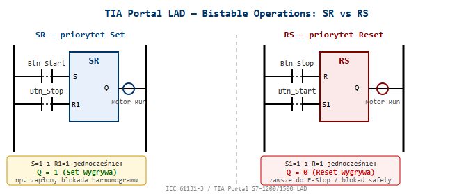

**Równoważny kod SCL — implementacja ręczna:**

```scl
// SR — priorytet Set (kolejność: najpierw Reset, potem Set nadpisuje)
"MotorRunSR" := "MotorRunSR" OR "StartBtn";
IF "StopBtn" THEN "MotorRunSR" := FALSE; END_IF;
IF "StartBtn" THEN "MotorRunSR" := TRUE; END_IF;   // Set na końcu = priorytet

// RS — priorytet Reset (kolejność: najpierw Set, potem Reset nadpisuje)
"MotorRunRS" := "MotorRunRS" OR "StartBtn";
IF "StartBtn" THEN "MotorRunRS" := TRUE; END_IF;
IF "StopBtn" THEN "MotorRunRS" := FALSE; END_IF;    // Reset na końcu = priorytet
```

**Praktyczna zasada doboru:**

| Sytuacja | Wybór |
|----------|-------|
| Stop ma wyższy priorytet (99% maszyn przemysłowych) | **RS** |
| Start/Set ważniejszy (np. latch alarmu do potwierdzenia) | **SR** |
| Fizyczny E-Stop / Guard | Zawsze **RS** — Reset (bezpieczeństwo) dominuje |

> ⚠️ W TIA Portal LAD bloki SR/RS są dostępne w *Basic Instructions → Bistable operations*. Parametr `Q` to bit zapamiętany — musi być adres **Memory** (`M`) lub **DB bit**, nigdy wejście `I`.

*Źródło: TIA Portal Help — LAD Bistable Operations; IEC 61131-3 §3.2.3*


---

### 1.15. Czym różni się Dominacja SET od Dominacji RESET w układzie samopodtrzymania LAD?  🔴

**Dominacja** określa, który sygnał wygrywa gdy jednocześnie wciśniemy START i STOP. Jest to praktyczny odpowiednik priorytetu przerzutnika SR/RS, widoczny bezpośrednio w schemacie drabinkowym.

**Dominacja SET** (lewy obwód) — priorytet ma START:
- START steruje Lampką **bezpośrednio** (równolegle z samopodtrzymaniem przez Lampkę)
- STOP jest szeregowy z samopodtrzymaniem, ale gdy START=1 — omija STOP
- Gdy `START=1` i `STOP=1` jednocześnie → **Lampka = 1** (SET wygrywa)
- „START bezpośrednio steruje Lampką, dlatego STOP nie ma tutaj nic do gadania"

**Dominacja RESET** (prawy obwód) — priorytet ma STOP:
- START zasila Lampkę **przez** STOP (szeregowo w tej samej gałęzi)
- Gdy `START=1` i `STOP=1` jednocześnie → **Lampka = 0** (RESET wygrywa — STOP odcina zasilanie)
- „START zasila Lampkę poprzez STOP, dlatego przycisk wyłączenia jest ważniejszy"


**Tabele prawdy — zachowanie Lampki:**


| Stan | START | STOP | Lampka (Dominacja SET) | Lampka (Dominacja RESET) |
|------|-------|------|------------------------|--------------------------|
| Oba wciśnięte | 1 | 1 | **1** ← SET wygrywa | **0** ← RESET wygrywa |
| Tylko START | 1 | 0 | 1 | 1 |
| Tylko STOP | 0 | 1 | 0 | 0 |
| Żaden | 0 | 0 | * (stan poprzedni) | * (stan poprzedni) |

> Gwiazdka „*" oznacza stan zapamiętany — bez akcji na wejściach układ nie zmienia stanu (samopodtrzymanie działa).

**Związek z przerzutnikami bistabilnymi w TIA Portal:**

| Schemat LAD (ręczny) | Odpowiednik bloku TIA Portal |
|----------------------|------------------------------|
| Dominacja SET | Blok **SR** — Set-Dominant (S wygrywa) |
| Dominacja RESET | Blok **RS** — Reset-Dominant (R wygrywa) |

**Zasada projektowania bezpiecznych maszyn:** Zawsze stosuj **Dominację RESET** dla obwodów STOP i E-Stop. Operator musi mieć gwarancję, że wciśnięcie przycisku wyłączenia zatrzyma maszynę niezależnie od innych sygnałów (EN 60204-1 §9.2.2).

*Źródło: Kurs ControlByte — Układy samopodtrzymania, Dominacja SET/RESET; EN 60204-1 §9.2.2*


---

### 1.16. Jaką typową pułapkę w obwodzie samopodtrzymania LAD pokazuje zadanie „Znajdź różnice"?  🔴

**Pułapka samopodtrzymania** polega na błędnym umieszczeniu styku samopodtrzymania (Lampka) tak, że **omija on przycisk STOP** — wciśnięcie STOP nie wyłącza cewki, bo prąd płynie alternatywną ścieżką.

**Obwód LEWOSTRONNY — poprawny (Dominacja RESET):**
```
BARIERA_MAGISTRALI
+--[ START ]--+----[ /STOP ]----(  Lampka  )
              |
+--[ Lampka ]-+
```
- Styk `Lampka` (samopodtrzymanie) jest w gałęzi **równoległej do START** — przed STOP
- STOP jest **szeregowy z oboma ścieżkami** (START i samopodtrzymaniem)
- Wciśnięcie STOP → otwiera jedyną drogę do cewki → Lampka **gaśnie** ✅

**Obwód PRAWOSTRONNY — niepoprawny (STOP omijany):**
```
+--[ START ]--[ /STOP ]---(  Lampka  )
|                              |
+--------[ Lampka ]------------+
```
- Styk `Lampka` (samopodtrzymanie) jest w gałęzi **równoległej do całego szeregu START–STOP**
- Gdy Lampka=1 i operator wciśnie STOP: prąd nadal płynie dolną ścieżką przez `Lampka` → cewka **nadal zasilona** ❌
- STOP jest **bezużyteczny** gdy Lampka jest już włączona

**Tabela porównawcza:**

| Stan | STOP wciśnięty | Obwód LEWY (poprawny) | Obwód PRAWY (błędny) |
|------|----------------|----------------------|----------------------|
| Lampka=1 | TAK | Lampka → 0 ✅ | Lampka → **1** ❌ |
| Lampka=0 | TAK | Lampka → 0 ✅ | Lampka → 0 ✅ |
| START=1 | NIE | Lampka → 1 | Lampka → 1 |

> ⚠️ **Błąd projektowy klasy STOP-ignorowanego!** Prawy obwód sprawia wrażenie poprawnego podczas statycznej analizy schematu. Błąd ujawnia się dopiero w działaniu — gdy Lampka raz się załączy, przycisku STOP nie można jej wyłączyć. W systemach safety jest to krytyczny błąd bezpieczeństwa.

> 💡 **Reguła zapamiętywania:** Styk samopodtrzymania **zawsze przed STOP** (w gałęzi równoległej tylko do START). STOP musi być „po" całej logice podtrzymania, żeby faktycznie odcinał zasilanie cewki.

**Zastosowanie w praktyce:**
- Typowy obwód układu napędowego: `(START || KM_zal) AND STOP_NC → KM_cewka`
- W TIA Portal LAD: samopodtrzymanie = styk wyjściowego bitu Q równoległy do przycisku START, STOP zawsze w gałęzi głównej przed cewką
- Analogiczny błąd w SCL: `IF Start OR Q THEN Q := TRUE; IF Stop THEN Q := FALSE; END_IF;` — STOP nie zadziała jeśli `Start=TRUE` jednocześnie (priorytet SET)

*Źródło: Kurs ControlByte — Slajd 9/24 „Znajdź różnice", Układy samopodtrzymania; EN 60204-1 §9.2.2*


---

## 2. ARCHITEKTURA SIMATIC SAFETY INTEGRATED

### 2.1. Co to jest SIMATIC Safety Integrated i co oznacza 'wszystko w jednym sterowniku'?  🔴

<span style="color:#1a5276">**SIMATIC Safety Integrated**</span> to koncepcja Siemensa gdzie funkcje bezpieczeństwa (failsafe) i funkcje standardowe działają w **jednym fizycznym CPU** (F-CPU), jednym projekcie TIA Portal i przez jedną sieć PROFINET/PROFIsafe.

**Korzyści:**
- Jeden sterownik zamiast dwóch (standard + safety)
- Ten sam inżyniering w TIA Portal
- Ta sama diagnostyka, mniej okablowania, mniejsza szafa sterownicza

**SIMATIC Safety Integrated — jeden PLC, jeden inżyniering, jedna komunikacja:**
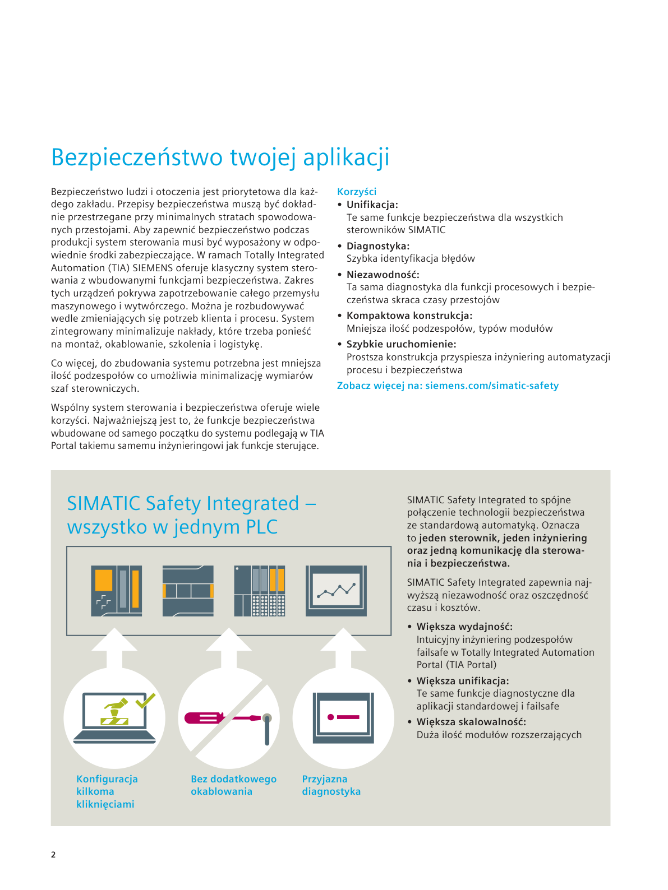

*[PRAWDOPODOBNE] — na podstawie wiedzy domenowej Siemens*
### 2.2. Co to jest F-CPU i jak działa dual-channel processing?  🔴

**Dual-channel processing** to architektura, w której ten sam fragment kodu Safety jest wykonywany przez **dwa niezależne kanały obliczeniowe wewnątrz jednego CPU**. W S7-1500F realizowane programowo (diversified redundant processing w jednym fizycznym procesorze — ten sam program Safety wykonywany dwukrotnie z dywersyfikowanym przetwarzaniem, wyniki porównywane). W starszych generacjach (S7-300F/400F) — sprzętowo (dwa oddzielne procesory). Oba kanały przetwarzają identyczne dane wejściowe i produkują wyniki. Na końcu każdego cyklu Safety specjalny komparator porównuje wyniki obu kanałów:
- Wyniki zgodne → cykl OK, wyjścia Safety ustawiane normalnie.
- Wyniki różne (nawet 1 bit) → CPU wykrywa błąd wewnętrzny → **natychmiastowe przejście w bezpieczny stan** (pasywacja wyjść Safety, stop napędów).

**Co to oznacza w praktyce dla komisjonera/integratora:**
- Nie musisz pisać logiki redundantnej — piszesz jeden program Safety, hardware sam wykonuje go dwukrotnie i sprawdza.
- Błąd sprzętowy wewnątrz CPU (uszkodzony rejestr, przekłamanie RAM) jest wykrywalny — to jest właśnie cel tej architektury, nie programowej redundancji.
- Czas cyklu Safety (F_MAIN) jest dłuższy niż OB1, bo CPU wykonuje go dwa razy + porównanie. Typowo 2× czas cyklu standardowego.

**Ciągły self-test:** F-CPU w tle testuje pamięć RAM (CRC bloków), ALU, rejestry procesora. Program Safety działa w oddzielnym chronionym obszarze pamięci — standardowy program OB1 nie może go nadpisać ani odczytać bezpośrednio.

> ⚠️ **DO WERYFIKACJI:** Twierdzenie „F_MAIN wykonywany typowo 2× dłużej niż OB1" jest uproszczeniem. Rzeczywisty czas cyklu Safety zależy od rozmiaru programu F, konfiguracji sprzętu i komunikacji PROFIsafe — nie jest to prosta wielokrotność czasu OB1. Sprawdź w TIA Portal → CPU properties → Cycle time.

*Certyfikacja (informacyjnie):* F-CPU jest certyfikowany dla SIL 3 / PL e — ta informacja pochodzi z karty katalogowej napędu lub CPU; nie musisz jej znać na pamięć, ale warto wiedzieć że to TÜV zatwierdza architekturę, nie sam Siemens.

*[PRAWDOPODOBNE] — na podstawie wiedzy domenowej Siemens*
### 2.3. Jakie sterowniki Siemens obsługują funkcje Safety?

S7-1500F: CPU 1511F, 1513F, 1515F, 1516F, 1517F, 1518F — Advanced controllers z wbudowanym Safety.
S7-1200F: CPU 1212FC, 1214FC, 1215FC — Basic controllers z Safety, mniejsze aplikacje.
ET 200SP CPU F: CPU 1510SP F, 1512SP F — zdalny sterownik z Safety, montaż przy maszynie.
ET 200pro CPU F: CPU 1516pro F — IP67, bezpośrednio na maszynie.
Wszystkie programowane w TIA Portal z STEP 7 Safety Advanced lub Safety Basic.

*[PRAWDOPODOBNE] — na podstawie wiedzy domenowej Siemens*
### 2.4. Co to jest F-DB i dlaczego nie można go edytować ręcznie?

F-DB (Fail-safe Data Block) generowany jest automatycznie przez TIA Portal dla każdego bloku Safety. Zawiera: CRC (checksum logiki), F-signature (podpis programu Safety), parametry czasowe.
Ręczna edycja zniszczyłaby spójność podpisu → F-CPU odmówiłoby uruchomienia Safety. To celowe zabezpieczenie przed nieautoryzowaną modyfikacją.

*[PRAWDOPODOBNE] — na podstawie wiedzy domenowej Siemens*
### 2.5. Co to jest F-signature i collective signature?  🟡

F-signature to unikalny podpis (suma kontrolna CRC) jednego bloku Safety — zmienia się przy każdej modyfikacji kodu.
Collective signature (podpis zbiorczy) to podpis CAŁEGO programu Safety złożony ze wszystkich bloków. Widoczny na wyświetlaczu CPU lub w TIA Portal jako ciąg znaków (np. '5CBE6409').
Przy wgraniu CPU porównuje collective signature — niezgodność → Safety nie uruchamia się.

*[PRAWDOPODOBNE] — na podstawie wiedzy domenowej Siemens*
### 2.6. Jakie są tryby pracy Safety CPU i jak się przełącza?

**Safety mode activated** — normalny tryb produktywny, program Safety działa, wyjścia sterowane przez logikę F.
**Safety mode deactivated** — tryb commissioning/testowy, wejścia/wyjścia F modułów mogą być nadpisywane ręcznie bez ochrony Safety (używany np. podczas uruchamiania do testów okablowania).
Przełączenie przez TIA Portal (Safety Administration) lub dedykowany sygnał w logice. Po przełączeniu wymagane potwierdzenie (hasło Safety lub ACK). Zmiana trybu jest logowana z datą i użytkownikiem. Uwaga: dezaktywacja trybu Safety jest widoczna w diagnostyce i na wyświetlaczu CPU — nie można jej ukryć.

*[PRAWDOPODOBNE] — na podstawie wiedzy domenowej Siemens*
### 2.7. Co to jest STEP 7 Safety Advanced vs Safety Basic?

Safety Basic: licencja wyłącznie dla S7-1200F. Prostsza funkcjonalność, niższy koszt, ograniczone biblioteki Safety.
Safety Advanced: pełna licencja dla S7-1500F i ET 200SP CPU F, wszystkie funkcje Safety, certyfikowane biblioteki funkcji (muting, two-hand, ESTOP), możliwość symulacji w PLCSIM.
Obydwie są wtyczką do TIA Portal — nie są osobnym oprogramowaniem.

*[PRAWDOPODOBNE] — na podstawie wiedzy domenowej Siemens*
### 2.8. Jakie są podstawowe komponenty i zasady programowania sterowników bezpieczeństwa Pilz PNOZmulti?

Pilz PNOZmulti to programowalny sterownik bezpieczeństwa, który umożliwia łatwe i intuicyjne tworzenie logiki bezpieczeństwa dla maszyn, wykorzystując dedykowane bloki funkcyjne i graficzne środowisko programowania.
- **Programowanie:**
  - Odbywa się za pomocą oprogramowania PNOZmulti Configurator.
  - Program jest podzielony na strony, co ułatwia organizację.
  - Wykorzystuje dedykowane bloki funkcyjne do obsługi elementów bezpieczeństwa (np. ML DH M gate, ML 2 D H M dla rygli, wejścia dwukanałowe).
  - Logika ryglowania i odryglowania jest zaimplementowana w specjalnych blokach.
- **Konfiguracja sprzętowa:**
  - W zakładce "Open Hardware Configuration" można zobaczyć jednostkę główną, dodatkowe moduły wejść/wyjść oraz urządzenia sieciowe (np. panel PMI, czytniki RFID podłączone przez switch).
  - Mapowanie zmiennych i wejść/wyjść odbywa się w zakładce "I O List".
- **Połączenie i diagnostyka:**
  - Połączenie ze sterownikiem odbywa się kablem Ethernet.
  - Adres IP i maska podsieci są dostępne w menu Ethernet -> info.
  - Opcja "Scan Network" pozwala wykryć sterownik w sieci.
  - W "Project Manager" należy wprowadzić Order number i Serial number sterownika, aby uzyskać dostęp.
  - Dostępne są trzy poziomy dostępu: pełna edycja, podgląd, zmiana parametrów.
  - Tryb "online Dynamic Program Display" podświetla aktywne sygnały na zielono, co ułatwia diagnostykę.
Praktyczne wskazówki:
- Programowanie PNOZmulti jest bardzo przyjazne użytkownikowi dzięki dedykowanym blokom.
- Diagnostyka w trybie online jest prosta, ponieważ aktywne sygnały są wizualnie wyróżnione.

**Kontekst na rozmowie:** PNOZmulti to *dedykowany sterownik bezpieczeństwa* (nie F-CPU) — często spotykany przy modernizacjach maszyn i w małych izolowanych aplikacjach Safety (prasy, ogrodzenia). Integracja z Siemens PLC: PNOZmulti jako IO-Device PROFINET (Safe PNOZmulti) lub przez wyjścia przekaźnikowe Safety do F-DI Siemens. Różnica od SIMATIC Safety: PNOZmulti jest tańszy i prostszy dla <20 sygnałów Safety, ale nie łączy logiki Safety z programem PLC w jednym środowisku jak TIA Portal.
*Źródło: transkrypcje ControlByte*

### 2.9. Co to jest S7-1500H (Hot Standby) i kiedy go stosujesz?  🟢

**S7-1500H** (Highly Available / Hot Standby) to konfiguracja redundantna dwóch identycznych CPU S7-1500 pracujących równolegle — jeden aktywny (Primary), drugi gotowy do natychmiastowego przejęcia sterowania (Backup).

**Zasada działania:**
- Oba CPU przetwarzają ten sam program synchronicznie w każdym cyklu
- Dane procesowe synchronizowane są przez dedykowaną sieć **Sync link** (Fiber lub Ethernet) — oddzielna od PROFINET
- Przy awarii Primary → Backup przejmuje sterowanie w czasie `< 1 cykl PLC` (bez STOP maszyny)
- **Bumpless switchover** — maszyna nie zauważa przełączenia

**Konfiguracja sprzętowa:**
- 2× CPU 1517H lub 1518HF (wersja z Safety)
- 2× IM 155-6 PN HF dla każdej stacji ET200SP (Shared-Device — oba CPU komunikują się z tą samą stacją)
- 2 fizyczne połączenia Sync link (redundancja linku synchronizacyjnego)

**Kiedy stosujesz S7-1500H:**
- Procesy ciągłe gdzie zatrzymanie CPU = duże straty (hutnictwo, chemia, petrochemia)
- Maszyny 24/7 gdzie planowanie okna serwisowego jest niemożliwe
- Wymagania SLA: `MTTR < 3s` (Mean Time To Recovery)

**Różnica H vs F (Safety):**

| Cecha | S7-1515F | S7-1517H | S7-1518HF |
|-------|----------|----------|-----------|
| Safety (F-CPU) | ✅ | ❌ | ✅ |
| Hot Standby | ❌ | ✅ | ✅ |
| Redundancja CPU | ❌ | ✅ | ✅ |

> ⚠️ **S7-1500H ≠ Safety redundancja** — Hot Standby gwarantuje dostępność (availability), nie poziom Safety (SIL). Do SIL wymagany F-CPU niezależnie od H.

> 💡 Programowanie w TIA Portal: H-system wygląda jak jeden CPU — piszesz kod jeden raz, TIA Portal automatycznie synchronizuje między Primary i Backup. Zmiana konfiguracji H wymaga krótkiego trybu serwisowego.

*Źródło: Siemens SIMATIC S7-1500H System Manual (6ES7518-4FX00-1AC2)*

---

## 3. MODUŁY F-DI / F-DO — OKABLOWANIE I PARAMETRY

### 3.1. Co to jest F-DI i jak różni się od standardowego DI?  🔴

F-DI (Fail-safe Digital Input) to moduł wejść bezpieczeństwa. Różnice od standardowego:
- VS* (pulse testing) — impulsowe zasilanie do diagnostyki okablowania
- Obsługa dwukanałowych czujników Safety (1oo2) z discrepancy time
- Cross-circuit detection — wykrywanie zwarć między kanałami
- Komunikacja przez PROFIsafe z CRC do F-CPU
- Self-test kanałów w tle
Moduły ET 200SP F-DI, ET 200MP F-DI, S7-1200 SM 1226 F-DI.

*[PRAWDOPODOBNE] — na podstawie wiedzy domenowej Siemens*
### 3.2. Co to jest VS* (pulse testing) i jak wykrywa usterki?  🔴

VS* to wyjście zasilające na module F-DI które wysyła krótkie impulsy testowe zamiast stałego napięcia. Czujnik zasilany jest tymi impulsami, a sygnał wraca na wejście razem z impulsami.
Moduł analizuje czy impulsy wróciły:
- Brak impulsów → zerwanie przewodu lub zwarcie do masy
- Impulsy cały czas bez przerwy → zwarcie do 24V
To mechanizm cross-circuit detection zapewniający Diagnostics Coverage (DC) bez dodatkowego okablowania. VS* z cross-circuit detection zapewnia DC ≥ 99% (Diagnostic Coverage) — warunek konieczny do osiągnięcia kategorii Cat.4 i Performance Level e (PL e wg ISO 13849-1) lub SIL 3 (wg IEC 62061 / IEC 61508). [ZWERYFIKOWANE — Siemens 39198632, normy ISO 13849-1 i IEC 62061]

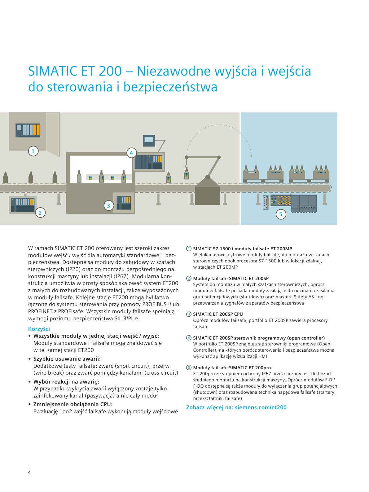

*[PRAWDOPODOBNE] — na podstawie wiedzy domenowej Siemens*
### 3.3. Dlaczego czujniki Safety podłącza się jako NC (normalnie zamknięty)?  🔴

Zasada bezpieczna (fail-safe): zerwanie kabla, przepalenie bezpiecznika, uszkodzenie czujnika → obwód otwarty → sygnał 0 → system Safety traktuje to jako zadziałanie i zatrzymuje maszynę.
Przy NO (normalnie otwartym): zerwanie kabla = brak sygnału = maszyna nie wie o zagrożeniu → niebezpieczeństwo.
NC to zasada 'fail-safe by design' wymagana przez normy bezpieczeństwa.

*[PRAWDOPODOBNE] — na podstawie wiedzy domenowej Siemens*
### 3.4. Co to jest discrepancy time i jak go konfigurujesz?  🟡

Discrepancy time to maksymalny czas w którym dwa kanały czujnika 1oo2 mogą pokazywać różne wartości bez generowania błędu. Przykład: przy otwieraniu osłony mechanicznej jeden styk reaguje 15ms wcześniej niż drugi — to normalne i fizyczne.
Konfigurujesz w TIA Portal: właściwości modułu F-DI → parametry kanału → Discrepancy time (typowo 10–200ms w zależności od czujnika).
Zbyt krótki → fałszywe błędy. Zbyt długi → późne wykrycie uszkodzenia.

*[PRAWDOPODOBNE] — na podstawie wiedzy domenowej Siemens*
### 3.5. Co to jest substitute value na F-DO i kto decyduje o jego wartości?

Substitute value to wartość którą przyjmuje wyjście F-DO po przejściu modułu w passivation (stan błędu). Konfigurujesz w TIA Portal we właściwościach kanału F-DO: wartość 0 lub 1.
Decyduje inżynier projektu na podstawie analizy bezpieczeństwa — nie Siemens. Przykłady: napęd → 0 (stop), zawór bezpieczeństwa → może być 1 (pozostaje otwarty), pompa chłodząca → może być 1 (chłodzi nadal).

*[PRAWDOPODOBNE] — na podstawie wiedzy domenowej Siemens*
### 3.6. Co to jest pm switching i pp switching — różnica?  🟡

pm switching (plus-minus): moduł F-PM-E przełącza **obie** linie obciążenia — P (+24V) **i** M (0V). Aktuator podłączony jest między wyjściem P a wyjściem M modułu. Wymaga wydzielonego zasilania obciążenia (Load supply) odizolowanego od zasilania elektroniki. [ZWERYFIKOWANE — Siemens 39198632 Fig. 2-1]
pp switching (plus-plus): moduł F-PM-E przełącza **dwa kanały po stronie P** (+24V). Linia M (0V) jest wspólnym powrotem obciążenia (common M) — nie jest przełączana przez moduł. [ZWERYFIKOWANE — Siemens 39198632 Fig. 2-2]
F-PM-E (Power Module) w ET 200SP/S może realizować oba tryby.

**pm-switching — schemat ET 200SP:**
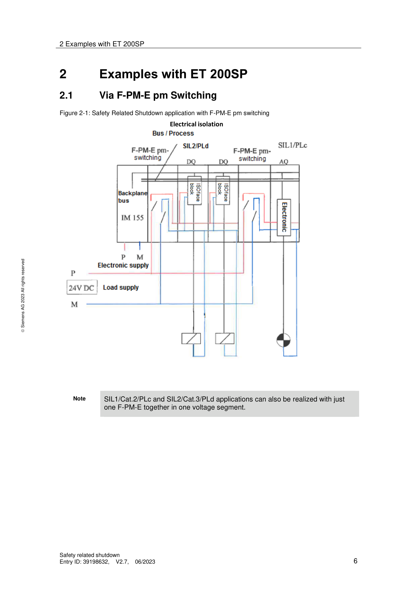

**pp-switching — schemat ET 200SP:**
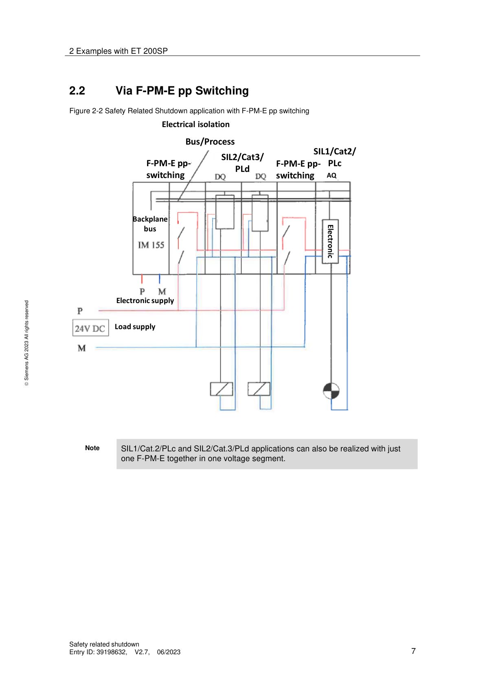

*[PRAWDOPODOBNE] — na podstawie wiedzy domenowej Siemens*
### 3.7. Co to jest F-PM-E i do czego służy?

F-PM-E (Fail-safe Power Module E) to moduł zasilający Safety w systemie ET 200SP/S. Umożliwia bezpieczne odcięcie zasilania grupy standardowych modułów DO przez sygnał Safety — bez ich fizycznej wymiany na moduły F.
Działanie: F-CPU nakazuje F-PM-E odciąć 24V dla grupy standardowych DQ → wszystkie wyjścia grupy idą na 0 (PM switching do SIL2/Cat.3/PLd).
Tańsze rozwiązanie niż wymiana wszystkich DQ na F-DQ.

*[PRAWDOPODOBNE] — na podstawie wiedzy domenowej Siemens*
### 3.8. Jak bezpiecznie wyłączyć standardowe moduły wyjść przez Safety?

Trzy główne metody (wg dokumentu Siemens 39198632):
- Safety Relay (np. 3SK1) — zewnętrzny przekaźnik bezpieczeństwa odcina zasilanie grupy DQ. Niezależne od PLC.
- F-PM-E (pm lub pp switching) — moduł F-PM-E w tej samej stacji ET200 odcina zasilanie grupy standardowych DQ (SIL2/Cat.3/PLd).
- F-DO + zewnętrzny przekaźnik — F-DO steruje cewką przekaźnika który odcina zasilanie modułów standardowych. Feedback z przekaźnika do DI.
Ważne: standardowe moduły DI nie mogą być używane do odczytu sygnałów Safety — wymagane F-DI.

**Schematy okablowania — Safety Relay i ET200MP/S7-1500:**
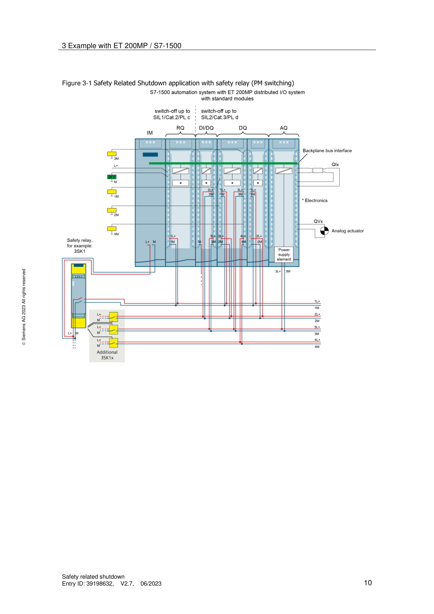

*[PRAWDOPODOBNE] — na podstawie wiedzy domenowej Siemens*
### 3.9. Jak F-CPU reaguje na typowe awarie wejść dwukanałowych (1oo2)?

Moduł F-DI, skonfigurowany do oceny dwukanałowej (1oo2), monitoruje sygnały z dwóch niezależnych kanałów i reaguje na różne typy awarii, aby zapewnić bezpieczny stan maszyny.
- **Zwarcie do potencjału 0 V (M):**
  - **Reakcja:** Kanał zostaje spaszywowany, styczniki rozłączone.
  - **Błąd diagnostyczny:** "Overload or internal sensor supply short circuit to ground".
  - **Reset:** Po usunięciu zwarcia, wymagany jest reset układu.
- **Zwarcie międzykanałowe:**
  - **Reakcja:** Cały moduł zapala się na czerwono, zgłaszając błąd.
  - **Błąd diagnostyczny:** "Internal sensor supply short circuit to P" lub "Short-circuit of two encoder supplies".
  - **Reset:** Po usunięciu zwarcia, wymagany jest reset układu.
- **Rozbieżność sygnału (Discrepancy failure):**
  - **Reakcja:** Pojawia się błąd "Discrepancy failure", wskazany jest kanał, na którym wystąpiła awaria.
  - **Przyczyna:** Utrata ciągłości obwodu w jednym z kanałów (np. uszkodzenie styku w E-STOP, kurtynie bezpieczeństwa, skanerze).
  - **Funkcja diagnostyczna:** Sprawdzenie równoczesności zadziałania sygnałów jest podstawową funkcją diagnostyczną dla urządzeń elektromechanicznych.
  - **Reset:** Po podłączeniu obwodu, diody migają naprzemiennie (czerwona i zielona), sygnalizując możliwość resetu/reintegracji.
Praktyczne wskazówki:
- W przypadku błędu rozbieżności, jeśli parametr "Reintegration after discrepancy error" jest ustawiony na "Test zero signal necessary", operator musi najpierw wymusić stan zerowy na czujniku (np. wcisnąć E-STOP), a dopiero potem może zresetować układ. Jest to ważne dla starszych urządzeń, które mogą generować fałszywe błędy rozbieżności.
*Źródło: transkrypcje ControlByte*

### 3.10. Jakie parametry są kluczowe przy konfiguracji wejść dwukanałowych w sterowniku bezpieczeństwa?

Prawidłowa konfiguracja parametrów wejść dwukanałowych jest niezbędna do zapewnienia niezawodnego działania systemu bezpieczeństwa i uniknięcia niepotrzebnych błędów.
- **Ocena (Evaluation):**
  - Dla wejść dwukanałowych często stosuje się ocenę "one out of two" (1oo2).
- **Discrepancy time (czas rozbieżności):**
  - **Definicja:** Maksymalny dopuszczalny czas między zmianą stanu sygnałów na dwóch kanałach wejściowych.
  - **Znaczenie:** Należy go dobrać precyzyjnie. Zbyt mały czas może generować niepotrzebne błędy i pasywację kanałów (np. przy E-STOP, wyłącznikach krańcowych). Zbyt długi czas zwiększa zwłokę w wykryciu sytuacji awaryjnej.
  - **Dobór:** Najlepiej określić go na podstawie testów.
- **Reintegracja po błędzie rozbieżności (Reintegration after discrepancy error):**
  - **Opcja "Test zero signal necessary":** W przypadku błędu rozbieżności, aby zresetować kanały, należy najpierw doprowadzić do stanu zerowego sygnał z czujnika (np. wcisnąć E-STOP, a następnie go odciągnąć).
  - **Znaczenie praktyczne:** Ten parametr wpływa na sposób obsługi stanowiska przez operatora. Urządzenia z kilkuletnim stażem mogą generować błędy rozbieżności, a ta opcja wymusza fizyczne potwierdzenie stanu bezpiecznego.
Praktyczne wskazówki:
- W przypadku błędu rozbieżności, jeśli "Test zero signal necessary" jest aktywne, diody zgłaszają błąd i brak możliwości reintegracji, dopóki nie zostanie wymuszony stan niski na obu kanałach, a dopiero potem można nacisnąć przycisk reset.
*Źródło: transkrypcje ControlByte*

---

## 4. STRUKTURY GŁOSOWANIA — 1oo1/1oo2/2oo2/2oo3


### 4.1. Wyjaśnij notację XooY i podaj przykład każdej architektury.  🟡

XooY = **X z Y**: ile (X) z dostępnych (Y) kanałów musi zadziałać aby system zareagował.

| Architektura | Definicja | Dostępność | Bezpieczeństwo | Typowe zastosowanie |
|-------------|-----------|-----------|---------------|---------------------|
| **1oo1** | 1 czujnik — wystarczy | Wysoka | Podstawowe | SIL1, proste maszyny |
| **1oo2** | 2 czujniki — wystarczy JEDEN | Niska (fałszywe stopy) | Wysokie | E-stopy, osłony — SIL2/3 |
| **2oo2** | 2 czujniki — wymagane OBA | Wysoka | Niższe (cichy błąd!) | Procesy ciągłe, kosztowne stopy |
| **2oo3** | 3 czujniki — wymagane 2 z 3 | Balans | Balans | Przemysł procesowy, ciśnienie/temp. |

> ⚠️ **2oo2 pułapka:** uszkodzenie jednego czujnika (sygnalizuje ciągle OK) → system może nie zadziałać gdy potrzeba. Wymagany monitoring DC!

---

*[PRAWDOPODOBNE] — na podstawie wiedzy domenowej Siemens*
### 4.2. Kiedy wybierasz 1oo2 a kiedy 2oo2?  🟡

**1oo2** gdy priorytet to **bezpieczeństwo** (zatrzymanie przy pierwszym sygnale):
- Osłony maszyn, e-stopy przy prasach
- Wyższy SIL, akceptowalne fałszywe zatrzymania

**2oo2** gdy priorytet to **dostępność** (unikanie fałszywych stopów):
- Procesy chemiczne gdzie zatrzymanie jest bardzo kosztowne
- Jedno "głuche" zadziałanie nie jest katastrofą

> ⚠️ Przy 2oo2: uszkodzenie jednego kanału *(zepsuty, ale nie zgłaszający błędu)* może spowodować że system nie zadziała gdy będzie potrzeba.

---

*[PRAWDOPODOBNE] — na podstawie wiedzy domenowej Siemens*
### 4.3. Jak 1oo2 jest realizowane w module F-DI Siemens?

Dwa sygnały z dwóch czujników podłączone na dwa kanały tego samego modułu F-DI (lub dwóch osobnych modułów). Moduł F-DI porównuje oba sygnały:
- Oba zgodne → OK
- Różnica przekracza `discrepancy time` → błąd → <span style="color:#c0392b">**passivation**</span> lub alarm

> 💡 Ewaluację 1oo2 wykonuje **sam moduł F-DI sprzętowo** — odciążając F-CPU. Wynik trafia do programu Safety jako jeden bezpieczny sygnał BOOL.

---

*[PRAWDOPODOBNE] — na podstawie wiedzy domenowej Siemens*
### 4.4. Jak F-CPU reaguje na błąd rozbieżności sygnału (Discrepancy Failure) w konfiguracji 1oo2?
Moduł F-DI wykrywa błąd rozbieżności sygnału, gdy jeden z dwóch kanałów skonfigurowanych w ocenie 1oo2 straci ciągłość obwodu lub sygnały nie zadziałają równocześnie w określonym czasie. Jest to podstawowa funkcja diagnostyczna dla urządzeń elektromechanicznych i czujników z wyjściami tranzystorowymi.
- Błąd "Discrepancy failure" jest zgłaszany w buforze diagnostycznym PLC, wskazując kanał awarii.
- Po usunięciu przyczyny błędu (np. ponownym podłączeniu obwodu), diody modułu naprzemian migają na czerwono i zielono, sygnalizując możliwość resetu reintegracji.
- Discrepancy time (np. 50 ms) musi być precyzyjnie dobrany, aby uniknąć fałszywych błędów lub zbyt długiej zwłoki w wykryciu awarii.
*Źródło: transkrypcje ControlByte*

### 4.5. Jakie są scenariusze awaryjne wykrywane przez moduł F-DI w układzie dwukanałowym 1oo2?
Moduł F-DI w układzie dwukanałowym 1oo2 jest w stanie wykryć różne scenariusze awaryjne, które mogą prowadzić do niebezpiecznych sytuacji, zapewniając wysoką diagnostykę.
- **Zwarcie do potencjału 0 V (zwarcie do masy):** Moduł zgłasza błąd "Overload or internal sensor supply short circuit to ground", pasywuje kanał i rozłącza styczniki.
- **Zwarcie międzykanałowe (do P):** Moduł zgłasza błąd "Internal sensor supply short circuit to P" lub "Short-circuit of two encoder supplies", cały moduł zapala się na czerwono.
- **Rozbieżność sygnału (Discrepancy failure):** Wykrywana, gdy jeden z kanałów straci ciągłość obwodu lub sygnały nie zadziałają równocześnie, co jest kluczowe dla urządzeń z mechanicznymi stykami (E-STOP, wyłączniki krańcowe) lub wyjściami tranzystorowymi.
*Źródło: transkrypcje ControlByte*

### 4.6. Jak parametr "Reintegration after discrepancy error" wpływa na obsługę błędu rozbieżności sygnału?
Parametr "Reintegration after discrepancy error" w konfiguracji modułu safety określa, czy po wystąpieniu błędu rozbieżności sygnału wymagane jest doprowadzenie sygnału do stanu zerowego przed wykonaniem resetu.
- Jeśli wybrano opcję "Test zero signal necessary", operator musi wymusić stan zerowy na czujniku (np. wcisnąć i odciągnąć E-STOP) zanim możliwy będzie reset reintegracji.
- Ten parametr jest istotny dla sposobu obsługi stanowiska przez operatora, szczególnie w przypadku starszych urządzeń, które mogą generować sporadyczne błędy rozbieżności.
- Reset reintegracji kanałów safety w sterowniku PLC jest odrębny od resetu funkcji bezpieczeństwa, który wymaga innej logiki programowania.
*Źródło: transkrypcje ControlByte*

### 4.7. Co to jest discrepancy time (czas rozbieżności) w F-DI 1oo2 i co się dzieje gdy zostanie przekroczony? 🔴
Discrepancy time (czas rozbieżności) to maksymalny czas, przez jaki oba kanały 1oo2 mogą mieć różne wartości logiczne bez wywołania błędu. Parametr konfigurowany w TIA Portal dla każdego F-DI z oceną 1oo2.
- Domyślnie: 100 ms — oba sygnały muszą zmienić stan w tym oknie
- Przekroczenie → F-DI przechodzi w stan pasywny (passivation), wyjście F-DO = substitute value
- Typowa przyczyna: mechaniczne opóźnienie styku bezpieczeństwa lub błąd okablowania
- Konfiguracja: właściwości modułu F-DI → zakładka „Input" → „Discrepancy time [ms]"
- W diagnostyce: alarm rozbieżności widoczny w buforze diagnostycznym CPU (F_LADDR.DIAG) ⚠️ DO WERYFIKACJI: konkretny numer kodu alarmu — sprawdź w SIMATIC Safety System Manual lub buforze diagnostycznym TIA Portal online

*[PRAWDOPODOBNE] — na podstawie wiedzy domenowej Siemens*
### 4.8. Jak moduł F-DI ET200SP wykrywa zwarcie między kanałami (cross-circuit detection) w obwodzie 1oo2? 🟡
Detekcja cross-circuit (zwarcia między kanałami) to mechanizm pozwalający wykryć zwarcie przewodu kanału 1 do kanału 2 dzięki testowym impulsom wyjść testowych (T-signal).
- T1 i T2 generują impulsy testowe z różną fazą (wzajemnie rozłączne)
- Wejścia odczytują sygnał z powrotem przez czujnik
- Zwarcie między kanałami = impuls T1 pojawia się na wejściu kanału 2 → błąd cross-circuit
- Wymaga okablowania z wyjść testowych (T1, T2) przez czujnik do wejść (DI0.0, DI0.1)
- Nie działa przy PM-switching bez wyjść testowych (wtedy detekcja cross-circuit jest ograniczona)

*[PRAWDOPODOBNE] — na podstawie wiedzy domenowej Siemens*
## 5. PASSIVATION, REINTEGRATION, ACK

### 5.1. Co to jest passivation i co się dzieje z wyjściami/wejściami?  🔴

<span style="color:#c0392b">**Passivation**</span> to stan błędu modułu F — wszystkie wyjścia przyjmują **substitute value** (zwykle `0`),
a wejścia raportowane są do F-CPU jako wartość bezpieczna (`0`).

**Przyczyny passivation:**
- Urwanie kabla lub zwarcie *(wykryte przez pulse testing)*
- Przekroczenie `discrepancy time` (ocena 1oo2)
- Utrata komunikacji PROFIsafe *(przekroczenie `F-monitoring time`)*
- Błąd wewnętrzny modułu
- Błąd spójności danych Safety

**W danych procesowych:** `PASS_OUT = TRUE` w F-DB modułu → widoczny w Watch Table

**Sekwencja sygnałów — passivation i reintegracja F-I/O:**
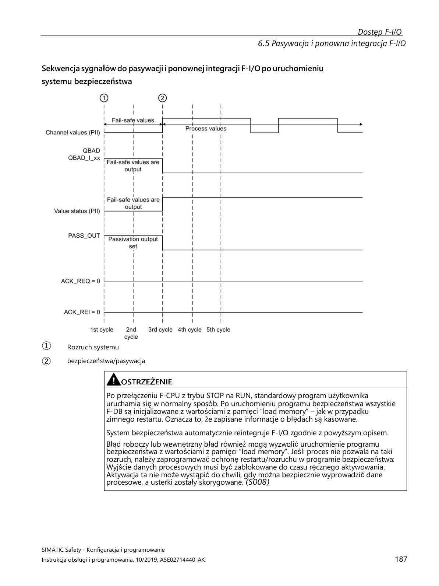

---

*[PRAWDOPODOBNE] — na podstawie wiedzy domenowej Siemens*
### 5.2. Dlaczego moduł nie wraca automatycznie po usunięciu błędu?

Celowo — zasada **"no silent recovery"** w systemach Safety.
Operator musi potwierdzić że sytuacja jest bezpieczna zanim maszyna wznowi pracę.

**Mechanizm reintegracji:**
1. Usuwasz przyczynę błędu *(naprawiasz kabel, naprawiasz czujnik)*
2. Moduł ustawia `ACK_REQ = TRUE` → widoczny w Watch Table
3. Operator naciska **"Reset Safety"** na HMI/kasecie
4. Generowany jest impuls na `ACK_REI` *(zbocze narastające, 1 cykl PLC)* — zmienna reintegracji F-I/O
5. Moduł reintegruje się → `PASS_OUT = FALSE`

---

*[PRAWDOPODOBNE] — na podstawie wiedzy domenowej Siemens*
### 5.3. Moduł nie wychodzi z passivation — co sprawdzasz?

**Checklista:**
- [ ] Błąd fizyczny faktycznie usunięty? *(sprawdź kabel / czujnik multimetrem)*
- [ ] Brak aktywnych błędów w diagnostyce TIA Portal?
- [ ] Sygnał `ACK_REI` (reintegracja F-I/O) podany jako **impuls** *(zbocze)*, nie poziom stały?
- [ ] F-CPU w trybie **Safety mode activated** *(nie deactivated)*?
- [ ] `F-monitoring time` nie przekroczony *(przeciążona sieć PROFINET)*?
- [ ] Brak drugiego ukrytego błędu na innym kanale modułu?

> ⚠️ **S7-1200/S7-1500:** tradycyjny bit `QBAD` zastąpiony przez **value status**
> — logika odwrócona: `FALSE` = aktywne wartości zastępcze | `TRUE` = dane prawidłowe

---

*[PRAWDOPODOBNE] — na podstawie wiedzy domenowej Siemens*
### 5.4. Co to jest ACK_REQ, ACK_NEC i ACK_REI w praktyce?  🔴

| Zmienna | Kierunek | Kontekst | Opis |
|---------|----------|----------|------|
| `ACK_REQ` | Wyjście bloku F | F-FB / F-I/O | Auto `TRUE` gdy moduł/blok wymaga resetu — widoczny w Watch Table |
| `ACK_NEC` | Wejście bloku F | Safety-FB (ESTOP1, Two-hand, GuardMonitoring) | Impuls *(zbocze narastające)* potwierdzający usunięcie błędu w logice Safety |
| `ACK_REI` | Wejście F-I/O DB | Reintegracja modułów F-I/O po passivation | Impuls reintegracji konkretnego modułu F-I/O |

**Schemat logiki Reset Safety (LAD):**
```
Reset_HMI: --|P|-- [ACK_NEC]   ← impuls z przycisku, tylko 1 cykl PLC
```

> ⚠️ `ACK_NEC` **nie może być** sygnałem stałym `TRUE` — tylko impuls zboczowy!

> 💡 **Zbiorcza reintegracja całej stacji:** blok `ACK_GL` *(STEP 7 Safety Advanced)*
> generuje zbiorczy impuls do **wszystkich** F-I/O w grupie runtime jednocześnie.
> Stosuj po wymianie modułu lub awarii sieci PROFINET całej stacji.

*[PRAWDOPODOBNE] — na podstawie wiedzy domenowej Siemens*
## 6. SAFE STATE — BEZPIECZNY STAN

### 6.1. Co to jest Safe State i kto go definiuje?

<span style="color:#c0392b">**Safe State**</span> to stan systemu po wykryciu zagrożenia lub błędu Safety. Definiuje go **inżynier projektu** na podstawie analizy ryzyka maszyny — Siemens dostarcza tylko narzędzia.

| Urządzenie | Safe State | Uzasadnienie |
|-----------|-----------|-------------|
| Prasa | Stop silnika | Brak ruchu = bezpieczny |
| Pompa cyrkulacyjna reaktora | Pozostaje **WŁĄCZONA** | Stop = przegrzanie = niekontrolowana reakcja |
| Wentylator chłodzący | Pozostaje **WŁĄCZONY** | Stop = pożar urządzenia |
| Zawór odcinający | NO lub NC — zależy od procesu | Analiza ryzyka musi to określić jednoznacznie |

> ⚠️ **Safe State definiuje inżynier, nie Siemens.** Siemens mówi: *"narzędzia są tu — użyj ich zgodnie z analizą ryzyka"*.

---

*[PRAWDOPODOBNE] — na podstawie wiedzy domenowej Siemens*
### 6.2. Dlaczego Safe State to nie zawsze wyłączenie?

Bo wyłączenie może być **bardziej niebezpieczne** niż kontynuacja działania:
- Pompa cyrkulacyjna reaktora — stop = przegrzanie = niekontrolowana reakcja chemiczna
- Wentylator chłodzący transformator — stop = pożar
- Podajnik na linii produkcyjnej — nagły stop = zablokowanie i awaria mechaniczna

> ⚠️ **`substitute value` F-DO może być `1`** (wyjście aktywne przy passivation) — to decyzja inżyniera, nie ustawienie domyślne Siemensa.

---

*[PRAWDOPODOBNE] — na podstawie wiedzy domenowej Siemens*
### 6.3. Jak F-DO substitute value wpływa na Safe State?

Parametr `substitute value` w TIA Portal (właściwości kanału F-DO) określa co wyjście robi przy passivation:

| `substitute value` | Zachowanie wyjścia | Kiedy używasz |
|-------------------|--------------------|---------------|
| `0` *(domyślne)* | Wyjście wyłączone | Napęd stop, zawór zamknięty — brak ruchu = bezpieczny |
| `1` | Wyjście aktywne | Pompa nadal działa, zawór otwarty — stop = większe ryzyko |

> 💡 To jest implementacja Safe State na **poziomie sprzętowym** — zadziała nawet przy awarii sieci komunikacyjnej, bez udziału logiki CPU.

---

*[PRAWDOPODOBNE] — na podstawie wiedzy domenowej Siemens*
### 6.4. Czym różni się STO jako Safe State napędu SINAMICS od zatrzymania programowego (OFF1/OFF2)? 🔴
STO (Safe Torque Off) jako Safe State napędu oznacza zablokowanie impulsów bramkowania tranzystorów — napęd nie może generować momentu obrotowego, nawet przy zasilaniu energetycznym. Zatrzymanie OFF1/OFF2 to kontrolowane wyhamowanie przez falownik z możliwością ponownego załączenia bez potwierdzenia.
- STO: brak momentu → wolne wybieganie jeśli nie ma hamulca mechanicznego (niebezpieczne na siłowniku pionowym!)
- OFF1: hamowanie po rampie (p1121 ⚠️ DO WERYFIKACJI w dokumentacji SINAMICS), potem wyłączenie impulsów — napęd można ponownie uruchomić sygnałem ON
- OFF2: natychmiastowe wyłączenie impulsów (jak STO, ale sterowane programem, nie Safety)
- Safe State = STO → w konfiguracji F-DO parametr „substitute value" = 0 dla wyjścia STO
- Dla osi pionowych (roboty, podnośniki): jako Safe State użyj SS1 (Stop + STO po rampie) lub SBC

*[PRAWDOPODOBNE] — na podstawie wiedzy domenowej Siemens*
### 6.5. Jak konfigurujesz substitute values dla F-DO i jaką wartość wybrać dla zaworu, siłownika i napędu? 🟡
Substitute value to wartość logiczna wyjścia F-DO nadawana automatycznie podczas passivacji lub gdy F-CPU akceptuje błąd bezpieczeństwa. Konfigurowana w TIA Portal → właściwości modułu F-DO → „Substitute value for outputs".
- Domyślnie: 0 (false) dla wszystkich kanałów — to zazwyczaj poprawne
- Zawór bezpieczeństwa (NC — normalnie zamknięty): substitute value = 0 → zawór zamknięty ✓
- Siłownik pneumatyczny: zależy od logiki bezpiecznej pozycji — z reguły 0 = bezpieczna
- Napęd STO: substitute value = 0 → F-DO = 0 → STO_enable usunięty → STO aktywne (brak momentu) ✓
- WYJĄTEK: zawór NO (normalnie otwarty) — substitute value = 0 → zawór OTWARTY (niespójne z intencją)
- Ważna zasada: Zawsze weryfikuj że substitute value 0 odpowiada fizycznie bezpiecznemu stanowi urządzenia

*[PRAWDOPODOBNE] — na podstawie wiedzy domenowej Siemens*
## 7. PROFISAFE — KOMUNIKACJA SAFETY

### 7.1. Co to jest PROFIsafe i co zawiera jego pakiet?  🔴

<span style="color:#1a5276">**PROFIsafe**</span> to protokół Safety działający na **warstwie aplikacji** ponad standardowym PROFINET lub PROFIBUS — bez osobnego okablowania bezpieczeństwa.

**Struktura ramki PROFIsafe** *(dodatkowe dane ponad normalne dane procesowe)*:

| Element | Rozmiar | Cel |
|---------|---------|-----|
| F-Data (dane procesowe Safety) | zmienny | Bezpieczne dane wejść/wyjść |
| Status/Control byte | 1 bajt | Toggle bit, potwierdzenia, sterowanie komunikacją |
| CRC | 3 bajty (CRC1) lub 4 bajty (CRC2) | Integralność — obliczany z uwzględnieniem Virtual Consecutive Number (VCN) i F-Address |

Ochrona przed utratą/powtórzeniem pakietów (VCN) i błędnym adresowaniem (F-Address) jest realizowana **wewnątrz obliczenia CRC** — nie są to osobne pola w ramce.

**Błędy wykrywane przez PROFIsafe**, których zwykły PROFINET nie wykrywa:
- Utrata pakietu
- Powtórzenie pakietu (replay)
- Błędna sekwencja
- Przekłamanie danych (bit flip)
- Błędny adres odbiorcy

---

*[PRAWDOPODOBNE] — na podstawie wiedzy domenowej Siemens*
### 7.2. Co to jest F-Address i jak go konfigurujesz?  🔴

`F-Address` (F-Destination Address) to unikalny F-address przypisany do każdego modułu F w sieci. **Musi być identyczny** w konfiguracji TIA Portal i na fizycznym urządzeniu (DIP switch lub parametryzacja).

**Konfiguracja:**
- TIA Portal → właściwości modułu F → zakładka `Safety` → pole `Safety address`
- Na urządzeniu: DIP switch lub przez TIA Portal `Assign PROFIsafe address` (online)

> ⚠️ **Przy wymianie modułu:** nowy moduł musi dostać **ten sam F-Address** co stary — inaczej nie uruchomisz systemu Safety.
> Błędny F-Address → moduł nie komunikuje się z F-CPU i pozostaje spassivowany.

---

*[PRAWDOPODOBNE] — na podstawie wiedzy domenowej Siemens*
### 7.3. Co to jest F-monitoring time i co się dzieje po jego przekroczeniu?

`F-monitoring time` to maksymalny czas oczekiwania F-CPU na kolejny pakiet PROFIsafe od modułu. Po przekroczeniu (np. przerwa w sieci, przeciążony switch) → moduł zostaje <span style="color:#c0392b">**spassivowany**</span>.

| Nastawienie | Skutek |
|-------------|--------|
| Za krótki | Fałszywe alarmy przy chwilowym obciążeniu sieci |
| Za długi | Wolne wykrywanie prawdziwej awarii komunikacji |

> 💡 Ustawiasz w parametrach modułu Safety. Wartość dobierasz do topologii sieciowej i obciążenia switcha — dla przeciążonych sieci zwiększ, dla wymagań szybkiego wykrycia awarii zmniejsz.

---

*[PRAWDOPODOBNE] — na podstawie wiedzy domenowej Siemens*
### 7.4. Jak Safety działa przez ET200 (zdalne I/O) i czym jest F-peripheral?

**F-peripheral** (fail-safe peripheral) to zdalne urządzenie I/O Safety podłączone do F-CPU przez PROFIsafe/PROFINET.

| F-peripheral | Stopień ochrony | Montaż |
|-------------|----------------|--------|
| ET200SP + moduły F-DI/F-DQ | IP20 | Szafa sterownicza, szyna DIN |
| ET200eco F | IP67 | Przy maszynie, bez szafy |
| ET200pro F | IP67 | Modułowe, trudne warunki |

**Zasada działania:**
- F-CPU wysyła i odbiera pakiety PROFIsafe do każdego F-peripherala **niezależnie**
- Każdy ma własny `F-Address` i `F-monitoring time`
- Awaria jednego peripherala <span style="color:#c0392b">**passivuje tylko ten moduł**</span>, nie cały system Safety

---

*[PRAWDOPODOBNE] — na podstawie wiedzy domenowej Siemens*

### 7.5. Jakie telegramy PROFIsafe są stosowane w napędach SINAMICS i co zawierają?

**Telegramy PROFIsafe w napędach** to dodatkowe submoduły komunikacyjne konfigurowane w TIA Portal obok standardowych telegramów PROFIdrive. Przesyłają komendy Safety (STO, SS1, SLS…) i status Safety napędu przez tę samą sieć PROFINET.

- **Telegram PROFIsafe 30** — podstawowy telegram Safety dla napędów SINAMICS. Zawiera:
  - Dane sterujące (F-CPU → napęd): komendy aktywacji/deaktywacji funkcji Safety (STO, SS1, SLS, SDI itp.)
  - Dane statusowe (napęd → F-CPU): potwierdzenie aktywnych funkcji Safety, status błędów Safety
  - Stosowany w SINAMICS G120 (CU250S-2) i S120 dla prostych konfiguracji Safety
- **Telegram PROFIsafe 54** — rozszerzony telegram Safety z dodatkowymi danymi diagnostycznymi, używany w zaawansowanych konfiguracjach S120
- **Telegram PROFIsafe 900/902** — telegramy Safety dla SINAMICS S120, stosowane w trybie izochronicznym (IRT). Telegram 902 jest konfigurowany np. na CU310-2 PN V5.1 dla synchronizacji Safety z cyklem PROFINET
- **Konfiguracja w TIA Portal:** Device view napędu → zakładka „Submodules" → dodaj submoduł PROFIsafe (np. „PROFIsafe Telegram 30") → ustaw F-Address, F-monitoring time

**Relacja telegram PROFIdrive + PROFIsafe:**
Napęd może mieć jednocześnie telegram PROFIdrive (np. telegram 20 — sterowanie prędkością) i telegram PROFIsafe (np. telegram 30 — komendy Safety). Oba działają równolegle na tym samym połączeniu PROFINET.

**Praktyka commissioning:** Po dodaniu telegramu PROFIsafe do napędu → F-Address musi być identyczny w TIA Portal i w napędzie. Po każdej zmianie parametrów Safety wymagany jest Safety Acceptance Test z podpisem. W S120 z trybem izochronicznym (telegram 902) należy skonfigurować także partition image process (PIP) dedykowane tylko dla F-I/O.

> Źródło: SIMATIC Safety - Konfiguracja i programowanie (2), s.62 — konfiguracja submodułu „Profisafe Telgr 902" sterownika SINAMICS S120 CU310-2 PN V5.1 [ZWERYFIKOWANE]

### 7.6. Jak oblicza się i dobiera F-monitoring time dla modułów PROFIsafe?

**F-monitoring time (czas monitorowania PROFIsafe, TPSTO)** to parametr określający maksymalny dozwolony czas między kolejnymi poprawnymi ramkami PROFIsafe. Po jego przekroczeniu moduł F przechodzi do stanu bezpiecznego (passivation).

- **Konfiguracja:**
  - Centralnie: we właściwościach F-CPU → „Default F-monitoring time for F-I/O of this interface" — domyślna wartość dla wszystkich modułów F na danym interfejsie
  - Indywidualnie: we właściwościach każdego F-I/O → „F-monitoring time" — nadpisuje wartość domyślną
- **Zasada doboru:**
  - **Za krótki** → fałszywe passivation przy chwilowym obciążeniu sieci (np. duży ruch PROFINET, wiele stacji)
  - **Za długi** → wolna reakcja na rzeczywistą awarię komunikacji — wydłuża czas odpowiedzi Safety
- **Narzędzie do obliczeń:** Siemens udostępnia arkusz kalkulacyjny Excel do obliczenia minimalnego F-monitoring time na podstawie: czasu cyklu PROFINET, liczby F-I/O, czasu cyklu grupy F-runtime, topologii sieci. Dostępny na support.automation.siemens.com (Entry ID: 49368678)
- **Czynniki wpływające:** czas cyklu PROFINET (Send Clock), liczba urządzeń na interfejsie, update time F-I/O, czas cyklu F-runtime group

**Procedura weryfikacji na obiekcie (z dokumentacji Siemens):**
1. Dodaj tymczasowy F-I/O do sieci
2. Ustaw na nim krótszy F-monitoring time niż na produkcyjnych F-I/O
3. Jeśli tymczasowy F-I/O generuje „Monitoring time for safety message frame exceeded" → wartość jest poniżej minimum
4. Zwiększaj F-monitoring time aż przestanie generować błędy — to przybliżone minimum dla sieci

**Praktyka commissioning:** Na nowych instalacjach zacznij od wartości domyślnej F-CPU. Jeśli pojawiają się sporadyczne passivation bez widocznej przyczyny sieciowej → zwiększ F-monitoring time o 50%. Zawsze dokumentuj wartości w tabeli komisjonowania.

> Źródło: SIMATIC Safety - Konfiguracja i programowanie (2), s.654-655 — procedura kontroli czasu monitorowania PROFIsafe [ZWERYFIKOWANE]

### 7.7. Jak PROFIsafe chroni przed przekłamaniem danych i jakie mechanizmy bezpieczeństwa stosuje ramka PROFIsafe?

**PROFIsafe** implementuje warstwę bezpieczeństwa na standardowym PROFINET/PROFIBUS, stosując mechanizm „black channel" — traktuje sieć jako kanał niebezpieczny i zabezpiecza się przed wszystkimi typami błędów transmisji.

**Mechanizmy ochronne w ramce PROFIsafe:**

- **CRC (Cyclic Redundancy Check)** — obliczany na podstawie danych Safety, F-Address i Virtual Consecutive Number (VCN). Wykrywa przekłamanie danych (bit flip) i błędne zaadresowanie (moduł dostaje dane innego modułu)
  - CRC1 (3 bajty) — dla krótszych telegramów
  - CRC2 (4 bajty) — dla dłuższych telegramów, wyższe pokrycie błędów
- **Virtual Consecutive Number (VCN)** — wirtualny numer sekwencyjny wbudowany w obliczenie CRC (nie jest osobnym polem w ramce). Chroni przed: utratą pakietu, powtórzeniem pakietu (replay), błędną sekwencją
- **Toggle bit** — w status/control byte ramki PROFIsafe. Zmienia się przy każdej nowej ramce — pozwala odbiorcy wykryć, czy otrzymał nową ramkę czy powtórzenie
- **F-Address w CRC** — adres nadawcy/odbiorcy jest wbudowany w obliczenie CRC. Jeśli ramka dotrze do niewłaściwego urządzenia, CRC się nie zgadza → passivation
- **Watchdog (F-monitoring time)** — jeśli prawidłowa ramka nie dotrze w określonym czasie → passivation

**Porównanie z „gołym" PROFINET:**
| Zagrożenie | PROFINET | PROFIsafe |
|-----------|----------|-----------|
| Bit flip | Ethernet CRC (L2) — nie fail-safe | CRC1/CRC2 z F-Address — fail-safe |
| Utrata pakietu | Brak wykrycia | VCN + watchdog |
| Powtórzenie/replay | Brak wykrycia | VCN + toggle bit |
| Błędny adres | Routing do IP — nie fail-safe | F-Address w CRC |

**Praktyka commissioning:** PROFIsafe nie wymaga specjalnego okablowania ani dedykowanych switchy — działa na standardowej infrastrukturze PROFINET. Ale jakość sieci wpływa na ilość retransmisji i ryzyko passivation. Na obciążonych sieciach → monitoruj wskaźnik retransmisji PROFIsafe w diagnostyce TIA Portal.

*[ZWERYFIKOWANE] — na podstawie SIMATIC Safety Integrated broszura (PROFINET i PROFIsafe, „black channel", s.7) + SIMATIC Safety - Konfiguracja i programowanie*

### 7.8. Jak działa komunikacja Safety między dwoma F-CPU (Safety-to-Safety communication) przez PROFIsafe?

**Komunikacja Safety-to-Safety (F-CPU ↔ F-CPU)** pozwala na wymianę danych bezpieczeństwa między dwoma sterownikami Safety bez pośrednictwa standardowego kodu — np. przekazanie stanu E-Stop z jednej linii do drugiej.

- **Realizacja:** Przez instrukcje `SENDDP/RCVDP` (S7-300F/400F) lub przez **Safety Data Exchange (S7-1500F)** — wymiana danych Safety przez PROFINET IO między dwoma F-CPU
- **Mechanizm:**
  - Jeden F-CPU jest IO-Controller, drugi jest IO-Device (lub oba mają funkcję Shared Device / I-Device)
  - Dane Safety przesyłane są przez PROFIsafe z pełnym CRC, VCN i F-monitoring time — identycznie jak dla F-I/O
  - Każde połączenie Safety-to-Safety wymaga osobnego F-Address i F-monitoring time
- **Zastosowanie:**
  - Linia produkcyjna z wieloma stacjami, każda ma własny F-CPU — E-Stop na jednej stacji musi zatrzymać napędy na sąsiednich
  - Robot ABB z dedykowanym PLC Safety — wymiana danych Safety z nadrzędnym F-CPU linii
  - Automotive: SICAR — każda cela robotyczna ma własny F-CPU, sygnały Safety (bramki, E-Stop, kurtyny) muszą być dzielone między celami

**Konfiguracja w TIA Portal:**
1. F-CPU „nadawca" konfiguruje transfer area w Safety Administration → definiuje jakie dane wysyła
2. F-CPU „odbiorca" konfiguruje odbieranie z podaniem F-Address nadawcy
3. Oba F-CPU muszą mieć identyczne collective signature Safety po konfiguracji

**Praktyka commissioning:** Przy Safety-to-Safety upewnij się, że F-monitoring time jest dostatecznie długi — komunikacja przechodzi przez PROFINET między CPU, co dodaje opóźnienie. Na dużych instalacjach z wieloma hopami sieciowymi zwiększ F-monitoring time o współczynnik 2-3x względem lokalnych F-I/O.

*[PRAWDOPODOBNE] — na podstawie wiedzy domenowej Siemens, szczegóły konfiguracji Safety-to-Safety mogą się różnić między S7-300F/400F a S7-1500F*
## 8. NAPĘDY SAFETY — SINAMICS Z WBUDOWANYM SAFETY

### 8.1. Co to jest STO (Safe Torque Off) i jak działa?  🔴

<span style="color:#c0392b">**STO**</span> natychmiastowo odcina moment obrotowy — falownik blokuje impulsy PWM do silnika. Silnik wybiega swobodnie (lub hamuje hamulec mechaniczny).

**Kluczowe cechy:**
- Brak rampy hamowania — natychmiastowe odcięcie
- Certyfikowany wg <span style="color:#1a5276">**IEC 61800-5-2**</span> — realizowany sprzętowo (dwa kanały w napędzie)
- Napęd potwierdza brak momentu do F-CPU przez PROFIsafe: sygnał `STO_Active`

> ⚠️ **Różnica od wyłączenia programowego:** komenda `OFF` przez PLC — niecertyfikowana, niemonitorowana, napęd może technicznie nadal generować moment.

---

*[PRAWDOPODOBNE] — na podstawie wiedzy domenowej Siemens*
### 8.2. Jaka jest różnica między STO a zwykłym wyłączeniem napędu przez PLC?

| Cecha | STO | Wyłączenie programowe |
|-------|-----|----------------------|
| Certyfikacja | <span style="color:#1a5276">**SIL3/PLe**</span> | Brak |
| Realizacja | Sprzętowa (2 kanały w napędzie) | Programowa |
| Potwierdzenie braku momentu | `STO_Active` → F-CPU | Brak |
| Monitoring | TAK (PROFIsafe lub zaciski) | NIE |
| Restart po odwołaniu | Wymaga potwierdzenia Safety | Natychmiastowy |

---

*[PRAWDOPODOBNE] — na podstawie wiedzy domenowej Siemens*
### 8.3. Co to jest SS1 i kiedy go używasz zamiast STO?  🔴

<span style="color:#c0392b">**SS1**</span> (Safe Stop 1): napęd hamuje wzdłuż zaprogramowanej rampy do zerowej prędkości, następnie aktywuje STO.

**Kiedy SS1 zamiast STO:**
- Natychmiastowe odcięcie momentu (STO) jest **niebezpieczne** — duże masy inercyjne
- Obrabiarka z ciężkim stołem — ryzyko zderzenia narzędzia przy wybiegu
- Winda, dźwig — wybieg = niekontrolowany ruch z ładunkiem

> ⚠️ Czas hamowania SS1 jest **monitorowany** — jeśli napęd nie zatrzyma się w zadanym czasie → natychmiastowe STO jako zabezpieczenie.

*[PRAWDOPODOBNE] — na podstawie wiedzy domenowej Siemens*
### 8.4. Co to są SS2, SOS, SLS, SDI, SBC?  🟢

| Funkcja Safety | Pełna nazwa | Działanie | Kiedy stosujesz |
|----------------|-------------|-----------|-----------------|
| **SS2** | Safe Stop 2 | Hamowanie z rampą → SOS (napęd zasilony, trzyma pozycję) | Wstrzymanie z zachowaniem pozycji (ramiona robotów, pionowe osie) |
| **SOS** | Safe Operating Stop | Napęd zasilony, monitoruje pozycję, może wytworzyć moment przy ruchu | Po SS2 lub gdy oś ma trzymać pozycję podczas inspekcji |
| **SLS** | Safely Limited Speed | Ograniczenie prędkości do bezpiecznego max | Tryb serwisowy — operator wchodzi do strefy, oś może się wolno ruszać |
| **SDI** | Safe Direction | Tylko jeden kierunek ruchu dozwolony | Osłona otwarta — oś może jechać tylko od operatora |
| **SBC** | Safe Brake Control | Certyfikowane sterowanie hamulcem — monitoring prądu uzwojenia | Osie pionowe z hamulcem mechanicznym Safety |

*[PRAWDOPODOBNE] — na podstawie wiedzy domenowej Siemens*
### 8.5. Jak STO jest realizowane sprzętowo — zaciski vs PROFIsafe?

Zaciski hardwarowe (STO1/STO2): bezpośrednie odcięcie sygnałów PWM przez zewnętrzny sygnał 24V z modułu Safety. Szybsze (bez opóźnienia sieci), prostsze, niezależne od komunikacji.
PROFIsafe: komenda STO przesyłana przez PROFINET. Umożliwia zaawansowane funkcje (SS1, SLS, SDI, diagnostyka przez sieć). Wymaga sprawnego połączenia sieciowego.
W praktyce: przy G120/S120 można łączyć oba sposoby — PROFIsafe dla zaawansowanych funkcji + zaciski STO jako backup.

*[PRAWDOPODOBNE] — na podstawie wiedzy domenowej Siemens*
### 8.6. Co sprawdzasz przy commissioning napędu z STO?

Procedura:
- Podaję sygnał STO (przez zaciski lub PROFIsafe) — weryfikuję że napęd zatrzymał się i nie ma momentu
- Sprawdzam potwierdzenie STO_Active w statusie napędu (w TIA Portal lub Startdrive)
- Weryfikuję że nie można uruchomić napędu gdy STO aktywne
- Zdejmuję STO — sprawdzam poprawny restart
- Testuję czas reakcji
- Sprawdzam poprawność adresu PROFIsafe jeśli używany
- Dokumentuję wyniki z podpisem

*[PRAWDOPODOBNE] — na podstawie wiedzy domenowej Siemens*
### 8.7. Czym różnią się telegramy PROFIdrive 1, 20, 102, 352 i jak dobirasz telegram dla napędu SINAMICS?

Telegram PROFIdrive określa format wymiany danych między CPU a napędem przez PROFINET. Numer musi być zgodny w napędzie (`p0922`) i w konfiguracji Startdrive/TIA Portal.

| Telegram | Dane procesowe | Typowe zastosowanie |
|----------|---------------|---------------------|
| **1** | STW1/ZSW1 (16b) + NSET/NIST (16b) | Standardowy napęd, proste zadawanie prędkości V/f lub wektorowe bez enkodera |
| **20** | STW1/ZSW1 + NSET + prąd/moment + alarmy | Rozszerzony monitoring — Startdrive, diagnostyka prądu |
| **102** | STW + NSET + enkoder (pozycja + prędkość) | S7-1500 Motion Control (TO_SpeedAxis / TO_PositioningAxis) z enkoderem |
| **105** | Telegram DSC (Dynamic Servo Control) + enkoder | S7-1500 TO_SynchronousAxis — wymagany IRT i Startdrive |
| **352** ⚠️ DO WERYFIKACJI | STW1/ZSW1 + PROFIsafe Safety | SINAMICS G120/S120 z Safety Integrated (STO/SS1/SLS przez PROFIsafe) — numer telegramu Safety wymaga weryfikacji w dokumentacji SINAMICS |

**Jak dobrać telegram:**
- Tylko prędkość, bez enkodera, bez Safety → Telegram 1
- Motion Control S7-1500 z enkoderem → Telegram 102
- Synchronizacja osi, IRT → Telegram 105
- Safety (STO/SS1/SLS przez PROFIsafe) → telegram Safety **dodawany** do telegramu standardowego (np. Telegram 20 + Safety telegram 30 ⚗️ DO WERYFIKACJI numeru w dokumentacji SINAMICS)

**Uwaga praktyczna:** Niezgodność telegramu między `p0922` (⚠️ DO WERYFIKACJI w dokumentacji SINAMICS) a konfiguracją TIA Portal → napęd nie komunikuje się lub dane są przesunięte — błędne sterowanie bez alarmu. Zawsze weryfikuj numer telegramu online po podłączeniu nowego napędu.

*[PRAWDOPODOBNE] — na podstawie wiedzy domenowej Siemens*
### 8.8. Jakie funkcje bezpieczeństwa są wbudowane w serwowzmacniacz Sinamics V90 i jak należy je podłączyć?
Serwowzmacniacz Sinamics V90 jest wyposażony w funkcję bezpieczeństwa STO (Safe Torque Off), która zapewnia bezpieczne zdjęcie momentu obrotowego z napędu.
- Funkcja STO jest realizowana poprzez terminale STO+, STO1 i STO2.
- Domyślnie terminale te są zmostkowane, co oznacza, że funkcja STO jest nieaktywna w trybie bezpieczeństwa.
- W docelowej aplikacji sygnały STO należy podłączyć dwukanałowo do układu bezpieczeństwa, takiego jak przekaźnik bezpieczeństwa lub F-CPU (np. S7-1500F), aby zapewnić funkcję STO (Safe Torque Off) napędu.
*Źródło: transkrypcje ControlByte*

---

## 9. TIA PORTAL — SAFETY PRAKTYKA

### 9.1. Jak wygląda struktura programu Safety w TIA Portal?

Program Safety w TIA Portal składa się z:
- F-OB (Safety Main OB, np. Main_Safety_RTG1) — główny cykl Safety, odpowiednik OB1 dla Safety
- F-FB / F-FC — bloki logiki Safety programowane w F-LAD lub F-FBD
- F-DB — instancje bloków, generowane automatycznie przez TIA Portal
Kompilacja Safety generuje F-signature dla każdego bloku i collective signature dla całości. Program Safety jest logicznie oddzielony od standardowego OB1.

*[PRAWDOPODOBNE] — na podstawie wiedzy domenowej Siemens*
### 9.2. Jak przekazujesz sygnał z obszaru F do standardowego OB?

Z F do standard: poprzez F-DB — zmienne wynikowe Safety są dostępne do odczytu ze standardowego programu. Przykład: F-DB.SafetyOK (BOOL) możesz odczytać w OB1 do wyświetlenia na HMI lub logowania.
Ze standard do F: przez dedykowane zmienne 'safe interlock' — standardowy program może pisać do specjalnych zmiennych które F-CPU traktuje jako niezaufane (nie używa do decyzji Safety).
Bezpośredni zapis ze standardowego do F-DB — zablokowany. Zalecany wzorzec Siemens (wg doc. 21064024): dwa globalne DB — DataFromSafety (zapisuje F-program, czyta standard) i DataToSafety (zapisuje standard, czyta F-program). Synchronizacja przez konsekwentne używanie tych DB eliminuje ryzyko niezamierzonego wpływu programu standardowego na logikę Safety.

*[PRAWDOPODOBNE] — na podstawie wiedzy domenowej Siemens*
### 9.3. Jak wgrywasz zmianę w programie Safety?  🟡

Modyfikujesz logikę F → kompilacja → TIA Portal ostrzega o zmianie F-signature → wymagane potwierdzenie zmiany (kliknięcie Accept lub hasło Safety) → wgranie do CPU (Download) → CPU weryfikuje collective signature → Safety RUN.
Każda zmiana jest logowana z datą i użytkownikiem w projekcie TIA Portal.

*[PRAWDOPODOBNE] — na podstawie wiedzy domenowej Siemens*
### 9.4. Co się dzieje gdy F-signature nie zgadza się po wgraniu?

F-CPU nie uruchamia programu Safety i zgłasza błąd 'F-signature mismatch'. Przyczyny: niekompletne wgranie, wgranie programu z innego projektu, ingerencja w F-DB.
Rozwiązanie: skompiluj projekt ponownie (Compile → Software) i wykonaj pełne wgranie (Download to device → All). Nie próbuj edytować F-DB ręcznie.

*[PRAWDOPODOBNE] — na podstawie wiedzy domenowej Siemens*
### 9.5. Jak czytasz diagnostykę F-modułu online w TIA Portal?  🟡

Online → w drzewie projektu rozwiń moduł F → Device diagnostics → zakładka Diagnostics.
Widzisz: status passivation (TAK/NIE), aktywne błędy kanałów (urwanie, zwarcie, discrepancy), status komunikacji PROFIsafe, liczniki błędów.
Alternatywnie: Watch Table z zmiennymi F-DB modułu (DIAG, PASS_OUT, ACK_REQ, QBAD).

*[PRAWDOPODOBNE] — na podstawie wiedzy domenowej Siemens*
### 9.6. Co to jest PLCSIM i jak pomaga w Safety?

PLCSIM Advanced to symulator TIA Portal umożliwiający testowanie programu PLC bez fizycznego sprzętu. Pełna symulacja programów Safety (F-CPU, logika F, PROFIsafe) wymaga **PLCSIM Advanced** — podstawowy PLCSIM ma ograniczone wsparcie Safety. W PLCSIM Advanced możesz symulować działanie F-CPU, testować logikę Safety, weryfikować ACK, passivation, reintegration.
Oszczędza czas commissioning bo błędy logiczne wyłapujesz przed wyjazdem do klienta. Nie zastępuje testów na prawdziwym sprzęcie dla certyfikacji — ale znacznie skraca czas FAT.

*[PRAWDOPODOBNE] — na podstawie wiedzy domenowej Siemens*
### 9.7. Co to jest Safety Matrix w TIA Portal i jak z niej korzystasz?  🟢

Safety Matrix (dostępna w STEP 7 Safety Advanced V15+) to graficzne narzędzie do definiowania logiki Safety w formie tabeli: **wiersze = zdarzenia wyzwalające** (triggery), **kolumny = funkcje bezpieczeństwa** (aktuatory/napędy). Przecięcie wiersza z kolumną określa czy dane zdarzenie aktywuje daną funkcję Safety.

**Kiedy używasz Safety Matrix:**
- Złożone maszyny z wieloma strefami Safety i zależnościami (np. e-stop strefy A wyłącza napędy A1, A2, A3, ale nie B — Safety Matrix to pokazuje na jeden rzut oka).
- Dokumentacja wymagana przez klienta lub rzeczoznawcę — matrix jest czytelna dla osób nie znających kodu LAD/FBD.
- Zamiast pisać ręcznie logikę AND/OR w F-FB, matrix generuje ją automatycznie.

**Praca z Safety Matrix w TIA Portal:**
1. W drzewie projektu: `Safety Administration → Safety Matrix → Add new Safety Matrix`.
2. W edytorze matrix: dodajesz kolumny (funkcje Safety: STO napędu, zawór bezp., blokada ryglowania) i wiersze (wyzwalacze: E-STOP, kurtyna, krańcówka).
3. W komórce przecięcia klikasz: `Active` (zadziała), `Not active` (ignoruje), `Deactivate` (dezaktywuje funkcję).
4. Opcjonalnie definiujesz warunki resetu per funkcja Safety: automatyczny lub wymagający ACK.
5. `Compile` — TIA Portal generuje automatycznie F-bloki z logiką odpowiadającą matrix.

**Ograniczenia:** Safety Matrix nie zastępuje pełnej logiki sekwencyjnej (np. muting z oknem czasowym, SS1 z rampą) — te programujesz nadal w F-FB. Matrix nadaje się dla logiki kombinacyjnej (A AND B → zatrzymaj napęd C).

**Na rozmowie:** Wspomnij, że matrix jest przydatna zarówno jako narzędzie projektowania, jak i dokumentacji do FAT/SAT — klient dostaje tabelę zamiast kodu.

*[PRAWDOPODOBNE] — na podstawie wiedzy domenowej Siemens*
### 9.8. Jak generujesz Safety Report / certyfikat Safety w TIA Portal i co zawiera?  🟢

Safety Report (raport Safety) to dokument generowany przez TIA Portal potwierdzający konfigurację i collective signature programu Safety — wymagany przy odbiorze maszyny i audycie bezpieczeństwa.

**Generowanie w TIA Portal:**
1. `Safety Administration` (lewy panel projektu) → `Safety program` → `Print / Save Safety program`.
2. Wybierz format: PDF lub wydruk (HTML).
3. TIA Portal generuje raport zawierający:

**Zawartość raportu Safety:**
- **Collective signature** (podpis zbiorczy) — unikalny skrót całego programu Safety. Zmiana czegokolwiek w logice = zmiana podpisu. Raport z podpisem jest dowodem że program nie był modyfikowany po certyfikacji.
- **Lista bloków F** z indywidualnymi F-signatures i datami ostatniej modyfikacji.
- **Lista F-peripherals** (moduły F-DI/F-DO/napędy Safety) z ich F-Address i F-monitoring time.
- **Parametry Safety** każdego modułu: discrepancy time, substitute values, ewaluacja kanałów.
- **Historia zmian** (Change log) — kto i kiedy modyfikował program Safety (TIA Portal śledzi zmiany per użytkownik).

**Kiedy generujesz raport:**
- Po zakończeniu kodowania Safety, przed FAT — jako baseline dla testów.
- Po każdej zmianie w Safety programie — nowy raport z nowym podpisem.
- Na żądanie klienta lub rzeczoznawcy TÜV/UDT.

**Ważne:** Raport Safety ≠ certyfikat bezpieczeństwa maszyny. To dokumentacja techniczna PLC. Certyfikat maszyny (CE, ocena ryzyka) wystawia producent maszyny lub notyfikowana jednostka — nie TIA Portal.

*[PRAWDOPODOBNE] — na podstawie wiedzy domenowej Siemens*
## 10. ROBOT ABB IRC5 — INTEGRACJA Z PLC

### 10.1. Jak przebiega komunikacja Siemens PLC z robotem ABB IRC5?  🟡

Przez PROFINET: Siemens PLC = IO-Controller, robot ABB IRC5 = IO-Device.
Konfiguracja: 1) W RobotStudio konfigurujesz PROFINET slave i sygnały I/O w pliku EIO.cfg. 2) Eksportujesz GSDML z IRC5. 3) W TIA Portal importujesz GSDML — robot widoczny jak każde urządzenie PROFINET. 4) Mapujesz adresy wejść/wyjść. 5) Ustawiasz IP robota i nazwę PROFINET zgodną z RobotStudio.

*[PRAWDOPODOBNE] — na podstawie wiedzy domenowej Siemens*
### 10.2. Co to jest GSDML i jak go instalujesz w TIA Portal?

GSDML (General Station Description Markup Language) to plik XML opisujący urządzenie PROFINET — jego moduły I/O, parametry, obsługiwane adresy.
Instalacja: TIA Portal → Options → Manage general station description files → Install → wskazujesz plik GSDML.
Plik GSDML dla ABB IRC5 znajdziesz w folderze instalacji RobotStudio lub w IRC5 controller disk.

*[PRAWDOPODOBNE] — na podstawie wiedzy domenowej Siemens*
### 10.3. Jak PLC wysyła numer programu do robota i jak robot go odczytuje?

Po stronie robota (EIO.cfg): definiujesz Group Input (GI) — np. GI_ProgramNumber, 8 bitów, zmapowany na bajt z PROFINET.
Po stronie PLC (TIA Portal): piszesz wartość INT (np. 5) do obszaru wyjść PROFINET przypisanego do robota.
Po stronie RAPID (kod robota): nrProgram := GInput(GI_ProgramNumber); a następnie SELECT nrProgram → IF 1 → MoveL pos1 → IF 2 → MoveL pos2 itd.

*[PRAWDOPODOBNE] — na podstawie wiedzy domenowej Siemens*
### 10.4. Jak działa przesyłanie offsetu pozycji z PLC do RAPID?

PLC wysyła wartość offsetu (np. X, Y w mm×10 jako INT, żeby uniknąć przecinka) przez Group Input PROFINET.
W RAPID: offsetX := GInput(GI_OffsetX) / 10.0;
Dodajesz do pozycji bazowej: targetPos := Offs(basePos, offsetX, offsetY, 0);
MoveL targetPos, v100, fine, tool1;
Metoda stosowana przy systemach wizyjnych i zmiennych pozycjach detali.

*[PRAWDOPODOBNE] — na podstawie wiedzy domenowej Siemens*
### 10.5. Jak debugujesz brak komunikacji PROFINET między PLC a robotem?

Kolejność sprawdzania:
- Czy robot ma poprawne IP i nazwę PROFINET (zgodne z TIA Portal)?
- Ping z PLC do IP robota — czy odpowiada?
- W TIA Portal diagnostyka PROFINET — czy urządzenie widoczne w sieci?
- W RobotStudio — czy interfejs PROFINET aktywny, czy sygnały skonfigurowane?
- Czy GSDML wersja pasuje do wersji RobotWare (starsze RW → starszy GSDML)?
- Czy nie ma duplikatu nazwy PROFINET w sieci?

---

*[PRAWDOPODOBNE] — na podstawie wiedzy domenowej Siemens*
### 10.6. Jakie protokoły komunikacyjne i format danych są wykorzystywane do integracji robota ABB IRC5 z PLC Siemens?
Integracja robota ABB z kontrolerem IRC5 ze sterownikiem PLC Siemens może być realizowana za pośrednictwem protokołu TCP lub UDP, z wykorzystaniem standardu XML do przesyłania danych.
- Komunikacja odbywa się z częstotliwością około 250 Hz (cykl co 4 ms) dzięki modułowi "Robot Reference Interface".
- **TCP (Transmission Control Protocol):** Wybierany, gdy kluczowe jest otrzymanie każdej ramki danych, nawet kosztem powtórnego wysyłania.
- **UDP (User Datagram Protocol):** Wybierany, gdy nie jest istotne otrzymanie każdej ramki (może zostać utracona), ale ważna jest aktualna wartość i ciągłość nadawania.
- Dane są przesyłane w formacie XML, który jest językiem znaczników umożliwiającym reprezentowanie informacji za pomocą struktury elementów i atrybutów.
*Źródło: transkrypcje ControlByte*

### 10.7. Jakie są kluczowe elementy struktury telegramu XML wysyłanego z robota ABB IRC5 do PLC?
Telegram XML wysyłany z robota ABB IRC5 do PLC zawiera ustrukturyzowane dane dotyczące stanu i położenia robota, wykorzystując elementy i atrybuty.
- Głównymi częściami dokumentu XML są elementy, takie jak `RobData` (element nadrzędny/root), `RobMode`, `Ts_act`, `P_act`, `J_act`, `Ts_des`, `P_des`, `J_des`.
- Elementy mogą zawierać tekst (np. `RobMode` z wartością "Auto") lub atrybuty (np. `RobData` z atrybutami `Id` i `Ts` zawierającymi wartości w cudzysłowie).
- Możliwe jest zagnieżdżanie elementów, gdzie `RobData` zawiera inne elementy, które z kolei posiadają atrybuty informujące o aktualnym położeniu i orientacji robota.
- Telegram jest kodowany w standardzie UTF-8, który jest rozszerzonym kodowaniem obejmującym znaki ASCII.
*Źródło: transkrypcje ControlByte*

### 10.8. Jak przebiega proces dekodowania telegramu XML z robota ABB w sterowniku PLC Siemens?
Proces dekodowania telegramu XML z robota ABB w sterowniku PLC Siemens obejmuje odbiór danych, konwersję znaków i ekstrakcję informacji z elementów i atrybutów XML.
- Sterownik PLC odbiera ramkę danych za pośrednictwem protokołu TCP.
- Odebrane bajty są dekodowane jako zmienne typu `character` (char), reprezentujące znaki w formacie ASCII/UTF-8.
- Następnie, z wykorzystaniem odpowiednich funkcji (np. z biblioteki LString), następuje dekodowanie poszczególnych pól dla elementów w znacznikach XML.
- Odczytywane są wartości atrybutów, które stanowią zmienne robota, takie jak położenie i orientacja.
- Do symulacji i testowania komunikacji można wykorzystać narzędzia takie jak PLCSIM Advanced i Node-RED, który generuje przykładowe telegramy XML.
*Źródło: transkrypcje ControlByte*

## 11. COMMISSIONING I DIAGNOSTYKA

### 11.1. Co sprawdzasz przed pierwszym RUN Safety?  🔴

**Checklista przed pierwszym uruchomieniem Safety:**

- [ ] Poprawność okablowania modułów F (`VS*`, `NC`, konfiguracja dwukanałowa)
- [ ] `F-Address` zgodny w TIA Portal i na modułach fizycznych (DIP switch lub elektroniczny)
- [ ] <span style="color:#c0392b">**Collective signature**</span> skompilowana i wgrana kompletnie do F-CPU
- [ ] Substitute values ustawione zgodnie z projektem Safety
- [ ] `Discrepancy time` dopasowany do czujników — nie za krótki!
- [ ] `ACK_NEC` podpięte do przycisku Reset (jako impuls, nie poziom stały)
- [ ] `F-monitoring time` skonfigurowany dla topologii sieci
- [ ] Safety CPU w trybie **RUN Safety** (nie LOCK, nie STOP)
- [ ] Dokumentacja Safety dostępna (Safety plan, listy testów, F-signature baseline)

**Przypisanie adresów PROFIsafe (procedura online):**
1. TIA Portal → `Devices & Networks` → prawym na moduł → `Assign PROFIsafe address`
2. Kliknij `Identification` → diody LED modułu **migają zielono jednocześnie**
3. Zaznacz `Confirm` → `Assign`

> 💡 Adres PROFIsafe zapisywany jest w **elektronicznym elemencie kodującym** modułu — przy wymianie modułu nowy moduł dziedziczy stary `F-Address` automatycznie, jeśli element kodujący pozostaje.

*[PRAWDOPODOBNE] — na podstawie wiedzy domenowej Siemens*
### 11.2. Jak testujesz e-stop podczas commissioning?  🟡

**Procedura testu e-stop — wykonaj dla każdego e-stopu osobno:**

1. Uruchom maszynę w trybie wolnym/testowym przy bezpiecznej prędkości
2. Wciśnij e-stop — weryfikuj natychmiastowe zatrzymanie **WSZYSTKICH** osi/napędów
3. Sprawdź że nie można uruchomić maszyny z wciśniętym grzybkiem
4. Odblokuj e-stop (przekręć) i wykonaj ACK — sprawdź poprawny powrót do RUN
5. Zmierz i zapisz **czas reakcji** (od wciśnięcia do zatrzymania) — porównaj z wartością z oceny ryzyka
6. **Dokumentuj wynik z datą i podpisem** — wymagane do FAT/SAT

> ⚠️ Powtórz dla **KAŻDEGO** e-stopu w każdej lokalizacji na maszynie. Jeden nieprzetestowany e-stop = maszyna nie może być odebrana!

*[PRAWDOPODOBNE] — na podstawie wiedzy domenowej Siemens*
### 11.3. Co to jest FAT i SAT w kontekście Safety?  🟢

| Test | Gdzie | Cel |
|------|-------|-----|
| **FAT** *(Factory Acceptance Test)* | Zakład dostawcy maszyny | Testy przed wysyłką — każda funkcja Safety, wyniki podpisane przez dostawcę i klienta |
| **SAT** *(Site Acceptance Test)* | U klienta po instalacji | Potwierdzenie że Safety działa w docelowym środowisku (okablowanie terenowe, warunki przemysłowe) |

Dla Safety: oba zawierają **obowiązkowe testy każdego e-stopu, kurtyny i krańcówek** — wyniki dokumentowane i podpisywane.

> 💡 Safety Report z TIA Portal (Collective Signature) jest częścią dokumentacji FAT — potwierdza że program Safety nie był modyfikowany po certyfikacji.

*[PRAWDOPODOBNE] — na podstawie wiedzy domenowej Siemens*
### 11.4. Jak postępujesz gdy odkryjesz błąd w logice Safety po FAT?

> ⚠️ **Nie modyfikujesz samodzielnie bez formalnej zgody** — każda zmiana programu Safety wymaga ścieżki Change Request i ponownej akceptacji (nowa `F-signature`).

**Procedura zmiany Safety po FAT:**

1. Zgłaszam do Safety Engineer / project managera — formalny `Change Request`
2. Zmiana zaakceptowana → dokonuję modyfikacji w TIA Portal
3. Kompiluję → nowa `F-signature` → wgranie do CPU
4. Przeprowadzam **testy regresji** (retesty dotkniętych funkcji Safety)
5. Generuję nowy Safety Report z nową <span style="color:#c0392b">**Collective Signature**</span>
6. Dokumentuję: co zmieniono, kiedy, kto zatwierdził, wyniki testów po zmianie

*[PRAWDOPODOBNE] — na podstawie wiedzy domenowej Siemens*
### 11.5. Jakie są najczęstsze przyczyny passivation F-DI w praktyce?  🟡

Najczęstsze przyczyny <span style="color:#c0392b">**passivation**</span> modułu F-DI wg doświadczenia commissionerów:

| Przyczyna | Jak zdiagnozować |
|-----------|----------------|
| Zerwany kabel czujnika *(najczęściej)* | Multimetr na zaciskach modułu |
| Czujnik NC „przyklejony" — uszkodzony mechanicznie | Ręczna aktywacja, sprawdź otwieranie NC |
| Źle przyłączony `VS*` — brak zasilania impulsowego | Sprawdź LED `VS*` modułu lub oscyloskop |
| `Discrepancy time` za krótki dla danego czujnika/prędkości | Zwiększ `discrepancy time` w parametrach modułu |
| Utrata komunikacji PROFIsafe — przeciążony switch | Sprawdź obciążenie switcha i `F-monitoring time` |
| Złe ustawienie `F-monitoring time` | Zweryfikuj topologię sieci, dostosuj wartość |
| Zwarcie do 24V na wejściu (np. łączenie kabli w trasie kablowej) | Pomiar izolacji kabla |

*[PRAWDOPODOBNE] — na podstawie wiedzy domenowej Siemens*
### 11.6. Jak reagować gdy moduł F świeci błędem którego nie możesz skasować?

**Systematyczna checklista debugowania:**

- [ ] Odczytaj **dokładny kod błędu** z diagnostyki TIA Portal — nie tylko status LED
- [ ] Sprawdź czy błąd fizyczny faktycznie usunięty (kabel, czujnik multimetrem)
- [ ] `ACK_NEC` podany jako **impuls** (zbocze narastające), NIE stały poziom HIGH?
- [ ] F-CPU w trybie **RUN Safety** — nie LOCK?
- [ ] Przy błędzie wewnętrznym modułu: wymień moduł — **zachowaj ten sam `F-Address`**
- [ ] Przy błędzie `F-signature`: pełna rekompilacja + pełne wgranie (`Download → All`)
- [ ] Jeśli nic nie pomaga: backup projektu → pełen restart CPU (`MRES`)

> ⚠️ Po wymianie modułu `F-Address` musi być **identyczny** ze starym — bez tego moduł pozostanie <span style="color:#c0392b">**spassivowany**</span> nawet przy sprawnym sprzęcie.

*[PRAWDOPODOBNE] — na podstawie wiedzy domenowej Siemens*
### 11.7. Jak wygląda typowy workflow pierwszego commissioning z TIA Portal — od projektu do działającej maszyny?

Sekwencja kroków w praktyce commissioning z TIA Portal:

**1. Weryfikacja projektu (offline):**
- Sprawdź wersję TIA Portal w projekcie vs zainstalowana na laptopie — niezgodność = nie otworzysz projektu.
- Sprawdź wersję firmware CPU w projekcie vs fizyczny sterownik — TIA Portal ostrzega, ale może odmówić Download.
- Przejrzyj `Devices & Networks` — czy IP adresy nie kolidują, czy wszystkie moduły są skonfigurowane.

**2. Go Online — pierwsze połączenie:**
- Podłącz laptop przez PROFINET lub USB PG. TIA Portal → `Online → Go online`.
- Jeśli CPU i projekt niezsynchronizowane: `Compare offline/online` → sprawdź różnice.
- Pierwsze wgranie: `Download to device → Hardware and software → All`.

**3. Diagnoza startu:**
- `Diagnostics buffer` (Online → PLC → Diagnostics) — ostatni wpis = ostatnie zdarzenie (STOP, błąd, start). Pierwsze miejsce diagnostyki.
- Moduły I/O: wszystkie zielone = OK. Pomarańczowe/czerwone = błąd konfiguracji lub awaria sprzętu.
- Safety: sprawdź tryb Safety RUN, collective signature zatwierdzona, F-Address przypisany.

**4. Monitoring I/O:**
- Watch Table: dodaj kluczowe zmienne (czujniki, wyjścia, timery) → monitoruj wartości na żywo.
- Force Values: wymuś wartości I/O do testów okablowania — tylko przy wyłączonej maszynie.

**5. Typowe pułapki pierwszego uruchomienia:**

> ⚠️ **CPU w STOP po Download** → sprawdź `Diagnostics buffer` — prawdopodobnie błąd adresowania lub konfiguracji.

> ⚠️ **Moduł pokazuje błąd ale kabel OK** → sprawdź numer katalogowy w TIA Portal = fizyczny moduł (inna rewizja hardware ≠ ten sam katalog).

> ⚠️ **HMI nie łączy się z PLC** → sprawdź IP w tej samej podsieci i czy firewall laptopa nie blokuje portu `102` (S7 protocol).

*[PRAWDOPODOBNE] — na podstawie wiedzy domenowej Siemens*
### 11.8. Jakie są etapy uruchomienia napędu SINAMICS G120 — od sprzętu do pierwszego ruchu?

SINAMICS G120 to przemiennik częstotliwości zbudowany z wymiennych komponentów: **CU (Control Unit)** + **PM (Power Module)**. Uruchomienie odbywa się przez **Startdrive** (wtyczka TIA Portal) lub standalone **STARTER**.

**Budowa — dobór komponentów:**
- CU: np. CU240E-2 DP (PROFIBUS), CU240E-2 PN (PROFINET), CU250S-2 (z enkoderem)
- PM: PM230 (bez hamowania), PM240-2 (z chopperem hamującym), PM250 (regeneratywny)
- Moc PM musi pasować do silnika — dobór wg karty katalogowej

**Etapy uruchomienia w Startdrive (TIA Portal):**

**1. Dodanie napędu do projektu:**
- `Devices & Networks` → `Add new device` → SINAMICS G120 → wybierz wersję CU
- Ustaw adres PROFINET (nazwa urządzenia + IP) — synchronizacja z fizycznym napędem przez `Assign device name`

**2. Quick Commissioning (p0010 = 1):**
- `p0100` — normy silnika: 0 = IEC (50 Hz, kW), 1 = NEMA (60 Hz, hp)
- `p0300` — typ silnika: 1 = silnik asynchroniczny (IM), 2 = PMSM (synchroniczny)
- Dane z tabliczki znamionowej silnika: `p0304` (napięcie), `p0305` (prąd znamionowy), `p0307` (moc), `p0308` (cos φ), `p0309` (sprawność), `p0310` (częstotliwość), `p0311` (prędkość)
- `p1080` / `p1082` — prędkość minimalna / maksymalna [rpm]
- `p1120` / `p1121` — czas rampy przyspieszania / hamowania [s]
- Zakończenie Quick Commissioning: `p3900 = 1` → napęd przelicza parametry i wraca do `p0010 = 0`

**3. Identyfikacja silnika (Motor Data Identification):**
- `p1910 = 1` → napęd wykonuje pomiar rezystancji uzwojeń przy zatrzymanym silniku
- `p1910 = 3` → identyfikacja silnika przy obracającym się wale (Rotating Motor Identification)
- `p1960 = 1` → optymalizacja regulatora prędkości (Speed Controller Optimization) — odrębny proces od identyfikacji silnika
- Wyniki zapisywane automatycznie do parametrów regulatora

**4. Telegram PROFINET i PZD:**
- `p0922` — wybór telegramu: 1 = standard (STW1/ZSW1 + Setpoint/Actual speed), 20 = rozszerzony, 352 = Safety
- W TIA Portal: w konfiguracji sprzętowej przypisz telegram G120 do DB komunikacyjnego; użyj FB `SINA_SPEED` (startdrive library)

**5. Fabryczny reset (gdy napęd był już używany):**
- `p0010 = 30`, następnie `p0970 = 1` → pełny reset do ustawień fabrycznych

**6. Weryfikacja i diagnostyka:**
- `r0002` — aktualny stan napędu (gotowy / run / fault)
- `r0945` — kod ostatniego błędu (Fault code) — niezbędny przy diagnostyce
- `r0947` — kod ostatniego alarmu (Alarm code)
- `r0949` — wartość powiązana z błędem (dodatkowa informacja diagnostyczna)
- Panel BOP-2 lub IOP na froncie CU — podgląd parametrów i stanów bez laptopa

**Praktyczne wskazówki:**

> 💡 Zawsze sprawdź zgodność napięcia zasilania PM z siecią zakładową (400 V / 480 V).

> 💡 Po `p3900 = 1` napęd generuje automatycznie parametry regulatora prędkości — nie nadpisuj ręcznie bez potrzeby.

> ⚠️ **PROFINET:** nazwa urządzenia w napędzie musi być **identyczna** jak w konfiguracji TIA Portal — **wielkość liter ma znaczenie**.

> ⚠️ **Fault `F07801`** (przetężenie) przy starcie → silnik za mały do PM lub zbyt krótki czas rampy (`p1120`).

*Źródło: Siemens SINAMICS G120 Getting Started / Startdrive commissioning guide*

### 11.9. Co to jest commissioning i jak przeprowadzić pełne uruchomienie instalacji — od fazy offline do RUN z Safety i Safety Matrix?  🔴

**Commissioning** to systematyczne uruchomienie maszyny — od projektu do produkcji. Nie „wgranie programu", a weryfikacja każdego obwodu zanim podasz napięcie. Na obiekcie pracujesz z elektrykami i mechanikami — ty weryfikujesz sygnały, elektryk naprawia kable, mechanik ustawia czujniki. Kolejność faz jest kluczowa:

**1. Offline (biuro):**
- Przeczytaj **schematy elektryczne** — zidentyfikuj obwody mocy, sterowania i Safety. Bez schematów nie wiesz co podłączasz.
- Weryfikacja TIA Portal: numery katalogowe modułów = BOM, adresy IP/nazwy PROFINET spisane w tabeli, firmware CPU = fizyczny sterownik.
- Kompilacja Standard + Safety — zero błędów i ostrzeżeń.
- **<span style="color:#c0392b">Safety Matrix</span>** — tabela przyczyn × skutków (wiersze: E-Stop, kurtyna, krańcówka; kolumny: STO napędu, zawór, ryglowanie). Generuje F-bloki automatycznie i służy jako dokument testowy na FAT/SAT.
- Zapisz <span style="color:#c0392b">**collective signature**</span> — referencja do porównania po Download.

**2. Weryfikacja sprzętu (BEZ napięcia):**
- Oględziny szafy: montaż, oznaczenia kabli, zaciski dokręcone, zasilanie 24 VDC i VS* poprawnie podłączone.
- Zweryfikuj protokół pomiarów PE od elektryka (<0,1 Ω wg EN 60204-1) — musisz go mieć PRZED załączeniem.

**3. Pierwsze załączenie i Download:**
- Załącz 24 VDC → **PRONETA** — skan sieci PROFINET: sprawdź czy wszystkie urządzenia odpowiadają, czy nie ma duplikatów nazw/IP. Bez tego lecisz na ślepo.
- Go Online → **najpierw HW Config** (bez programu — wyłapiesz problemy z modułami). Jeśli moduł ma inną rewizję HW niż w projekcie → zaktualizuj konfigurację.
- `Assign device name` (PROFINET) + `Assign PROFIsafe address` (moduły F).
- Download pełny → CPU w RUN. Jeśli STOP → Diagnostics buffer — nie restartuj bez diagnozy.

**4. Test I/O (najdłuższa faza — robisz z elektrykiem):**
- Watch Table **wejścia**: aktywuj każdy czujnik ręcznie → weryfikuj w PLC. Niezgodność → elektryk sprawdza kabel, ty wskazujesz który kanał.
- Watch Table **wyjścia** (Force): wymuś wyjście pojedynczo → sprawdź fizycznie czy zawór/przekaźnik zadziałał. Safety jeszcze nie jest przetestowane — upewnij się że **nikt nie jest w strefie zagrożenia** przed forsowaniem.
- Kanały 1oo2: testuj każdy osobno — odłącz jeden → passivation w ramach `discrepancy time`.
- Na obiekcie ZAWSZE są niezgodności: kabel w złym kanale, czujnik w złej pozycji, moduł o innym numerze katalogowym. To normalne — naprawiasz na bieżąco.

**5. Safety — testy wg Safety Matrix (PO testach I/O):**
- Sprawdź `collective signature` online = offline.
- **Wiersz po wierszu matrycy:** E-Stop strefa A → wciśnij → czy KAŻDY skutek z kolumny zadziałał (STO napęd 1 ✓, zawór ✓). Kurtyna → przerwij → skutki ✓. Krańcówka drzwi → otwórz → skutki ✓.
- Po każdym teście: zwolnij → ACK → <span style="color:#c0392b">**reintegration**</span>.
- Test napędów Safety: STO, SS1, SLS każdej osi.
- **Dokumentuj** każdy test: data, wynik PASS/FAIL, podpis — bez tego FAT nie przechodzi.

**6. Napędy i sekwencje:**
- Quick Commissioning (G120: `p0010=1` → tabliczka → `p3900=1`), identyfikacja silnika (`p1910`), Jog → kierunek obrotu.
- Sekwencje w trybie Step — krok po kroku.

**7. Backup i przekazanie:**
- Upload projektu z CPU → zapisz jako referencja po commissioning. Bez backupu nie masz punktu odniesienia.

> 💡 **Na rozmowie:** pokaż że znasz kolejność: schematy → oględziny → PRONETA → HW config → I/O z elektrykiem → Safety wg matrycy → napędy → backup. I że wiesz, że na obiekcie nigdy nie jest 1:1 z projektem.

*[PRAWDOPODOBNE] — na podstawie wiedzy domenowej Siemens i źródeł w workspace*

### 11.10. Co to jest ProDiag i jak go używasz do diagnostyki maszyny?  🟢

ProDiag (Process Diagnostics) to mechanizm wbudowany w TIA Portal dla S7-1500 i ET200SP CPU. Pozwala definiować komunikaty diagnostyczne bezpośrednio w kodzie PLC i automatycznie wyświetlać je na HMI jako alarmy z opisem warunku.

**Jak działa:**
- W TIA Portal kliknij prawym na styk/cewkę w LAD/FBD → `Add supervision` → podaj tekst komunikatu (np. *„Motor M1 — brak potwierdzenia startu po 5s”*).
- TIA Portal wstawia blok ProDiag do kodu i rejestruje warunek.
- Na HMI (WinCC Unified lub Comfort): dodajesz widget `Diagnostic View` → automatycznie wyświetla aktywne komunikaty ProDiag z nazwą warunku i kontekstem.
- Dostępny online w TIA Portal bez HMI: Online → CPU → Diagnostics → Process diagnostics.

**Korzyści vs. klasyczne alarmy HMI:**
- Klasyczne alarmy WinCC: każdy alarm musisz ręcznie zdefiniować, zmapować bit, napisać tekst — czasochłonne dla 500+ alarmów.
- ProDiag: definicja w kodzie PLC → TIA Portal synchronizuje teksty do HMI automatycznie. Zmiana logiki = alarm aktualizuje się razem z kodem.

**Ograniczenia:**
- Dostępne tylko dla S7-1500 i ET200SP CPU — nie S7-1200.
- Wymaga WinCC Unified lub WinCC Comfort V15+ dla wyświetlania na HMI.
- Nie zastępuje Safety Alarms — Safety ma osobny mechanizm diagnostyki.

> 💡 **Na rozmowie:** Jeśli pytają o „jak robisz diagnostykę maszyny” — wymień ProDiag obok Watch Table i Diagnostics Buffer. Pokazuje to znajomość narzędzi nowszych wersji TIA Portal (V16+).

---

*[PRAWDOPODOBNE] — na podstawie wiedzy domenowej Siemens*
## 12. NAPĘDY SINAMICS

### 12.1. Co to jest SINAMICS Startdrive w TIA Portal?

**SINAMICS Startdrive** to wtyczka do TIA Portal do parametryzacji, uruchamiania i diagnostyki napędów SINAMICS (G120, S120, V90) bezpośrednio z TIA Portal — bez osobnego oprogramowania STARTER.

**Możliwości:**
- Konfiguracja napędu i autotuning
- Monitoring parametrów online
- Diagnostyka błędów (fault codes)
- Konfiguracja Safety Integrated (STO, SS1, SLS przez PROFIsafe)

*[PRAWDOPODOBNE] — na podstawie wiedzy domenowej Siemens*
### 12.2. Jak konfigurujesz SINAMICS G120 z Safety przez PROFIsafe?  🟡

**Konfiguracja SINAMICS G120 z Safety (w SINAMICS Startdrive):**

1. Dodaj napęd G120 do projektu (`CU240E-2 PN` lub `CU250S-2 PN`) — ustaw adres PROFINET i telegram (`p0922`)
2. Zakładka `Safety Integrated` → włącz PROFIsafe, ustaw `F-Address`
3. Wybierz funkcje Safety: `STO`, `SS1` (`p9560` = ramp time ⚠️ DO WERYFIKACJI w SINAMICS G120 Safety Function Manual), `SLS` (`p9531` = max prędkość ⚠️ DO WERYFIKACJI)
4. Autotuning: Static motor identification → Speed controller optimization
5. Weryfikacja Safety: test STO → accept safety settings → Safety checksum/Safety ID

Po stronie F-CPU: blok Safety dla napędu (F-FB dla G120 z biblioteki) odbiera/wysyła telegram PROFIsafe.

> ⚠️ `F-Address` musi być **identyczny** w TIA Portal i na fizycznym napędzie — inaczej Safety nie uruchomi się.

> 💡 Pełna procedura krok po kroku: → Sekcja 19 *(Commissioning — Dodawanie napędu G120)*.

---

*[PRAWDOPODOBNE] — na podstawie wiedzy domenowej Siemens*

### 12.3. Z jakich komponentów składa się napęd SINAMICS G120 i jaką rolę pełni każdy z nich?

**SINAMICS G120** to modułowy przemiennik częstotliwości Siemens składający się z dwóch głównych komponentów: Control Unit (CU) i Power Module (PM), które dobieramy niezależnie.

- **Control Unit (CU)** — moduł sterujący odpowiedzialny za regulację napędu, komunikację sieciową (PROFINET/PROFIBUS) oraz realizację funkcji Safety Integrated. Warianty:
  - `CU240E-2` — podstawowa wersja z interfejsem Ethernet/PROFINET
  - `CU250S-2` — wersja z Safety Integrated (STO, SS1, SLS, SDI przez PROFIsafe) i wejściami/wyjściami Safety
- **Power Module (PM)** — moduł mocy zasilający silnik. Warianty obejmują PM240-2 (standardowy), PM230 (bez hamowania DC), PM250 (z wbudowanym hamowaniem regeneracyjnym)
- **Panel operatorski (opcja)** — BOP-2 (Basic Operator Panel — wyświetlacz segmentowy, ustawianie parametrów ręcznie), IOP-2 (Intelligent Operator Panel — graficzny wyświetlacz LCD, kopiowanie parametrów między napędami)
- **Karta pamięci SD** — na CU, przechowuje parametryzację napędu (backup/restore — wymiana CU bez ponownej parametryzacji)

**Praktyka commissioning:** Przy wymianie CU w terenie — karta SD z parametrami pozwala na szybką wymianę bez Startdrive. Wyjmij kartę ze starego CU → włóż w nowy → napęd startuje z zapisaną konfiguracją.

*[PRAWDOPODOBNE] — na podstawie wiedzy domenowej Siemens, warianty CU/PM mogą się różnić w zależności od generacji*

### 12.4. Czym są telegramy PROFIdrive i jakie telegramy stosuje się w SINAMICS G120?

**PROFIdrive** to standard komunikacji napędów przez PROFINET/PROFIBUS, definiujący strukturę danych wymienianych cyklicznie między PLC a napędem. Wybór telegramu determinuje jakie dane sterujące i statusowe są przesyłane.

- **Telegram 1** — sterowanie prędkościowe podstawowe: słowo sterujące STW1 + zadana prędkość NSOLL_A → słowo statusowe ZSW1 + aktualna prędkość NIST_A. Najczęściej stosowany w prostych aplikacjach transporterów i wentylatorów
- **Telegram 20** — rozszerzony telegram prędkościowy z dodatkowymi słowami sterującymi (STW2) i procesowymi (PZD). Umożliwia przesyłanie dodatkowych parametrów (np. moment, prąd)
- **Telegram 352/353** — telegramy z danymi Safety (PROFIsafe) — dla CU250S-2 z Safety Integrated, łączy sterowanie standardowe z danymi failsafe
- **p0922** — parametr w napędzie, który określa numer aktywnego telegramu. Zmiana telegramu wymaga restartu napędu

**Słowo sterujące STW1 (Control Word)** — kluczowe bity:
- Bit 0: ON/OFF1 (włącz/wyłącz napęd z wyhamowaniem po rampie)
- Bit 1: OFF2 (wyłącz — wybieg naturalny)
- Bit 3: Enable operation (zezwolenie na pracę)
- Bit 7: Acknowledge fault (kasowanie błędu — zbocze narastające)

**Praktyka commissioning:** Po dodaniu G120 do projektu TIA Portal → w konfiguracji sprzętowej wybierz telegram (zakładka „Telegram configuration") → w programie PLC mapuj STW1/ZSW1 do odpowiednich adresów procesowych.

*[PRAWDOPODOBNE] — struktura telegramów zgodna z profilem PROFIdrive V4; numery telegramów Safety (352/353) ⚠️ DO WERYFIKACJI w dokumentacji SINAMICS G120*

### 12.5. Jak wygląda procedura pierwszego uruchomienia (commissioning) SINAMICS G120 przez Startdrive?

**Procedura pierwszego uruchomienia G120** w TIA Portal ze Startdrive obejmuje konfigurację podstawowych parametrów silnika, identyfikację i optymalizację regulatorów.

**Krok po kroku:**

1. **Dodaj napęd do projektu** — wstaw CU (np. CU240E-2 PN) z katalogu sprzętowego, przypisz adres PROFINET i nazwę urządzenia
2. **Konfiguracja silnika (dane z tabliczki znamionowej):**
   - Moc znamionowa, napięcie, prąd, częstotliwość, prędkość obrotowa — Startdrive prowadzi przez wizard „Motor data"
   - Tryb sterowania: V/f (skalarny — proste aplikacje) lub Vector (wektorowy — precyzyjna regulacja momentu)
3. **Identyfikacja silnika:**
   - „Stationary motor identification" — pomiar parametrów silnika bez obrotu wału (rezystancja, indukcyjność, stała czasowa). Bezpieczna — silnik się nie kręci
   - „Rotating motor identification" — pomiar z obrotem wału (momenty bezwładności, optymalizacja regulatora prędkości). Uwaga: silnik się obraca — odłącz mechanikę!
4. **Autotuning regulatorów** — na podstawie identyfikacji Startdrive proponuje nastawy regulatora prądowego i prędkościowego
5. **Test w trybie Jog** — ręczny obrót silnika z Startdrive (przycisk Jog w panelu commissioning) → weryfikacja kierunku obrotu, płynności pracy
6. **Download do napędu** — „Download to device" → parametry zapisywane w CU (EEPROM)

**Praktyka:** Zawsze wykonaj identyfikację silnika — bez niej regulator pracuje na parametrach domyślnych, co prowadzi do oscylacji, przegrzewania i faultów (np. overcurrent). Po identyfikacji napęd pracuje stabilnie od pierwszego startu.

*[PRAWDOPODOBNE] — procedura ogólna Startdrive commissioning wizard, nazwy parametrów mogą się różnić między wersjami Startdrive*

### 12.6. Czym różnią się napędy SINAMICS G120, S120 i V90 i kiedy stosuje się każdy z nich?

**Rodzina SINAMICS** obejmuje trzy główne serie napędów, dobierane w zależności od wymagań aplikacji: prostota (G120), wydajność wieloosiowa (S120) lub precyzja serwo (V90).

- **SINAMICS G120** — modułowy przemiennik częstotliwości do silników asynchronicznych. Zastosowanie: transportery, pompy, wentylatory, proste napędy w liniach produkcyjnych. Moc: 0,37 kW – 250 kW. Sterowanie: V/f lub wektorowe. Safety opcjonalnie (CU250S-2)
- **SINAMICS S120** — wieloosiowy system napędowy do wymagających aplikacji Motion Control. Architektura: wspólna szyna DC (Active/Smart Line Module) + pojedyncze Motor Modules dla każdej osi. Zastosowanie: maszyny wieloosiowe (CNC, pakowanie, handling), linie produkcyjne automotive. Pełna integracja Safety Integrated (STO, SS1, SS2, SOS, SLS, SDI, SBC). Wymaga CU310-2 PN lub CU320-2 PN
- **SINAMICS V90** — kompaktowy serwonapęd do prostych aplikacji pozycjonowania. Sterowanie: PTI (Pulse Train Input) lub PROFINET (telegram 1/2/3/102). Wbudowane STO (hardwired, dwukanałowe). Zastosowanie: małe maszyny, proste osie pozycjonujące, podajniki. Komisjonowanie przez V-Assistant (dedykowane narzędzie) lub Startdrive

**Kryterium wyboru na commissioning:**
| Kryterium | G120 | S120 | V90 |
|-----------|------|------|-----|
| Typ silnika | Asynchroniczny | Synchroniczny/Asynchroniczny | Serwo (1FL6) |
| Liczba osi | Jednoosiowy | Wieloosiowy (wspólna DC bus) | Jednoosiowy |
| Safety Integrated | Opcja (CU250S-2) | Pełna (CU310/320) | Tylko STO hardwired |
| Narzędzie | Startdrive | Startdrive/STARTER | V-Assistant/Startdrive |

*[PRAWDOPODOBNE] — na podstawie wiedzy domenowej Siemens i źródeł workspace (kb_S16, kb_S08)*

### 12.7. Jak wygląda diagnostyka napędu SINAMICS G120 — fault codes, ostrzeżenia i kasowanie błędów?

**Diagnostyka napędów SINAMICS** opiera się na kodach błędów (fault/alarm) wyświetlanych na BOP/IOP, w Startdrive online lub odczytywanych z PLC przez słowo statusowe ZSW1 i bufor diagnostyczny.

- **Fault (Fxxxx)** — błąd krytyczny, napęd zatrzymuje się. Wymaga usunięcia przyczyny i skasowania (acknowledge). Przykłady typowych faultów:
  - `F07011` — Motor blocked / zablokowany silnik (przeciążenie mechaniczne)
  - `F07801` — Motor overtemperature / przegrzanie silnika (KTY/PTC)
  - `F30001` — Power module overcurrent / przetężenie modułu mocy
  - `F30003` — DC-link overvoltage / przepięcie na szynie DC (hamowanie bez rezystora hamującego)
  - `F01000` — Internal software error (często po aktualizacji firmware — reset do factory)
  ⚠️ DO WERYFIKACJI — numery faultów mogą się różnić między generacjami firmware G120
- **Alarm (Axxxx)** — ostrzeżenie, napęd kontynuuje pracę. Np. `A07900` — motor overtemperature warning (zbliżanie się do limitu)
- **Kasowanie błędu z PLC** — zbocze narastające na bicie 7 słowa STW1 (Acknowledge fault). Z BOP: przytrzymanie przycisku `FN`
- **Bufor diagnostyczny** — Startdrive → „Diagnostics" → „Fault buffer" / „Alarm buffer" — historia ostatnich błędów z timestampem

**Praktyka commissioning:** Przy pierwszym uruchomieniu najczęstsze faultdy to: overcurrent (źle dobrana identyfikacja silnika), DC-link overvoltage (brak rezystora hamującego przy szybkim hamowaniu), motor overtemperature (niepodłączony czujnik PTC/KTY). Zawsze sprawdź fault buffer po pierwszym starcie — nawet jeśli napęd działa, mogły wystąpić alarmy.

*[PRAWDOPODOBNE] — typowe faultcodes SINAMICS, numery konkretnych faultów ⚠️ DO WERYFIKACJI w dokumentacji SINAMICS G120 Faults and Alarms*

### 12.8. Czym jest sterowanie wektorowe (Vector Control) vs skalarne (V/f) w SINAMICS G120 i kiedy stosujesz każdy tryb?

**Tryb sterowania** w napędzie SINAMICS G120 określa sposób regulacji prędkości/momentu silnika asynchronicznego. Wybór trybu wpływa na dynamikę, precyzję i zachowanie napędu.

- **V/f (skalarny)** — utrzymuje stały stosunek napięcia do częstotliwości. Prosty, nie wymaga identyfikacji silnika. Zastosowanie: proste aplikacje bez wymagań dynamicznych — pompy, wentylatory, transportery. Nie kontroluje momentu bezpośrednio
- **Vector (wektorowy, SLVC — Sensorless Vector Control)** — rozdziela prąd silnika na składową momentotwórczą i magnesującą, regulując moment niezależnie od prędkości. Wymaga identyfikacji silnika (motor identification). Zastosowanie: precyzyjna regulacja prędkości/momentu, aplikacje z dynamicznym obciążeniem (wciągarki, nawijarki, prasy)
- **Vector z enkoderem (VC — Vector Control with Encoder)** — jak SLVC, ale z enkodem na wale silnika — najlepsza precyzja. Pozwala na pełny moment przy 0 Hz (holding torque). Wymaga fizycznego enkodera i karty enkoderowej na CU

**Kiedy co wybrać:**
| Aspekt | V/f | SLVC | VC (z enkoderem) |
|--------|-----|------|-------------------|
| Precyzja prędkości | ±2-3% | ±0,5% | ±0,01% |
| Moment przy 0 Hz | Brak | Ograniczony | Pełny |
| Identyfikacja silnika | Nie wymagana | Wymagana | Wymagana |
| Koszt wdrożenia | Najniższy | Średni | Najwyższy |

**Praktyka commissioning:** Domyślny tryb przy dodaniu G120 do projektu to V/f. Jeśli aplikacja wymaga dynamiki (szybkie przyspieszanie/hamowanie, trzymanie pozycji) — przełącz na Vector i wykonaj identyfikację silnika. Bez identyfikacji tryb wektorowy generuje faultdy.

*[PRAWDOPODOBNE] — na podstawie wiedzy domenowej Siemens, wartości precyzji są orientacyjne*

### 12.9. Czym różni się architektura SINAMICS S120 od G120 i jak wygląda jej konfiguracja w TIA Portal?

**SINAMICS S120** to wieloosiowy system napędowy z centralną szyną DC, przeznaczony do maszyn o wielu osiach (CNC, handling, automotive). W odróżnieniu od G120 (samodzielny napęd jednoosiowy), S120 składa się z wielu modułów współdzielących zasilanie.

- **Architektura S120:**
  - **Active/Smart Line Module (ALM/SLM)** — prostownik sieciowy zasilający wspólną szynę DC. ALM umożliwia zwrot energii do sieci (regeneracja), SLM jest prostszy (bez regeneracji)
  - **Motor Module (MM)** — falownik dla pojedynczej osi, zasilany z szyny DC. Jeden Motor Module na jedną oś/silnik
  - **Control Unit (CU310-2 PN / CU320-2 PN)** — sterownik napędu. CU310-2 steruje jedną osią, CU320-2 steruje wieloma osiami (do 6 Motor Modules). CU320-2 jest typowy dla aplikacji wieloosiowych
  - **Sensor Module (SMC/SME)** — moduł do podłączenia enkodera silnika
- **Konfiguracja w TIA Portal:**
  1. Wstaw Line Module + CU + Motor Modules z katalogu sprzętowego → automatycznie tworzą się połączenia po szynie DRIVE-CLiQ (wewnętrzna magistrala między modułami S120)
  2. Każdy Motor Module konfiguruj osobno: dane silnika, telegram PROFIdrive, identyfikacja
  3. Safety: każda oś S120 ma pełen zestaw Safety Integrated (STO, SS1, SS2, SOS, SLS, SDI, SBC) — konfiguracja przez PROFIsafe telegram (np. telegram 30/54/902)
- **Tryb izochroniczny** — S120 obsługuje synchronizację cyklu napędu z cyklem PROFINET IRT (Isochronous Real-Time), co jest wymagane w aplikacjach Motion Control z wieloma zsynchronizowanymi osiami

**Praktyka commissioning:** Przy S120 kluczowe jest DRIVE-CLiQ topology — fizyczne połączenie kablami DRIVE-CLiQ między CU, Motor Modules i Sensor Modules musi odpowiadać topologii w projekcie TIA Portal. Błędna topologia → napęd nie startuje i zgłasza fault.

> Źródło: SIMATIC Safety - Konfiguracja i programowanie (2), s. 62 — konfiguracja PROFIsafe telegram 902 dla SINAMICS S120 CU310-2 PN V5.1 w trybie izochronicznym [ZWERYFIKOWANE]

### 12.10. Jak wyglądają typowe scenariusze wymiany napędu SINAMICS G120 na obiekcie (service/replacement)?

**Wymiana napędu G120** na działającej linii produkcyjnej to częsta procedura serwisowa. Kluczowe jest szybkie przywrócenie pracy bez ponownej pełnej parametryzacji.

**Scenariusz 1 — Wymiana Power Module (PM) przy sprawnym CU:**
1. Odłącz zasilanie → wymień PM na identyczny typ
2. CU rozpoznaje nowy PM automatycznie → parametryzacja pozostaje w CU
3. Włącz zasilanie → napęd powinien wystartować bez zmian. Jeśli PM jest innego typu → fault incompatibility

**Scenariusz 2 — Wymiana Control Unit (CU) z kartą SD:**
1. Wyjmij kartę SD ze starego CU → włóż w nowy CU tego samego typu
2. Przy starcie nowy CU ładuje parametry z karty SD automatycznie
3. Ustaw nazwę PROFINET i adres IP identycznie jak poprzedni CU (przez Startdrive online lub BOP)
4. Weryfikacja: Startdrive online → porównaj parametry → test Jog

**Scenariusz 3 — Wymiana CU bez karty SD (brak backupu):**
1. Skonfiguruj napęd od zera w Startdrive (wizard commissioning)
2. Jeśli masz backup projektu TIA Portal → „Download to device" przywraca pełną konfigurację
3. Jeśli nie masz backupu → ręczna parametryzacja z dokumentacji maszyny + identyfikacja silnika

**Praktyka commissioning:** ZAWSZE rób backup parametrów na kartę SD po komisjonowaniu. Na każdej linii powinien być dostępny backup projektu TIA Portal z aktualną konfiguracją napędów. Brak backupu + padnięty CU = wielogodzinny przestój.

*[PRAWDOPODOBNE] — procedura standardowa wymiany SINAMICS G120, zgodna z praktyką serwisową*
## 13. E-STOP — NORMY, IMPLEMENTACJA I OBLICZENIA BEZPIECZEŃSTWA


### 13.1. Jakie są kategorie zatrzymania wg EN 60204-1 i jak wpływają na wybór STO vs SS1?  🔴

| Kategoria | Opis zatrzymania | Odpowiednik Safety | Kiedy stosujesz |
|-----------|-----------------|-------------------|-----------------|
| **Kat. 0** | Natychmiastowe odcięcie zasilania napędów — wybieg swobodny | <span style="color:#c0392b">**STO**</span> (Safe Torque Off) | Wybieg akceptowalny i bezpieczny (lekkie masy) |
| **Kat. 1** | Hamowanie z rampą do zatrzymania, następnie odcięcie zasilania | <span style="color:#c0392b">**SS1**</span> (Safe Stop 1) | Inercja maszyny wyklucza bezpieczny wybieg (prasy, obrabiarki, dźwigi) |
| **Kat. 2** | Hamowanie z rampą, napęd pozostaje zasilony i monitoruje pozycję | <span style="color:#c0392b">**SS2 → SOS**</span> | Oś musi trzymać pozycję po zatrzymaniu (ramiona robotów, pionowe slide) |

> ⚠️ **Norma:** EN 60204-1 wymaga by e-stop realizował kategorię **0 lub 1** — nie 2, chyba że analiza ryzyka uzasadnia inaczej.

*[PRAWDOPODOBNE] — na podstawie wiedzy domenowej Siemens*
### 13.2. Co to jest LSafe_EStop i gdzie go znajdziesz w TIA Portal?  🟡

`LSafe_EStop` to certyfikowany przez TÜV blok funkcjonalny z biblioteki LSafe (STEP 7 Safety Advanced). Realizuje kompletną logikę e-stopu: odcięcie wyjścia aktuatora, blokada restartu, sekwencja ACK i monitorowanie styczników.

**Wejścia kluczowe:**
- `eStop` (BOOL, **NC** — FALSE = e-stop wciśnięty)
- `start/stop`, `acknowledge` (impuls)
- `feedback1/feedback2` (zwrotne styki pomocnicze NC) + `feedbackTime` (max czas reakcji)
- `actuatorVS` (value status F-DO)

**Wyjścia:**
- `actuator` (BOOL — steruje F-DO → styczniki)
- `acknowledgeRequestedEStop` (TRUE = wymagane ACK)
- `eStopReleased` (TRUE = e-stop odblokowany)
- `fault` (błąd logiki lub zacięty styk)

**Lokalizacja w TIA Portal:** `Safety Advanced → Libraries → LSafe → LSafe_EStop`
Blok musi być wywołany z Safety OB (`F_MAIN` lub Safety Main OB).

> 💡 **Oba kanały e-stopu** (2×NC) podłączone do pary kanałów F-DI z ewaluacją 1oo2 — sam moduł F-DI dostarcza jeden bezpieczny sygnał BOOL do bloku (kanały nie są widoczne osobno w programie).

**Struktura programu Safety z blokiem LSafe_EStop:**
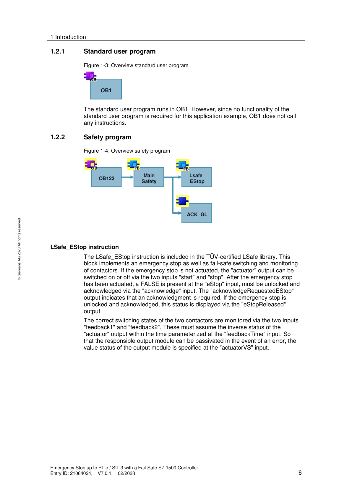

**Okablowanie sprzętowe E-Stop (CPU 1516F + F-DI + F-DQ z dwoma kanałami):**
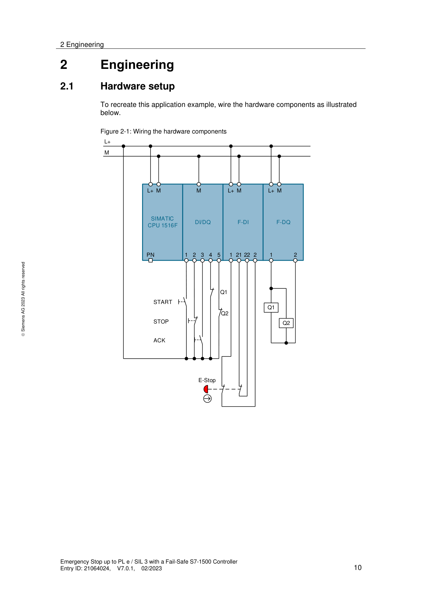

*[PRAWDOPODOBNE] — na podstawie wiedzy domenowej Siemens*
### 13.3. Co to jest feedback circuit (obwód sprzężenia zwrotnego styczników) i dlaczego jest wymagany dla SIL 3 / PL e?  🟡

Feedback circuit to monitorowanie stanu styków pomocniczych (NC, pozytywnie sterowanych) styczników wykonawczych podłączone z powrotem na wejście DI lub F-DI.
Cel: wykrywanie zgrzania (welding) lub zacięcia styku stycznika. Zgrzany styk = kontakt NC pozostaje otwarty mimo odcięcia cewki → feedback = niezgodność → maszyna nie może wystartować.
Dla Cat.4 / PL e / SIL 3 wymagana jest REDUNDANCJA ścieżki wyłączania (2 styczniki szeregowo lub równolegle) PLUS monitoring feedback obydwu — bez tego system nie spełnia DC ≥ 99% w podsystemie Reaction.
Parametr feedbackTime w LSafe_EStop definiuje max czas w którym stycznik musi się przełączyć po komendzie (typowo 100–300ms ⚠️ DO WERYFIKACJI — wartość zależy od rodzaju stycznika, sprawdź w dokumentacji producenta).
Połączenie styczników: pozytywne otwarcie (EN 60947-5-1) — jeśli cewka odcięta, styk NC jest MECHANICZNIE zmuszony do otwarcia nawet przy zgrzaniu. Wymagane przez normy w obwodach Safety.

*[PRAWDOPODOBNE] — na podstawie wiedzy domenowej Siemens*
### 13.4. Co to są CCF (Common Cause Failure) i jakie środki są wymagane dla Cat.4?  🟢

CCF (Common Cause Failure / Usterka wspólnej przyczyny) to scenariusz gdzie JEDNA przyczyna (np. przepięcie, temperatura, EMC, błąd montażu) uszkadza oba kanały redundantnego systemu jednocześnie — co pozbawia system odporności na błędy.
ISO 13849-1 Tablica F.1 wymaga minimum 65 punktów CCF dla architektury Cat.3 i Cat.4. Punkty przyznawane za środki zapobiegawcze, m.in.: separacja/oddzielenie tras kablowych, stosowanie różnych technologii czujników, ochrona przed EMC, uwzględnienie warunków środowiskowych, procedury testowania ⚠️ DO WERYFIKACJI: dokładne wartości punktowe w ISO 13849-1 Tablica F.1 (zależą od wydania normy).
W praktyce: prowadź kable kanału 1 i 2 w osobnych trasach, stosuj różnych producentów czujników (diverse redundancy), zachowuj separację przestrzenną.
Siemens F-DI realizuje diagnostykę cross-circuit (zwarcie między kanałami) i pulse-testing — ale CCF środki leżą po stronie projektu i montażu, nie CPU.

*[PRAWDOPODOBNE] — na podstawie wiedzy domenowej Siemens*
### 13.5. Czy można łączyć przyciski e-stop szeregowo do jednego wejścia F-DI?

Tak, ale z ograniczeniami. EN ISO 13850 i IEC 62061 dopuszczają szeregowe połączenie e-stopów TYLKO jeśli można wykluczyć jednoczesne naciśnięcie dwóch e-stopów ORAZ jednoczesne wystąpienie awarii i naciśnięcia.
Problem: przy szeregowym połączeniu nie wiadomo KTÓRY e-stop zadziałał → brak diagnostyki granularnej. Siemens zaleca oddzielne kanały F-DI per e-stop dla szybszej lokalizacji usterek i lepszej diagnostyki ProDiag/HMI.
Praktyczny kompromis Siemens (wg doc. 21064024): każdy e-stop na osobnej parze kanałów F-DI z 1oo2 evaluation → każdy e-stop widoczny osobno w diagnostyce TIA Portal i na HMI.
Jeśli szeregowo: każde zadziałanie to osobna "supplementary safety function" — analiza ryzyka musi obejmować wszystkie e-stopy indywidualnie.

---

*[PRAWDOPODOBNE] — na podstawie wiedzy domenowej Siemens*

### 13.6. Jak wygląda obliczenie PFHD (Probability of Dangerous Failure per Hour) dla funkcji Safety E-Stop z F-CPU S7-1500F?

**PFHD** to prawdopodobieństwo niebezpiecznej awarii na godzinę — podstawowa miara ilościowa bezpieczeństwa funkcjonalnego. Dla osiągnięcia PL e / SIL 3 sumaryczne PFHD wszystkich podsystemów musi być < 10⁻⁷ (< 1×10⁻⁷ /h).

**Podział na podsystemy (z Application Example Siemens, Entry ID: 21064024):**

Funkcja Safety E-Stop dzieli się na 3 podsystemy, każdy oceniany osobno:

| Podsystem | Komponenty | PFHD | PL |
|-----------|-----------|------|-----|
| **Detection** (detekcja) | Przycisk E-Stop (B10=100.000, 20% dangerous) + F-DI (DC≥99%, 1oo2) | 9,06×10⁻¹⁰ | PL e |
| **Evaluation** (ewaluacja) | CPU 1516F (2,00×10⁻⁹) + ET200MP F-DI (1,00×10⁻⁹) + F-DQ (2,00×10⁻⁹) | 5,00×10⁻⁹ | PL e |
| **Reaction** (reakcja) | 2 styczniki (B10=1.000.000, 73% dangerous, Cat.4, DC≥99%) | 1,45×10⁻⁹ | PL e |
| **SUMA** | — | **7,35×10⁻⁹** | **PL e** |

**Kluczowe parametry wejściowe:**
- **B10** — liczba cykli do 10% awaryjności (producent podaje w karcie katalogowej)
- **Percentage of dangerous failures** — jaki % awarii jest niebezpieczny (E-Stop: 20%, stycznik: 73%)
- **DC (Diagnostic Coverage)** — ≥99% wymagane dla Cat.4/PL e. Realizowane przez: cross-comparison w F-DI (detekcja) i redundantną ścieżkę wyłączania + dynamiczny monitoring styczników (reakcja)
- **CCF ≥ 65 punktów** — wymagane środki przeciw usterkom wspólnej przyczyny wg ISO 13849-1 Tablica F.1

**Narzędzie do obliczeń:** Safety Evaluation w TIA Selection Tool (online) — wprowadzasz komponenty, parametry B10, DC, architekturę → narzędzie oblicza PFHD per podsystem i sumę.

**Praktyka commissioning:** Nie musisz obliczać PFHD samodzielnie — jako commissioner weryfikujesz, czy zastosowane komponenty i architektura odpowiadają obliczeniom z projektu Safety. Sprawdź: czy zastosowano właściwe styczniki (B10 z karty), czy feedback circuit jest podłączony (DC≥99%), czy CCF measures są spełnione (separacja kabli, różne trasy).

> Źródło: Siemens Application Example „Emergency Stop up to PL e / SIL 3 with F-S7-1500", Entry ID: 21064024, V7.0.1, tabele 3-3 do 3-8 [ZWERYFIKOWANE]

### 13.7. Co to jest DC (Diagnostic Coverage) i jak jest osiągane w poszczególnych podsystemach E-Stop?

**DC (Diagnostic Coverage / Pokrycie diagnostyczne)** to miara procentowa zdolności systemu do wykrywania niebezpiecznych awarii zanim doprowadzą do utraty funkcji Safety. DC ≥ 99% jest wymagane dla najwyższych poziomów bezpieczeństwa (Cat.4 / PL e / SIL 3).

**DC w podsystemie Detection (detekcja — E-Stop + F-DI):**
- Realizowane przez **cross-comparison w module F-DI** — moduł porównuje sygnały z dwóch kanałów (1oo2 evaluation). Rozbieżność → discrepancy error → passivation
- E-Stop z pozytywnym otwieraniem (EN 60947-5-1) zapewnia, że mechaniczne zacięcie jest wykrywalne przez drugi kanał
- DC ≥ 99% — cross-comparison wykrywa praktycznie wszystkie awarie w torze detekcji

**DC w podsystemie Evaluation (ewaluacja — F-CPU + F-I/O):**
- Realizowane przez **wewnętrzną diagnostykę F-CPU** — dual-channel processing, program diversification, self-tests
- Wartość PFHD podawana przez Siemens w Safety Evaluation TIA Selection Tool (np. CPU 1516F: 2,00×10⁻⁹)
- Commissioner nie konfiguruje DC ewaluacji — jest wbudowane w F-CPU

**DC w podsystemie Reaction (reakcja — styczniki):**
- Realizowane przez **redundantną ścieżkę wyłączania** (2 styczniki) + **dynamiczny feedback monitoring** (styki pomocnicze NC podłączone do F-DI/DI, monitorowane przez LSafe_EStop → parametr feedbackTime)
- Zgrzany styk jednego stycznika → feedback = niezgodność → blokada restartu → system wykrywa awarię
- DC ≥ 99% wymaga ZARÓWNO redundancji (2 styczniki) JAK I feedback monitoringu — same 2 styczniki bez monitoringu to DC < 99%

**Praktyka commissioning:** Podczas acceptance testu sprawdź: (1) oba kanały E-Stop podłączone i przetestowane (cross-comparison w F-DI), (2) feedback z obu styczników podłączony i monitorowany, (3) feedbackTime ustawiony odpowiednio do typu stycznika (typowo 100–300 ms ⚠️ DO WERYFIKACJI — zależy od producenta stycznika).

> Źródło: Siemens Application Example Entry ID: 21064024, tabele 3-3 i 3-6 — DC≥99% przez cross-comparison i redundant switch-off path [ZWERYFIKOWANE]

### 13.8. Jak wygląda obliczenie czasów odpowiedzi (response time) w funkcji Safety E-Stop i co na nie wpływa?

**Czas odpowiedzi Safety (Safety Response Time)** to czas od wykrycia zagrożenia (naciśnięcie E-Stop) do osiągnięcia stanu bezpiecznego (odcięcie momentu napędu). Jest sumą opóźnień w całym łańcuchu Safety.

**Składowe czasu odpowiedzi:**

| Składowa | Typowy zakres | Źródło opóźnienia |
|---------|--------------|-------------------|
| Czas reakcji F-DI | 2–12 ms | Filtrowanie wejścia + czas cyklu aktualizacji F-I/O |
| Czas cyklu F-runtime group | 10–100 ms | Czas przetwarzania programu Safety (zależy od rozmiaru programu) |
| Czas komunikacji PROFIsafe (round-trip) | 2–20 ms | Zależy od topologii sieci, send clock PROFINET, liczby urządzeń |
| Czas reakcji F-DQ | 1–5 ms | Czas przełączenia wyjścia Safety |
| Czas mechaniczny stycznika | 10–30 ms | Czas otwarcia styku (z karty katalogowej producenta) |
| **Suma (worst case)** | **25–167 ms** | — |

**Czynniki wpływające:**
- **F-monitoring time** — nie jest częścią normalnego czasu odpowiedzi, ale wpływa na worst-case w przypadku utraty komunikacji
- **Czas cyklu F-runtime group** — najważniejszy parametr do optymalizacji. Ustawisz go w Safety Administration → F-runtime group → Max cycle time
- **Filtr wejścia F-DI** — zbyt długi filtr debounce na wejściu F-DI zwiększa czas reakcji

**Narzędzie Siemens:** Arkusz kalkulacyjny Excel do obliczenia response time dostępny na support.automation.siemens.com (Entry ID: 49368678). Wprowadzasz parametry sieci i konfiguracji → arkusz oblicza worst-case response time.

**Praktyka commissioning:** Czas odpowiedzi musi być krótszy niż czas dobiegu maszyny do zatrzymania (wynikający z analizy ryzyka). Jeśli obliczony response time > czas wymagany → skróć cykl F-runtime, zmniejsz filtr wejścia F-DI, upewnij się, że PROFINET send clock jest optymalny. Dokumentuj obliczony response time w protokole Safety Acceptance Test.

> Źródło: Siemens Application Example Entry ID: 21064024 + arkusz kalkulacyjny Entry ID: 49368678 (referencja w SIMATIC Safety - Konfiguracja i programowanie, s.654) [ZWERYFIKOWANE]
## 14. PROFINET — TOPOLOGIA, DIAGNOSTYKA I ZAAWANSOWANE FUNKCJE


### 14.1. Co to jest MRP (Media Redundancy Protocol) i kiedy go stosujesz?  🟢

<span style="color:#1a5276">**MRP**</span> (Media Redundancy Protocol) to protokół redundancji Ethernet w topologii **pierścieniowej** PROFINET.

| MRP wariant | Czas przełączenia | Limit urządzeń | Wymagania |
|-------------|------------------|----------------|-----------|
| **MRP** | ≤ 200 ms | max 50 | Standard switch z PROFINET |
| **MRPD** *(Planned Duplication)* | ≈ 0 ms | zależny od IRT | Tryb IRT, SCALANCE X lub CPU z IRT |

**Zasada działania:** w normalnej pracy pierścień działa jak linia — jeden port blokowany przez **MRM** (Media Redundancy Manager, zazwyczaj switch lub CPU). Przy zerwaniu kabla port otwiera się → ruch odbywa się w drugą stronę.

**Konfiguracja:** TIA Portal → Network view → właściwości switcha/CPU → PROFINET → `Media redundancy` → ustaw role MRM/MRC.

> ⚠️ Termin **„Fast-MRP"** nie jest oficjalnym pojęciem PROFINET — nie używaj go na rozmowie.

> 💡 Stosujesz gdy awaria pojedynczego kabla nie może zatrzymać produkcji.

*[PRAWDOPODOBNE] — na podstawie wiedzy domenowej Siemens*
### 14.2. Co to jest IRT (Isochronous Real-Time) i kiedy jest wymagany?  🟢

<span style="color:#1a5276">**IRT**</span> (Isochronous Real-Time) to tryb PROFINET z deterministyczną synchronizacją cyklu do **250 µs** i jitterem **< 1 µs**, realizowaną sprzętowo (ASIC).

| Tryb | Cykl | Jitter | Realizacja | Zastosowanie |
|------|------|--------|------------|-------------|
| **RT** *(Real-Time, standard)* | ~1 ms | kilka–kilkanaście µs | Programowa | Standardowe I/O, roboty |
| **IRT** *(Isochronous Real-Time)* | do 250 µs | < 1 µs | Sprzętowa (ASIC) | S120 synchroniczny, systemy wieloosiowe |

**Wymagania IRT:**
- Zarządzane switche Siemens (np. SCALANCE X) lub topologia gwiazdki bez zewnętrznych switchów
- CPU obsługujące IRT (S7-1500 — większość modeli z interfejsem PN/DP, w tym standardowe, T-CPU i F-CPU)
- Telegram 105 (DSC) lub 111 dla SINAMICS S120

*[PRAWDOPODOBNE] — na podstawie wiedzy domenowej Siemens*
### 14.3. Jak diagnostykujesz sieć PROFINET w TIA Portal i PRONETA?  🟡

**Diagnostics w TIA Portal:**
1. Online → rozwiń `Devices & Networks` → prawym na urządzenie → `Diagnose`
2. Zakładka `Diagnostics` — stan komunikacji, aktywne alarmy, topology view (połączenia portów)
3. `Go Online` → mapa sieci ze statusami wszystkich urządzeń

**PRONETA** *(bezpłatne narzędzie Siemens)*:
- Standalone diagnostics PROFINET — niezależny od TIA Portal
- Skanuje sieć, pokazuje mapę urządzeń, nazwy PROFINET, IP, porty

> 💡 PRONETA jest szczególnie użyteczny gdy **nie masz projektu TIA** ani dostępu do sterownika — np. przy szybkiej diagnozie u klienta lub sprawdzeniu sieci nieznanego systemu.

*[PRAWDOPODOBNE] — na podstawie wiedzy domenowej Siemens*
### 14.4. Co to jest Shared Device i kiedy go używasz?

**Shared Device** (PROFINET) to urządzenie I/O równocześnie zarządzane przez **dwa kontrolery** — każdy ma przypisany inny zakres modułów.

**Przykład:** ET200SP z 16 slotami:
- CPU A zarządza slotami 1–8 *(program standardowy)*
- CPU B zarządza slotami 9–16 *(program Safety)*

**Stosujesz gdy:**
- Integracja Safety z systemem standardowym obsługiwanym przez różnych dostawców PLC
- Aplikacja Safety i standardowa mają osobne sterowniki

**Konfiguracja:** TIA Portal → właściwości urządzenia → `Advanced Settings` → `Shared Device`

*[PRAWDOPODOBNE] — na podstawie wiedzy domenowej Siemens*
### 14.5. Jak działa Device replacement bez PG (automatic name assignment)?

CPU S7-1500 może automatycznie przypisać nazwę PROFINET nowemu modułowi bez laptopa z TIA Portal.

**Warunek:** TIA Portal → CPU Properties → `Support device replacement without exchangeable medium` *(domyślnie włączone w S7-1500)*

**Procedura:**
1. Wymień fizycznie urządzenie na **ten sam typ katalogowy**
2. Podłącz do sieci PROFINET
3. CPU widzi urządzenie bez nazwy → porównuje topologię (numery portów switch)
4. CPU przypisuje nazwę automatycznie

> ⚠️ **Nie działa** jeśli: nowe urządzenie ma inny typ katalogowy, lub topologia sieci jest niejednoznaczna (duplikaty portów).

*[PRAWDOPODOBNE] — na podstawie wiedzy domenowej Siemens*
### 14.6. Jakie są rodzaje i funkcje przemysłowych switchy Ethernet w sieciach PROFINET?

Przemysłowe switche Ethernet zapewniają komunikację PROFINET w trudnych warunkach. Dzielą się na dwie kategorie:

**Niezarządzalne (Plug & Play):**
- Nie wymagają konfiguracji — podłącz i działa
- Fast Ethernet (10/100 Mb/s) lub Gigabit (10/100/1000 Mb/s), porty SFP (światłowód)
- Niektóre wspierają QoS (priorytet pakietów PROFINET) mimo braku konfiguracji
- Zastosowanie: proste segmenty sieci, rozgałęzienia I/O

**Zarządzalne:**
- Pełna kontrola: VLAN, QoS, RSTP/MRP (redundancja), SNMP, LACP (agregacja łączy), IGMP Snooping
- Diagnostyka: web interface, port monitoring, port mirroring
- Kontrola dostępu: 802.1X, Port Access Control, DHCP Snooping
- Wersje Gigabit z portami SFP, PoE+ (zasilanie kamer, czytników)
- **Wymagane** dla topologii pierścieniowych (MRP), IRT, sieci z diagnostyką

**Wspólne cechy przemysłowych switchy:**
- Metalowa obudowa IP30, montaż DIN, bezwentylatorowe (-40 do 75°C)
- Redundantne zasilanie DC + styk przekaźnikowy Fault
- Odporność EMC wg norm EN, architektura non-blocking

**Na co zwracać uwagę przy PROFINET:**
- QoS musi priorytetyzować ramki PROFINET (VLAN Priority 6/7)
- Zarządzalny switch = wymagany do MRP, IRT, TSN i diagnostyki PROFINET
- W Siemens: seria SCALANCE X (XB/XC/XP/XR) — zintegrowana z TIA Portal

*Źródło: transkrypcje ControlByte*

### 14.7. Co to jest S7 Communication (GET/PUT) i ISO on TCP — kiedy i jak je stosujesz?

S7 Communication to protokół komunikacji PLC–PLC i HMI–PLC firmy Siemens oparty na ISO on TCP (RFC 1006 — TCP/IP z warstwą ISO). Umożliwia bezpośredni dostęp do obszarów pamięci DB, M, I, Q zdalnego sterownika przez sieć PROFINET/Industrial Ethernet.

**Instrukcje GET/PUT:**
- `GET` — odczyt danych ze zdalnego PLC do lokalnego DB (dostępny w S7-1200/1500 z biblioteki Communication).
- `PUT` — zapis danych z lokalnego DB do zdalnego PLC.
- W S7-1200: bloki GET/PUT wbudowane. W S7-1500: dostępne przez Communication → S7 Communication.

**Zastosowania:**
- Komunikacja PLC–PLC między dwoma liniami bez SCADA (PLC A czyta statusy z PLC B).
- HMI firm trzecich (Weintek, Proface, IDEC) obsługujących S7 protocol — mapują bezpośrednio adresy DB, bez GSDML.
- Legacy integracja ze starszymi systemami SCADA (WinCC V6, InTouch) lub sterownikami S7-300/400.

**Kluczowe ograniczenie bezpieczeństwa — S7-1500:**
Domyślnie w S7-1500 dostęp PUT/GET z zewnętrznych urządzeń jest **zablokowany**. Aktywacja: TIA Portal → CPU Properties → Protection & Security → **Permit access with PUT/GET communication**.

> ⚠️ Włączenie PUT/GET obniża poziom bezpieczeństwa — każde urządzenie znające IP PLC może czytać/pisać pamięć bez uwierzytelniania. **Nigdy nie włączaj** w systemach podłączonych do sieci korporacyjnej bez firewalla.

> 💡 Dla nowych integracji z IT preferuj **OPC UA** (TLS 1.2 + certyfikaty). S7/ISO on TCP = szybkie (<1 ms), bez autentykacji. OPC UA = ~10 ms, z szyfrowaniem — wybór dla systemów IT/OT.

*[PRAWDOPODOBNE] — na podstawie wiedzy domenowej Siemens*
### 14.8. Co to jest PROFINET TSN (Time Sensitive Networking) i czym różni się od IRT?  🟢

**PROFINET TSN** to następca IRT — stan standaryzacji IEEE 802.1 definiujący determinizm czasowy w standardowym Ethernet na poziomie sprzętowym, ale bez wymogu specjalistycznych ASIC-ów jak w IRT.

**Kluczowe cechy TSN:**

| Cecha | PROFINET IRT | PROFINET TSN |
|-------|-------------|-------------|
| Standard | Siemens-proprietary ASIC | IEEE 802.1AS/Qbv/Qbu (open standard) |
| Cykl | 250 µs | 31.25 µs – 1 ms (konfigurowalny) |
| Jitter | < 1 µs | < 1 µs |
| Switche | Tylko SCALANCE X (Siemens) | Dowolny switch TSN-compliant (multi-vendor) |
| Topologia | Gwiazdka lub linia (bez obcych switchów) | Elastyczna, mieszana |
| Telegram | 102, 105 (S120) | Te same (102, 105, 111) — zmiana na warstwie transportowej, nie aplikacji |

**Mechanizmy TSN (IEEE 802.1):**
- **802.1AS** — synchronizacja czasu gPTP *(generalized Precision Time Protocol)* z dokładnością < 1 µs
- **802.1Qbv** — Time-Aware Shaper: harmonogramowanie ramek Ethernet w oknach czasowych (time slots)
- **802.1Qbu** — Frame Preemption: przerywanie niskopriorytetowych ramek dla krytycznej transmisji

**Zastosowanie TSN:**
- Synchronizacja osi w systemach MRC (Motion Control Systems) z > 100 osi
- Koroboty (cobots) wymagające deterministycznej synchronizacji z PLC < 1 ms
- Fabryki przyszłości (Industry 4.0) — jeden segment Ethernet dla OT i IT jednocześnie

> ⚠️ **Stan w 2026:** PROFINET TSN jest zdefiniowany w PI (PROFIBUS & PROFINET International) specyfikacji V2.4. Sprzęt Siemens obsługujący pełne TSN: **SIMATIC S7-1500 V3.0+** oraz **SCALANCE XC/XP TSN**. Sprawdź aktualną wersję firmware przed projektem.

> 💡 **Na rozmowie:** pytanie o TSN pojawia się coraz częściej. Kluczowa odpowiedź: TSN = IRT-like deterministm ale na otwartym standardzie IEEE → nie wymaga jednorodnej infrastruktury Siemens.

*Źródło: PROFIBUS & PROFINET International (PI), PROFINET Specification V2.4*

---

## 15. KURTYNY BEZPIECZEŃSTWA I MUTING


### 15.1. Czym różni się kurtyna bezpieczeństwa Type 2 od Type 4 (IEC 61496)?

| Cecha | <span style="color:#1a5276">**Type 2**</span> | <span style="color:#1a5276">**Type 4**</span> |
|-------|-------|-------|
| Diagnostyka | Zewnętrzny moduł testujący (External Test Device) | Wewnętrzna, w każdym cyklu (self-testing) |
| DC | 60–99% | ≥ 99% |
| Max poziom Safety | do <span style="color:#1a5276">**PL d / SIL 2**</span> *(przy architekturze 1oo2)* | do <span style="color:#1a5276">**PL e / SIL 3**</span> |
| Kategoria | Cat.2 lub Cat.3 | Cat.4 |
| Zastosowanie | Lekkie maszyny, dostępy serwisowe | Robotyzowane linie automotive, prasy |

> ⚠️ Type 2 **NIE** jest ograniczona do PL c / SIL 1 — z architekturą 1oo2 osiąga PL d / SIL 2. Częste nieporozumienie na rozmowach!

**W TIA Portal:** podłączasz jako F-DI z `1oo2 evaluation` lub OSSD bezpośrednio na wejście Safety.

*[PRAWDOPODOBNE] — na podstawie wiedzy domenowej Siemens*
### 15.2. Jak działa muting i czym różni się od override?

| Cecha | **Muting** | **Override** |
|-------|-----------|-------------|
| Inicjacja | Automatyczna przez program Safety | Ręczna przez operatora (klucz/przycisk) |
| Powtarzalność | Wielokrotna, automatyczna | Jednorazowe, z licznikiem i logowaniem |
| Warunki | Fizyczne (czujniki mutingowe, okno czasowe) | Brak — tylko dostęp serwisowy |
| Cel | Normalny przepływ materiału | Usuwanie awarii, serwis |
| Status prawny | Element projektu Safety (uwzględniony w ocenie ryzyka) | Środek awaryjny z ograniczonym dostępem |

**Przykład muting:** paleta wjeżdża na taśmę — czujniki mutingowe po obu stronach muszą oba zadziałać w czasie `< 4s`, tylko wtedy kurtyna jest zawieszona na czas przejazdu.

**W TIA Portal:** certyfikowany blok `MUTING_FKT` (z biblioteki LSafe) obsługuje schematy 4-czujnikowe (cross i parallel). Wymaga 2 par czujników i okna czasowego sekwencji.

> ⚠️ Override jest środkiem **wyłącznie awaryjnym** — musi być rejestrowany (kto, kiedy, ile razy). Nie stosuj jako alternatywy dla prawidłowo działającego muting.

*[PRAWDOPODOBNE] — na podstawie wiedzy domenowej Siemens*
### 15.3. Jak podłączasz OSSD (Output Signal Switching Device) kurtyny do modułu F-DI?

**OSSD** to para wyjść kurtyny (OSSD1, OSSD2) — dwa kanały sygnałów bezpieczeństwa z wbudowanym testowaniem impulsowym.

**Podłączenie:**
- `OSSD1` → kanał A modułu F-DI
- `OSSD2` → kanał B modułu F-DI *(para 1oo2)*

> ⚠️ **NIE podłączaj** zasilania `VS*` (pulse test) modułu F-DI do OSSD — kurtyna sama generuje własne impulsy testowe. W TIA Portal ustaw parametr `Sensor supply` tego kanału na `None` / `Disabled` — inaczej impulsy F-DI **zablokują sygnał** z kurtyny.

`Discrepancy time`: dopasuj do specyfikacji kurtyny (zazwyczaj 10–30 ms ⚠️ DO WERYFIKACJI — sprawdź w karcie katalogowej konkretnej kurtyny).

*[PRAWDOPODOBNE] — na podstawie wiedzy domenowej Siemens*
### 15.4. Jakie jest zastosowanie wyjść tranzystorowych z czujników bezpieczeństwa w systemach PLC Safety?

Wyjścia tranzystorowe z czujników bezpieczeństwa, takich jak kurtyny bezpieczeństwa czy skanery, są kluczowe dla systemów PLC Safety, ponieważ umożliwiają dwukanałowe monitorowanie i szybkie wykrywanie awarii.
- **Podłączenie:** Wyjścia tranzystorowe z czujników bezpieczeństwa podłącza się do wejść bezpieczeństwa sterownika PLC.
- **Wykrywanie awarii:**
  - Jeśli jedno z wyjść tranzystorowych ulegnie uszkodzeniu (np. spali się lub będzie miało zwarcie), system Safety natychmiast wykryje sytuację awaryjną.
  - Jest to analogiczne do wykrywania rozbieżności sygnału ("discrepancy error") w przypadku styków mechanicznych.
Praktyczne wskazówki:
- W przypadku uszkodzenia jednego z wyjść tranzystorowych kurtyny bezpieczeństwa, F-CPU natychmiast zgłosi błąd, co zapobiega dalszej pracy maszyny w niebezpiecznym stanie.
*Źródło: transkrypcje ControlByte*

### 15.5. Jakie typy elektrygli bezpieczeństwa (door interlocks) istnieją i jak dobirasz odpowiedni Performance Level?  🟡

**Elektrorygiel bezpieczeństwa** *(door interlock / guard locking)* to urządzenie mechaniczno-elektryczne które:
1. Monitoruje stan osłony (otwarta/zamknięta) — sygnał Safety do F-DI
2. Rygluje osłonę mechanicznie — uniemożliwia otwarcie strefy niebezpiecznej gdy maszyna działa

**Typy elektrygli (na przykładzie Pilz PSENm):**

| Model | Zasada | Max PL | Cechy charakterystyczne |
|-------|--------|--------|-------------------------|
| **PSENmlock mini** | Elektromechaniczny | PL d / Cat.3 | Kompaktowy, proste aplikacje, dedykowany aktuator |
| **PSENmlock** | Elektromechaniczny z klamką | PL e / Cat.4 | Klamka awaryjna (escape release) — operator może wyjść od środka; siła trzymania 7500 N; ryglowanie i odryglowanie impulsowe (bez stałego zasilania cewki); IP67; montaż na profilach 40 mm |
| **PSENslock 2** | Elektromagnetyczny (brak mechaniki) | PL e / Cat.4 | Wbudowany w osłonę, brak ruchomego aktuatora → eliminuje zużycie mechaniczne; trzymanie siłą elektromagnesu |

**Kryteria doboru:**
- **PL d wystarczy?** → PSENmlock mini (tańszy, prostszy montaż)
- **Wymagany PL e?** → PSENmlock lub PSENslock 2
- **Operator może zostać zatrzaśnięty w strefie** → PSENmlock z klamką *(wymóg EN ISO 13849-1)*
- **Aplikacja bez klamki wymaganej, chcesz uniknąć konserwacji mechanicznej** → PSENslock 2

**Podłączenie do PLC Safety:**
- Elektrorygiel ma wyjścia cyfrowe (sygnały Safety) — podłącz do F-DI Siemens z ewaluacją 1oo2
- Cewka ryglowania: steruj przez F-DO lub standardowe DQ + F-PM-E (jeśli SIL 2 wystarczy)
- Sygnały z PNOZmulti: elektrorygiel podłącz do dedykowanego bloku `ML 2 D H M` w konfiguratorze PNOZmulti

**Funkcja Key in Pocket (RFID):**
- Kaseta Pilz PIT z czytnikiem RFID + elektrorygiel = operator musi `zalogować się tagiem RFID` aby wejść do strefy
- PLC monitoruje `czy operator z tagiem JEST w środku` (Key in Pocket) — ryglowanie możliwe tylko gdy wszystkie tagi są na zewnątrz
- Zapobiega przypadkowemu zamknięciu i zaryglowaniu strefy z operatorem wewnątrz

> ⚠️ **Siła trzymania a PL:** sama siła mechaniczna ryglowania nie decyduje o PL — decyduje architektura sygnałów Safety (1oo2, DC, CCF). Elektrorygiel z katalogową wartością PL e osiąga ten poziom tylko przy prawidłowym okablowaniu i konfiguracji systemu Safety.

*Źródło: transkrypcje ControlByte — Pilz PSENmlock, dokumentacja Pilz*

### 15.6. Czym jest czujnik radarowy bezpieczeństwa (np. Pilz PSEN RD 1.2) i kiedy go stosujesz zamiast skanera laserowego?  🟢

**Czujnik radarowy Safety** to urządzenie bezpieczeństwa oparte na emisji fal elektromagnetycznych (radar) do wykrywania obecności osób w strefie niebezpiecznej — zamiast wiązki laserowej.

**Architektura systemu Pilz PSEN RD 1.2:**
- **Czujniki radarowe** — do 5 m zasięgu, kąt ±50° od osi — komunikacja przez magistralę CAN (daisy chain)
- **Analizator** — przetwarza sygnały z czujników, konfiguracja przez Ethernet; wyjścia cyfrowe Safety lub PROFIsafe/Safety over EtherCAT
- 1 analizator obsługuje kilka czujników łącznie

**4 strefy wykrywania na jeden czujnik:**
- Strefa 1 (dalsza, np. 1 m) → spowolnienie robota do prędkości bezpiecznej (tryb SLS)
- Strefa 2 (bliższa, np. 0.4 m) → pełne zatrzymanie (STO/SS1)
- Konfiguracja stref przez oprogramowanie `PSEN RD1 Configurator` (GUI, Ethernet)

**Porównanie radar vs skaner laserowy:**

| Cecha | Skaner laserowy (SICK, PILZ) | Radar PSEN RD 1.2 |
|-------|------------------------------|-------------------|
| Zasada | Wiązka laserowa (optoelektronika) | Fale elektromagnetyczne |
| Wrażliwość na pył/mgłę/dym | Wysoka (błędne detekcje lub zaniki) | Bardzo niska (radar przebija pył) |
| Warunki środowiskowe | Czyste / kontrolowane | Trudne: odlewnie, spawalnie, pilarnie |
| Zasięg | do 5,5 m (safe area scanner) | do 5 m / do 9 m (wersje) |
| Konfiguracja stref | Oprogramowanie + teach-in | `PSEN RD1 Configurator`, 4 strefy/czujnik |
| Koszt systemu | Wyższy per czujnik | Niższy przy dużym obszarze |

**Kiedy stosujesz radar:**
- Spawalnie (iskry, dym), odlewnie (pył metalowy), pilarnie (trociny)
- Strefy z dużym zabrudzeniem gdzie skaner laserowy generuje fałszywe alarmy
- Monitorowanie robotów mobilnych AGV/AMR w trudnym środowisku

> ⚠️ **Integracja z Siemens Safety:** analizator PSEN RD 1.2 obsługuje PROFIsafe → możesz go podłączyć bezpośrednio do F-CPU Siemens przez PROFINET. Alternatywnie: wyjścia cyfrowe Safety (OSSD) → F-DI.

*Źródło: transkrypcja ControlByte — Poradnik Safety Czujnik radarowy Pilz PSEN RD 1.2*

---

## 16. MOTION CONTROL I SINAMICS — PRAKTYKA COMMISSIONING


### 16.1. Co to jest Technology Object (TO) w TIA Portal i jak go używasz?

**Technology Object** to abstrakcja osi w TIA Portal dla motion control *(dostępna w S7-1500, ET200SP CPU)*. TO enkapsuluje napęd + enkoder + parametry osi jako jeden obiekt z gotowym API w SCL.

| Typ TO | Opis | Typowe zastosowanie |
|--------|------|---------------------|
| `TO_SpeedAxis` | Tylko prędkość | Napędy bez pozycjonowania |
| `TO_PositioningAxis` | Pozycjonowanie absolutne/względne | Przenośniki z pozycją |
| `TO_SynchronousAxis` | Synchronizacja do osi master | Systemy wieloosiowe, cam profiles |
| `TO_ExternalEncoder` | Zewnętrzny enkoder bez napędu | Monitoring pozycji, wałek wirtualny |

**API Motion Control (bloki MC_):**
`MC_Power`, `MC_Home`, `MC_MoveAbsolute`, `MC_MoveVelocity`, `MC_Halt`, `MC_Stop`

**Konfiguracja:** TIA Portal → `Add new object` → `Technology object` → wybierz typ → przypisz napęd SINAMICS przez telegram PROFIdrive `105` / `111`.

*[PRAWDOPODOBNE] — na podstawie wiedzy domenowej Siemens*
### 16.2. Jak robisz autotuning napędu G120/V90 w Startdrive?

**Startdrive:** Online → wybierz napęd → `Commissioning` → `Motor identification`

**1. Motor identification (statyczna — silnik stoi):**
- `Motor identification → Static → Start`
- Trwa ~30 s, napęd mierzy rezystancję i induktancję uzwojeń
- Wymagane: uziemienie silnika, napęd w stanie Ready

**2. Speed controller optimization (dynamiczna — silnik się obraca):**
- `Motor identification → Speed controller optimization → Start`
- Silnik wykonuje sekwencję ruchów testowych — **odblokuj strefę bezpieczeństwa**
- Wyznacza `Kp` (wzmocnienie) i `Ti` (czas całkowania) regulatora prędkości

**3. Weryfikacja:** `r0047` ⚗️ DO WERYFIKACJI (status identyfikacji) = `0` → brak błędu, parametry zapisane. Można też sprawdzić po powrócie `p1910` do 0 i braku faultu w `r0945`.

> 💡 Jeśli napęd jest mechatronicznie połączony z ciężką maszyną: uruchom identyfikację na **biegu jałowym** lub przy odłączonej mechanice, a potem ręcznie dostraj `Kp`.

*[PRAWDOPODOBNE] — na podstawie wiedzy domenowej Siemens*
### 16.3. Jakie są najważniejsze parametry SINAMICS G120 które musisz znać?

| Parametr | Opis | Uwaga |
|----------|------|-------|
| `p0840` | ON/OFF1 — źródło sygnału start/stop | Bit z telegramu PROFIdrive lub terminal |
| `p1120` | Czas rampy rozruchu [s] | Od 0 do max prędkości |
| `p1121` | Czas rampy hamowania [s] | |
| `p0922` | Telegram PROFIdrive | Musi zgadzać się z konfiguracją TIA Portal! |
| `r0002` | Aktualny status napędu (bitmapa) | Gotowy / praca / błąd / alarm |
| `r0945[0..7]` | Kody błędów (fault codes) | Pierwsze miejsce diagnostyki po F-alarm |
| `r2110` | Aktualny kod alarmu (warning) | ⚠️ DO WERYFIKACJI — sprawdź w Parameter Manual |
| `p9501` / `p9601` | Parametry Safety (STO enable, SS1) | ⚠️ DO WERYFIKACJI — zakres p95xx/p96xx poprawny, dokładne numery sprawdź w SINAMICS Safety Function Manual |

> ⚠️ Błędny `p0922` (telegram) = brak komunikacji lub brak danych Safety — **zawsze weryfikuj po podłączeniu** nowego napędu.

### 16.4. Jak interpretujesz i kasujesz fault F30001 i F07801 w SINAMICS?

| Fault | Znaczenie | Najczęstsza przyczyna | Diagnoza |
|-------|-----------|----------------------|---------|
| **F30001** | Power unit: Overcurrent — przetężenie wyjścia | Zwarcie kabla silnikowego, doziemienie, zbyt szybka rampa przyspieszenia, błędne dane silnika | Sprawdź kabel megaomomierzem 500V DC między żyłami a PE (≥10 MΩ), zweryfikuj p0304–p0311, zmniejsz rampę p1120 |
| **F07801** | Motor overtemperature (model termiczny) | Przeciążenie, zatkany filtr chłodzenia, za długie rozruchy | Sprawdź `p0335` (klasa izolacji) i wentylację silnika |

> ⚠️ W starszych wersjach firmware G120 `F30001` może oznaczać różne usterki Power Unit — zawsze weryfikuj w Parameter Manual dla konkretnej wersji firmware (`r0018` = wersja firmware).

**Kasowanie faultów:**
- Programowo: `p2103 = 1` lub bit 7 słowa sterowania `STW1` w telegramie PROFIdrive
- Na panelu BOP-2: długie wciśnięcie ESC/OK
- Historia faultów: `r0945[0..7]`

*[PRAWDOPODOBNE] — na podstawie wiedzy domenowej Siemens*
### 16.5. Czym jest SINAMICS G120 i do jakich silników oraz aplikacji jest przeznaczony? 🔴

**SINAMICS G120** to rodzina przemysłowych przemienników częstotliwości (falowników) firmy Siemens przeznaczonych do regulacji prędkości silników indukcyjnych (asynchronicznych) klatkowych w aplikacjach ogólnoprzemysłowych.

**Podstawowe dane:**
- Zakres mocy: 0,37 kW – 250 kW (napięcie 3×400V AC / 3×690V AC)
- Topologia: modułowa — Control Unit (CU) + Power Module (PM) + opcjonalnie BOP (panel operatorski)
- Komunikacja: PROFINET, PROFIBUS, USS, Modbus RTU (zależy od wersji CU)

**Stosowane silniki:**
| Typ silnika | Tryb sterowania G120 | Typowe zastosowanie |
|-------------|---------------------|-------------------|
| Silnik indukcyjny klatkowy (IM) | V/f, Vector (sensorless / closed-loop) | Wentylatory, pompy, przenośniki |
| Silnik indukcyjny z enkoderem | Vector closed-loop | Wciągarki, prasy, mieszalniki |
| PMSM / IPM (IE4/IE5) | Vector PMSM | Sprężarki, pompy wysokosprawne |

**Typowe aplikacje G120:**
- Wentylatory i pompy (redukcja zużycia energii przez regulację prędkości)
- Przenośniki taśmowe i rolkowe
- Mieszalniki, ekstruktory, wciągarki
- Sprężarki powietrza

> ⚠️ **G120 ≠ serwonapęd** — G120 nie jest przeznaczony do precyzyjnego pozycjonowania (brak sprzężenia zwrotnego pozycji w standardzie). Do servo używaj SINAMICS S120 lub V90.

*Źródło: Siemens SINAMICS G120 Getting Started / transkrypcje ControlByte*

### 16.6. Jakie są podstawowe komponenty układu napędowego z SINAMICS G120 i sterownikiem Siemens? 🔴

Kompletny układ z G120 składa się z kilku modułów, które można dobierać niezależnie.

**Architektura modułowa G120:**

| Komponent | Opis | Przykładowe typy |
|-----------|------|-----------------|
| **Control Unit (CU)** | "Mózg" napędu — sterowanie, komunikacja, Safety | CU240E-2 PN, CU250S-2 PN, CU230P-2 |
| **Power Module (PM)** | Przekształtnik mocy — prostownik + falownik IGBT | PM240-2, PM250, PM330 |
| **BOP-2 / IOP** | Panel operatorski — parametryzacja, diagnostyka | BOP-2 (basic), IOP-2 (graficzny) |
| **Silnik** | Silnik indukcyjny klatkowy 3-fazowy | SIMOTICS GP, SD, DP |
| **Sterownik PLC** | Wydaje rozkazy przez PROFINET/PROFIBUS | S7-1200, S7-1500 |

**Połączenia:**
- CU ↔ PM: złącze wewnętrzne (snap-in) lub kabel adaptera
- PLC ↔ CU: PROFINET lub PROFIBUS — telegramy standardowe (1, 20, 352)
- Czujnik temperatury silnika: PTC/KTY84 do wejścia CU (ochrona termiczna)

> 💡 **PM250** ma funkcję odzysku energii (regeneracja do sieci) — stosowany przy wciągarkach i aplikacjach z hamowaniem.

*Źródło: Siemens SINAMICS G120 Getting Started / transkrypcje ControlByte*

### 16.7. Jakie oprogramowanie służy do konfiguracji i uruchomienia SINAMICS G120? 🔴

Do uruchomienia G120 dostępne są trzy narzędzia — wybór zależy od zakresu prac.

| Narzędzie | Zastosowanie | Kiedy używać |
|-----------|-------------|-------------|
| **Startdrive** *(wtyczka TIA Portal)* | Pełna konfiguracja, parametryzacja, diagnostyka online, Safety | Nowe projekty, integracja z PLC |
| **STARTER** *(standalone)* | Parametryzacja offline/online, oscyloskop, Drive Control Chart | Starsze projekty, poza TIA |
| **BOP-2 / IOP** | Parametryzacja ręczna na panelu napędu | Szybki serwis w terenie bez laptopa |
| **SINAMICS Smart Access Module** | Parametryzacja przez Wi-Fi z przeglądarki | Uruchomienie mobilne |

**Startdrive — kluczowe kroki commission:**
1. TIA Portal → Add new device → Drives → SINAMICS G120 → wybierz CU i PM
2. Konfiguracja silnika: `p0304` (napięcie), `p0305` (prąd), `p0307` (moc), `p0310` (częstotliwość), `p0311` (prędkość znamionowa)
3. Identyfikacja silnika: `p1910 = 1` (pomiar stojana w stanie spoczynku) lub `p1960 = 1` (obracająca się identyfikacja)
4. Wybór metody sterowania: `p1300` (0 = V/f, 20 = Vector bez enkodera, 21 = Vector z enkoderem)
5. Download → Compile → Go online → Test Jog

*Źródło: Siemens SINAMICS G120 Getting Started / transkrypcje ControlByte*

### 16.8. Jakie tryby sterowania oferuje SINAMICS G120 i czym się różnią? 🟡

G120 obsługuje kilka metod sterowania silnikiem — dobór zależy od wymagań aplikacji.

| Tryb (`p1300`) | Nazwa | Enkoder | Dokładność prędkości | Zastosowanie |
|----------------|-------|---------|---------------------|-------------|
| **0** | V/f (liniowy) | Nie | ±3–5% | Wentylatory, pompy, proste przenośniki |
| **2** | V/f z FCC (Flux Current Control) | Nie | ±2–3% | Wyższy moment przy małych prędkościach |
| **20** | Vector (bez enkodera) | Nie | ±0,5% | Wymagania na moment, bez czujnika |
| **21** | Vector (z enkoderem) | Tak | ±0,01% | Wciągarki, precyzyjne prędkości |
| **22** | PMSM Vector (bez enk.) | Nie | ±0,5% | Silniki IE4/IE5 bez enkodera |
| **23** | PMSM Vector (z enk.) | Tak | ±0,01% | Silniki IE4/IE5 z enkoderem |

**Telegramy PROFINET dla G120:**
- **Telegram 1** (standardowy): słowo sterujące STW1 + prędkość zadana (16-bit)
- **Telegram 20**: rozszerzony — dodaje prąd, moment, status
- **Telegram 352** (Safety): zawiera PROFIsafe — dla wersji CU z Safety Integrated

> ⚠️ **p1300 = 0 (V/f)** nie reguluje momentu — przy przeciążeniu prędkość spada. Do stałego momentu niezależnego od obciążenia → Vector (p1300 = 20/21).

*Źródło: Siemens SINAMICS G120 Getting Started / transkrypcje ControlByte*

### 16.9. Jak przebiega procedura identyfikacji silnika (Motor ID) w SINAMICS G120 i dlaczego jest niezbędna? 🟡

**Identyfikacja silnika** to pomiar elektrycznych parametrów podłączonego silnika przez napęd G120. Bez niej regulator wektorowy nie działa poprawnie — używa jedynie wartości tabliczkowych, które nie uwzględniają rzeczywistego okablowania i stanu silnika.

**Dwa rodzaje identyfikacji:**

| Parametr | Typ | Opis | Warunek |
|----------|-----|------|---------|
| `p1910 = 1` | **Stojanova (statyczna)** | Pomiar rezystancji stojana R1, indukcyjności rozproszenia — silnik stoi | Silnik może być połączony z maszyną |
| `p1960 = 1` | **Wirująca (dynamiczna)** | Pomiar R1 + R2, indukcyjności magnesującej Lm — silnik obraca się | Silnik musi móc się obracać swobodnie |

**Procedura `p1910` (statyczna) krok po kroku:**
1. Podaj dane tabliczkowe silnika: `p0304`, `p0305`, `p0307`, `p0310`, `p0311`
2. Ustaw `p1910 = 1` → przy następnym rozruchu napęd przeprowadzi pomiar
3. Daj rozkaz RUN (Enable) → napęd wykonuje pomiar (~10–30 s), silnik może lekko drżeć
4. Po zakończeniu `p1910` wraca do 0, parametry `p0350` (R1), `p0356` (Ls) są zapisane
5. Zapisz parametry: `p0971 = 1` (zapis do ROM) lub przez Startdrive → Download

**Dlaczego to ważne:**
- Zbyt wysokie R1 (długi kabel) → regulator wektorowy kompensuje automatycznie po ID
- Silnik inny niż w danych tabliczkowych (np. przewinięty) → ID wykryje różniące się R1
- Brak ID przy `p1300 = 20/21` → moment może być niedokładny o 20–40%

> ⚠️ **Najczęstszy błąd na komisjoningu:** download projektu, pierwsze uruchomienie → silnik wibruje lub nie osiąga zadanej prędkości → przyczyną brak identyfikacji lub błędne dane tabliczkowe.

*Źródło: Siemens SINAMICS G120 Getting Started / transkrypcje ControlByte*

### 16.10. Jak wygląda pełna procedura commissioning SINAMICS G120 z TIA Portal krok po kroku? 🔴

Procedura uruchomienia G120 (CU240E-2 PN + PM240-2) z silnikiem indukcyjnym przez PROFINET.

**Faza 1 — Przygotowanie sprzętowe:**
1. Zamontuj CU na PM (snap-in), podłącz 3×400V AC do PM, silnik do U2/V2/W2
2. Podłącz PTC/KTY84 do CU, kabel PROFINET do switcha/PLC
3. Jeśli Safety: podłącz E-Stop do zacisków STO (DI4/DI5)
4. Włącz zasilanie — BOP-2 pokaże `o` lub alarm A07991 (brak konfiguracji)

**Faza 2 — Konfiguracja w Startdrive:**
1. TIA Portal → `Add new device` → `SINAMICS G120` → wybierz CU i PM
2. Commissioning wizard: dane tabliczkowe silnika (`p0304`–`p0311`), metoda sterowania (`p1300`)
3. Network view: połącz z PLC, ustaw nazwę PROFINET i IP
4. Wybierz telegram `p0922` (1 = standardowy, 20 = rozszerzony, 352 = Safety)
5. Compile + Download HW do PLC

**Faza 3 — Identyfikacja silnika:**
1. Statyczna (`p1910 = 1`): pomiar R1, Lσ przy stojącym silniku (~30s)
2. Opcjonalnie wirująca (`p1960 = 1`): silnik musi się obracać swobodnie — **zabezpiecz strefę**
3. Sprawdź `r0047 = 0` (brak błędów po identyfikacji)

**Faza 4 — Test Jog i weryfikacja:**
1. Startdrive → Control panel → Jog: ustaw 300 rpm, kliknij JOG+
2. Monitoruj `r0021` (prędkość), `r0027` (prąd) — porównaj z tabliczkowymi
3. Kierunek odwrotny? → zamień fazy lub `p1821 = 1`
4. Test STO: aktywuj → `r9722.0 = 1` (STO_Active) → napęd nie generuje momentu

**Faza 5 — Uruchomienie z PLC przez PROFINET:**
1. STW1 = `16#047F` (Enable + RUN), HSW = `16384` → 100% prędkości `p2000`
2. Monitoruj ZSW1 (`r0052`): bit 2 = gotowy, bit 4 = w ruchu
3. Zapisz do ROM: `p0971 = 1`

**Faza 6 — Safety komisjonowanie (jeśli dotyczy):**
1. Startdrive → Safety Integrated → Start safety commissioning
2. Test STO z podpisem → Safety checksum (Safety ID) → zmień hasło

| Parametr diagnostyczny | Opis |
|----------------------|------|
| `r0945` | Kod ostatniego faultu |
| `r0021` | Prędkość aktualna [rpm] |
| `r0027` | Prąd aktualny [A] |
| `r0052` | Słowo statusowe ZSW1 |

> ⚠️ **Telegram `p0922`** musi być identyczny w napędzie i DB PLC. Niezgodność = pozornie poprawna komunikacja, ale bity na złych pozycjach.

> ⚠️ Po zmianie parametrów Safety obowiązkowy **Safety Acceptance Test** z raportem.

> 💡 `Take online device as preset` — TIA Portal wczyta konfigurację z istniejącego napędu jako punkt startowy.

*Źródło: Siemens SINAMICS G120 Getting Started, Startdrive commissioning guide*

### 16.11. Do czego służy blok funkcyjny MC_MoveJog w TIA Portal i jakie są jego podstawowe parametry wejściowe?
Blok funkcyjny MC_MoveJog w TIA Portal służy do sterowania osią z zadaną prędkością, najczęściej wykorzystywany jest do ruchu w trybie ręcznym (JOG), ale może być również używany w normalnym cyklu pracy maszyny.
- Jest to blok typu Enable, co oznacza, że działa tak długo, dopóki na jego wejściu `JogForward` lub `JogBackward` podany jest stan wysoki.
- **`Axis`:** Referencja do obiektu technologicznego (SpeedAxis, PositioningAxis, SynchronousAxis).
- **`JogForward` (BOOL):** Aktywuje ruch osi do przodu.
- **`JogBackward` (BOOL):** Aktywuje ruch osi do tyłu (jednoczesne aktywowanie obu powoduje błąd).
- **`Velocity` (Long Real):** Bezwzględna wartość prędkości, z jaką oś ma się poruszać (np. w mm/s); wartość ujemna jest traktowana jako bezwzględna, a kierunek nadaje `JogForward`/`JogBackward`.
- **`Acceleration`, `Deceleration`, `Jerk` (Long Real):** Parametry dynamiki ruchu; wartość -1 powoduje użycie parametrów skonfigurowanych w obiekcie technologicznym.
- **`PositionControl` (BOOL):** Aktywuje regulator pozycji (domyślnie True).
*Źródło: transkrypcje ControlByte*

### 16.12. Jakie są kluczowe cechy i zachowania bloku MC_MoveJog podczas pracy?
Blok MC_MoveJog charakteryzuje się specyficznymi zachowaniami i wyjściami statusowymi, które informują o jego działaniu i umożliwiają dynamiczną kontrolę ruchu.
- Po aktywacji ruchu (np. `JogForward` = True), na wyjściu `Busy` pojawia się stan True, a po osiągnięciu zadanej prędkości, bit `InVelocity` również przyjmuje wartość True.
- W przypadku błędnej parametryzacji (np. nieodpowiednie przyspieszenie), na wyjściu `Error` pojawia się True, a `ErrorID` wskazuje kod błędu (np. 8004h dla "Illegal acceleration specification").
- Podczas trwania ruchu możliwe jest dynamiczne zmienianie parametrów `Velocity`, `Acceleration`, `Deceleration` i `Jerk` "w locie", co jest przydatne w aplikacjach wymagających adaptacji prędkości.
- Podanie wartości 0 dla `Velocity` podczas aktywnego bloku spowoduje zahamowanie osi i utrzymanie prędkości zerowej.
*Źródło: transkrypcje ControlByte*

### 16.13. Jakie są parametry enkoderów inkrementalnych i absolutnych — rozdzielczość, co mogą i czego nie mogą?  🟡

**Enkoder inkrementalny — kluczowe parametry:**

| Parametr | Typowe wartości | Opis |
|----------|----------------|------|
| **PPR** *(Pulses Per Revolution)* | 100 / 512 / 1024 / 2048 / 4096 / 8192 | Impulsy na jeden pełny obrót osi enkodera |
| **Napięcie zasilania** | 5 V DC (TTL) / 12–24 V DC (HTL) | TTL = linie różnicowe, HTL = sygnał push-pull |
| **Sygnały** | A, B (faza 90°), Z (indeks/zerowy) | A+B → kierunek i liczba impulsów; Z → punkt odniesienia |
| **Max częstotliwość** | do 500 kHz (HTL) / do 1 MHz (TTL) | Limit dla modułu licznikowego lub wejścia HSC |
| **Ochrona** | IP54–IP67 | Zależnie od producenta i montażu |

**Enkoder absolutny — kluczowe parametry:**

| Parametr | Typowe wartości | Opis |
|----------|----------------|------|
| **Rozdzielczość single-turn** | 12–25 bit | 17 bit = 131 072 pozycji/obrót (typowy HIPERFACE/EnDat) |
| **Rozdzielczość multi-turn** | 12 bit dodatkowe | 4096 pełnych obrotów liczonych niezależnie |
| **Interfejs** | SSI, EnDat 2.1/2.2, HIPERFACE, HIPERFACE DSL | Patrz Q16.13 |
| **Czas odpowiedzi** | do 8 µs (EnDat 2.2) | Limit dla krótkiego czasu cyklu napędu |
| **Diagnostyka** | temperatura, błędy wewnętrzne | Dostępna przez EnDat 2.2 i HIPERFACE DSL |

**Co mogą:**
- Precyzyjne pozycjonowanie do ±1 impulsu (inkrementalny) lub ±0.003° przy 17 bit (absolutny)
- Pomiar prędkości: $n = (f 	imes 60) / PPR$ [rpm]
- Multi-turn absolutny: śledzenie pozycji przez wiele obrotów bez zasilania bateryjnego
- Diagnostyka wewnętrzna (temperatura, błędy — EnDat 2.2, HIPERFACE DSL)
- Synchronizacja osi (`TO_ExternalEncoder` w TIA Portal) — wałek wirtualny, master-slave

**Czego nie mogą:**
- **Inkrementalny:** nie pamięta pozycji po zaniku zasilania → **zawsze wymaga homing** po resecie
- **Inkrementalny:** nie ma jednoznacznej pozycji absolutnej → niebezpieczne przy osiach pionowych z obciążeniem
- **Absolutny single-turn:** zlicza tylko jeden obrót → po >360° traci pozycję absolutną
- **Standard enkodery:** nie są certyfikowane Safety → **nie można ich używać dla SLS/SDI** (wymagają enkoder Safety: HIPERFACE Safety lub EnDat Safety)
- **HTL przy dużej prędkości:** ograniczona częstotliwość (~500 kHz) → przy dużej prędkości i wysokim PPR może dochodzić do utraty impulsów

> ⚠️ **Safety funkcje SLS/SDI:** SINAMICS wymaga enkodera certyfikowanego Safety (HIPERFACE Safety lub EnDat Safety) wbudowanego w silnik — standardowy enkoder przemysłowy nie spełnia wymagań IEC 61800-5-2 dla „safe encoder feedback".

> 💡 **Przelicznik rozdzielczości:** enkoder 1024 PPR z interpolacją ×4 (A, /A, B, /B) daje **4096 kroków/obrót** — to standardowe zachowanie modułu HSC lub SINAMICS przy zliczaniu czterech zboczy.

*[PRAWDOPODOBNE] — na podstawie wiedzy domenowej Siemens*
### 16.14. Jakie są interfejsy enkoderów i jak konfigurujesz enkoder w SINAMICS i TIA Portal?  🟡

**Przegląd interfejsów:**

| Interfejs | Typ sygnału | Napięcie | Kierunek | Typowe zastosowanie |
|-----------|------------|----------|----------|---------------------|
| **TTL (A/B/Z)** | Cyfrowy różnicowy | 5 V DC | Jednostronny | S7-1200 HSC, proste osi, tanie aplikacje |
| **HTL (A/B/Z)** | Cyfrowy push-pull | 12–24 V DC | Jednostronny | Środowisko przemysłowe, odporność na EMC |
| **Sin/Cos 1 Vpp** | Analogowy sinusoidalny | 5 V / 12 V | Jednostronny | G120 z CU240E, wysoka rozdzielczość przez interpolację |
| **SSI** | Szeregowy synchroniczny | 5 V / 12 V | Jednostronny | Absolutne enkoderzy starszej generacji |
| **EnDat 2.1/2.2** | Szeregowy, dwukierunkowy | 5 V DC | Dwukierunkowy | S120, SIMOTION, nowoczesne SINAMICS — wysoka dynamika |
| **HIPERFACE** | Sin/Cos + RS-485 | 7–12 V DC | Dwukierunkowy | Silniki Siemens 1FK7/1FT7 (classic) |
| **HIPERFACE DSL** | Cyfrowy, tylko 2 żyły | 5 V DC | Dwukierunkowy | V90 z 1FG/1FK7 — kabel enkodera = kabel mocy |

**Konfiguracja w SINAMICS Startdrive:**

| Parametr | Opis | Przykładowe wartości |
|----------|------|---------------------|
| `p0400` | Typ enkodera | 0=brak, 1=TTL/HTL inkr., 4=SSI, 9=EnDat 2.2, 11=HIPERFACE sin/cos |
| `p0404` | Liczba PPR (impulsy/obrót) | 1024, 2048, 4096, 8192 |
| `p0406` | Napięcie zasilania enkodera | 0=5V, 1=12V, 2=24V |
| `p0408` | Liczba bitów SSI | 10–30 bit |
| `p0418` | Współczynnik interpolacji sin/cos | 1024 lub 2048 |
| `p0431` | Korekta offsetu enkodera (fine adjust) | Wartość w impulsach |

**Konfiguracja Technology Object (TIA Portal Motion Control):**
1. TIA Portal → Technology objects → wybrany TO (`TO_PositioningAxis` lub `TO_ExternalEncoder`)
2. Zakładka `Encoder` → `Encoder type`: Incremental / Absolute
3. Ustaw: `Data exchange type` (np. PROFIdrive, analog sin/cos, HSC module)
4. `Encoder resolution`: podaj PPR lub ilość bitów
5. Dla `TO_ExternalEncoder`: wskaż moduł HSC (S7-1200) lub interfejs sieciowy enkodera (ET200S counting module)

**Wejście HSC (High Speed Counter) w S7-1200/S7-1500 dla enkoderów TTL/HTL:**
- S7-1200: wbudowane HSC (`HSC1–HSC6`) — max **100 kHz** na kanał; moduł SB 1221 High Speed zwiększa do **200 kHz**
- S7-1500T: moduł TM PosInput (6ES7138-6AA01) dla enkoderów sin/cos / TTL do 1 MHz

> ⚠️ **PROFINET enkoder z Technology Object:** telegram `102` (z enkoderem) wymaga że SINAMICS odbiera pozycję z wbudowanego enkodera przez Startdrive, następnie przesyła ją do CPU przez PROFINET jako część PZD telegramu. Telegramy `1` i `20` **nie zawierają** danych enkodera — tylko prędkość!

> 💡 **HIPERFACE DSL:** jeden kabel do serwosiłnika zawiera jednocześnie zasilanie silnika (3 fazy + PE) i sygnał enkodera DSL — brak osobnego kabla enkodera. W Siemens: V90 współpracuje z silnikami 1FL6 (enkoder wbudowany), natomiast 1FK7 używa DRIVE-CLiQ z S120/S210 (OCT — One Cable Technology, Siemens Motion Connect kable).

*[PRAWDOPODOBNE] — na podstawie wiedzy domenowej Siemens*
### 16.15. Czym są silniki IE5 (IPM / synchroniczne z magnesami trwałymi) i dlaczego zastępują klasyczne silniki indukcyjne w nowych projektach?  🟢

**Silniki IE5** *(Ultra-Premium Efficiency)* to silniki synchroniczne z magnesami trwałymi wbudowanymi w wirnik (IPM — Interior Permanent Magnet). Są najwyższą klasą sprawności według IEC 60034-30-1.

**Klasy sprawności silników (IEC 60034-30-1):**

| Klasa | Opis | Sprawność (4-bieg., 11 kW) |
|-------|------|---------------------------|
| IE1 | Standard | ~89% |
| IE2 | High Efficiency | ~91% |
| IE3 | Premium | ~92% |
| IE4 | Super Premium | ~94% |
| **IE5** | **Ultra Premium** | **≥ 96%** |

**Dlaczego IE5 / IPM zastępuje silnik indukcyjny klatkowy:**
- **Sprawność:** IE5 = ≥96% vs IE3 = ~92% → mniejszy pobór prądu, oszczędność energii
- **Regulator:** PMSM wymaga enkodera i wektorowego sterowania (FOC) — nie można go uruchomić przez prosty V/f; wymaga SINAMICS z silnikowym modułem
- **Wygląd:** silnik IE5 (np. SIMOTICS GP 1LA, seria 1PH PMSM) wygląda identycznie jak klasyczny silnik indukcyjny — tylko tabliczka znamionowa zdradza różnicę
- **Wymaganie unijne:** od 2023 roku w EU obowiązkowy IE3 dla silników ≥750W; nowe projekty kierują się w stronę IE4/IE5

**IE5 w praktyce commissioning:**
- Tabliczka znamionowa: `IPM` lub `PMSM` zamiast `IM` (Induction Motor)
- Parametryzacja napędu: `p0300 = 2` *(PMSM)* zamiast `p0300 = 1` *(IM)*
- Enkoder obowiązkowy (inkrementalny lub absolutny wbudowany) — napęd musi znać pozycję kątową wirnika z magnesami trwałymi, aby prawidłowo generować pole stojana (FOC)
- Identyfikacja silnika (p1910/p1960) przebiega inaczej niż dla IM — uwzględnia magnetyzację stałą magnesów

> ⚠️ **Najczęstszy błąd:** operator wymienia silnik IE3 (IM) na IE5 (IPM) i pozostawia `p0300 = 1` — napęd próbuje magnetyzować silnik synchroniczny jak indukcyjny → natychmiastowy fault lub zniszczenie uzwojeń.

> 💡 **Na rozmowie:** pytanie *"co zrobisz gdy dostajesz silnik który wygląda jak standardowy trójfazowy ale napęd nie chce się uruchomić?"* → sprawdź typ: `IM` vs `PMSM/IPM` na tabliczce → ustaw `p0300` odpowiednio.

*Źródło: transkrypcja ControlByte — przegląd silników w aplikacjach Motion Control*

---

## 17. REALNE SCENARIUSZE COMMISSIONING


### 17.1. Maszyna startuje sama po ACK bez przycisku Start — co sprawdzasz?

**Systematyczna checklista:**

- [ ] **Logika inicjalizacji OB100:** czy po resecie CPU warunek Start jest `TRUE` bez oczekiwania na zbocze?
- [ ] **HMI — typ eventu przycisku Start:** `Press` (zbocze) czy `State` (poziom)? Poziom = `TRUE` przez cały czas trzymania → program widzi ciągły sygnał start
- [ ] **Logika startowa:** czy warunek to zbocze narastające (`R_TRIG`) czy poziom `BOOL`? Maszyny **wymagają zbocza** — jednorazowy impuls
- [ ] **Fizyczny przycisk:** czy styk NO nie jest przyklejony lub przewód zwarty?
- [ ] **Safety ACK + start w logice:** jeśli ACK kasuje blokadę i jednocześnie zmienna startowa jest aktywna (nie skasowana po awaryjnym zatrzymaniu) — maszyna ruszy

> ⚠️ **Pułapka Safety + Start:** logika musi wymagać nowego impulsu Start **po** ACK. ACK samo w sobie nie powinno uruchamiać napędów.

*[PRAWDOPODOBNE] — na podstawie wiedzy domenowej Siemens*
### 17.2. HMI pokazuje alarm którego nie ma w projekcie TIA Portal — skąd pochodzi?

**Możliwe źródła „obcych" alarmów:**

| Źródło | Opis | Gdzie szukać |
|--------|------|-------------|
| **System alarm** *(auto)* | Generowany przez TIA Portal dla zdarzeń sprzętowych (moduł offline, błąd Safety, utrata komunikacji) | HMI → `System alarms` → `Diagnostic alarms` |
| **Stary projekt HMI** | Alarm do tagu który już nie istnieje — „stale" wpisy w alarm buffer | TIA Portal → HMI Alarms → Discrete Alarms → szukaj po numerze |
| **Alarm z urządzenia** | Napęd/robot wysyła alarm diagnostyczny przez PROFINET alarm mechanism | WinCC → `Diagnostic alarms` lub alarm z adresem sprzętowym |

> 💡 **Procedura:** TIA Portal → HMI Alarms → Discrete Alarms / Analog Alarms — filtruj po numerze alarmu. Jeśli brak → sprawdź `System alarms → Diagnostic alarms`.

*[PRAWDOPODOBNE] — na podstawie wiedzy domenowej Siemens*
### 17.3. Moduł ET200SP nie pojawia się w sieci po podłączeniu — lista kroków diagnostycznych.

- [ ] **Kabel fizyczny:** czy dioda LINK/ACT na porcie modułu lub switcha miga? Zamień kabel.
- [ ] **Zasilanie BusAdapter:** ET200SP wymaga zasilania `BA 2×RJ45` lub `BA SCRJ` — czy `L+` i `M` podłączone?
- [ ] **Nazwa PROFINET:** brak nazwy → moduł nowy/po resecie → TIA Portal → Online → `Accessible devices` → przypisz nazwę
- [ ] **Duplikat nazwy PROFINET:** dwa moduły o tej samej nazwie → konflikt — sprawdź całą sieć przez PRONETA
- [ ] **Switch / VLAN:** czy moduł w tej samej VLAN co CPU? *(SCALANCE CLI lub Web GUI → port status)*
- [ ] **Mapa topologii:** Online → `Devices & Networks` → Topology view → czy moduł widoczny?
- [ ] **GSDML / firmware:** stary hardware z nowym projektem może wymagać aktualizacji firmware modułu

> 💡 PRONETA → skan sieci → sprawdź czy moduł odpowiada na ARP — szybki sposób bez TIA Portal.

*[PRAWDOPODOBNE] — na podstawie wiedzy domenowej Siemens*
### 17.4. Napęd SINAMICS G120 świeci ciągłym czerwonym LED i nie kasuje się — co robisz?  🟢

Ciągły czerwony RDY LED = aktywny <span style="color:#c0392b">**fault**</span> (F-alarm), nie alarm (A-alarm, który jest żółty).

**Procedura diagnostyki:**
1. Odczytaj kod: `r0945[0]` w Startdrive (online) lub na panelu BOP-2 → zapisz `r0945[0..7]`
2. Sprawdź w Parameter Manual: każdy `Fxxxxx` ma opis przyczyny i działania korygującego
3. Najczęstsze: `F30001` (przetężenie wyjścia / overcurrent), `F07800-F07802` (temperatura silnika), `F30002` (przepięcie / nadnapięcie DC-bus — overvoltage), `F30004` (przegrzanie radiatora — overtemperature heatsink)

> ⚠️ Jeśli fault **kasuje się ale wraca natychmiast**: przyczyna fizyczna wciąż aktywna — nie idź dalej bez usunięcia przyczyny.

> ⚠️ Fault nie daje się skasować → sprawdź czy **STO nie jest aktywne** (`r9772` = STO status) — napęd nie ruszy ani się nie skasuje przy aktywnym STO.

> 💡 Jeśli kasowanie przez sieć nie działa: hardware reset — chwilowe odcięcie zasilania 24V Control Unit *(zachowaj 400V Power Module)*.

*[PRAWDOPODOBNE] — na podstawie wiedzy domenowej Siemens*
### 17.5. CPU przeszło w STOP podczas produkcji — pierwsze 3 kroki.  🟢

CPU w STOP = zatrzymanie wszystkich wyjść. Prawidłowa kolejność: odczyt → diagnoza → przyczyna → **dopiero wtedy** akcja.

**Kroki:**
1. **Odczytaj informację ze sprzętu:** wyświetlacz S7-1500 pokazuje skrócony opis przyczyny STOP. Dioda RUN/STOP: ciągłe żółte = STOP. Zanotuj wszystko zanim podłączysz się do sieci.
2. **Diagnostics buffer w TIA Portal:** Online → CPU → `Diagnostics → Diagnostic buffer`. Ostatni wpis = przyczyna zatrzymania.

| Typowa przyczyna STOP | Co oznacza |
|----------------------|------------|
| `Time error OB cyclic` | Scan time przekroczony — za dużo kodu lub zablokowane wywołanie FB |
| `STOP requested by program` | Instrukcja `STP` w kodzie — szukaj w bloku aktywnym w chwili STOP |
| `Hardware failure` | Moduł I/O wypadł z konfiguracji lub zwarcie |
| `Safety STOP` | F-CPU wykryło błąd Safety — sprawdź F-Runtime group |

3. **Nie uruchamiaj niczego** zanim nie znasz przyczyny.

> ⚠️ **Zakaz Download przed diagnozą:** Download kasuje Diagnostics buffer na CPU — tracisz ślad przyczyny. Zawsze odczytaj Diagnostic buffer PRZED downloadem.

> 💡 **Warm restart a STOP:** `Warm restart` (Run) bez zrozumienia przyczyny = maszyna może natychmiast znów wejść w STOP. Jeśli przyczyną jest zwarcie I/O, warm restart tylko powtórzy błąd.

*[PRAWDOPODOBNE] — na podstawie wiedzy domenowej Siemens*
### 17.6. Po czym poznajesz, że projekt w TIA Portal jest skalowalny?  🟡

Skalowalny projekt TIA Portal to taki, który można rozszerzać (nowe urządzenia, sekcje, osie) bez przepisywania istniejącego kodu — tylko przez parametryzację lub powielanie gotowych wzorców.

**Cechy skalowalnego projektu:**
- **Global Library / Project Library (PLCtype):** każda nowa instancja = przeciągnięcie z biblioteki. Zmiana w typie → aktualizacja wszystkich instancji jednym kliknięciem.
- **UDT jako interfejs danych:** struktury UDT dla każdego urządzenia (np. `typeValve`: cmd, status, alarm, mode) — dodanie nowego zaworu = 1 zmienna UDT.
- **Tablice + pętle FOR:** zamiast 20 identycznych sieci LAD — jeden FB parametryzowany indeksem. Dodajesz urządzenie 21 przez zwiększenie `MAX_DEVICES`.
- **Symbolic addressing only:** zmiana konfiguracji sprzętowej (nowa karta IO, zmiana slotu) nie łamie programu.
- **Rezerwa slotów i adresów PROFINET:** nowe moduły dodajesz bez przesypywania konfiguracji.
- **Modularny kod Safety:** każda strefa jako osobny F-FB z własnym `ACK` i `PASS_OUT`.
- **Spójna konwencja nazw:** np. `++STATION_Drive01` — autogeneracja dokumentacji i wyszukiwanie po wzorcu.

> ⚠️ **Red flags braku skalowalności:** copy-paste FC z ręczną edycją numerów, absolutne adresy `I0.0`/`Q0.0`, brak bibliotek, każdy napęd w osobnym OB.

> 💡 **Na rozmowie:** skalowalność = biblioteki + UDT + tablice. Pokaż przykład: "Mamy 12 zaworów w tablicy, dodanie 13. to zmiana jednej stałej `MAX_VALVES`."

*[PRAWDOPODOBNE] — na podstawie wiedzy domenowej Siemens*
### 17.7. Co sprawdzasz na FAT (Factory Acceptance Test) dla instalacji z Safety? 🟡
FAT (Factory Acceptance Test) to weryfikacja systemu u producenta maszyny przed wysyłką do klienta. Dla Safety obejmuje funkcjonalne testy każdej funkcji bezpieczeństwa zgodnie z wymaganiami normy EN ISO 13849-1 i dokumentacją techniczną.
- Weryfikacja F-Signatures (F-DB i F-CPU): sprawdź match między TIA Portal a CPU → F-Program → Signature Comparison
- Test każdego E-Stop fizycznie: wciśnij → CPU pasywuje → wyjścia = substitute values → zwolnij → ACK → restart
- Test discrepancy: symuluj opóźnienie jednego kanału 1oo2 > discrepancy time → passivation
- Test muting: aktywuj oba czujniki muting w oknie czasowym → kurtyna działa → odblokowanie
- Test napędów Safety: sprawdź STO, SS1, SLS każdej osi — porównaj z Safety Matrix
- Documented: każdy test zapisany w protokole FAT z datą, podpisem, numerem PO
- Checklista: F-Version, F-Address, F-Monitoring Time, passivation time, substitute values

*[PRAWDOPODOBNE] — na podstawie wiedzy domenowej Siemens*
### 17.8. Jak realizujesz SAT (Site Acceptance Test) po dostarczeniu maszyny do klienta? 🟡
SAT (Site Acceptance Test) to weryfikacja systemu na miejscu klienta po instalacji. Różni się od FAT tym, że uwzględnia rzeczywiste środowisko: okablowanie obiektowe, medium procesowe, warunki bezpieczeństwa operacyjnego.
- Krok 1: Upload projektu z CPU i porównaj z referencją z FAT (Project → Compare)
- Krok 2: Sprawdź F-Signature CPU vs wartość zapisana w FAT-protokole — muszą być identyczne
- Krok 3: Fizyczny test E-Stop i kurtyn w normalnych warunkach pracy maszyny
- Krok 4: Próba produkcyjna z rzeczywistym materiałem (opcjonalnie)
- Krok 5: Przeszkolenie operatorów i techników serwisu
- Dokumentacja: protokół SAT + podpis inżyniera Safety i przedstawiciela klienta
- Jeśli F-Signature różni się od FAT → STOP — ktoś zmienił program po FAT, eskalacja

*[PRAWDOPODOBNE] — na podstawie wiedzy domenowej Siemens*
### 17.9. Jak podejść do diagnostyki nieznanego lub legacy projektu TIA Portal, który przejmujesz po raz pierwszy? 🟡

**Scenariusz:** dostajesz maszynę z projektem TIA Portal od innego integratora lub starszą wersję — musisz zrozumieć co robi i ewentualnie poprawić usterki.

**Krok po kroku — archeologia projektu:**
1. **Wersja TIA Portal:** sprawdź `~AL\project.hmi` lub po prostu próbuj otworzyć — TIA informuje o wersji źródłowej; pobierz właściwą wersję (nie uaktualniaj bez decyzji)
2. **Firmware CPU:** Online → Device → Properties → porównaj z wymaganiami projektu; `r0018` = firmware napędu
3. **Upload z CPU:** Online → Upload Device as New Station — zawsze upload najpierw zanim cokolwiek zmienisz; masz wtedy rzeczywisty state PLC
4. **Compare Online/Offline:** Online → Compare → rozwiń różnice; każda różnica = ktoś zmieniał na żywym obiekcie bez zapisu projektu
5. **Diagnostics Buffer:** Online → Diagnostics → Diagnostics buffer — historia alarmów sprzętowych CPU; szukaj wzorców czasowych
6. **Cross-References:** w TIA Portal: Extras → Cross-references → szukaj gdzie i jak używana jest zmienna alarmowa
7. **F-Signature:** jeśli Safety — odczytaj F-Signature i porównaj z dokumentacją SAT; brak dokumentacji = czerwona flaga
8. **Komentarze w kodzie:** często brakuje — szukaj w historii edycji (`git blame` o ile projekt jest w SVN/GIT) lub wypytaj poprzedniego komisjonera
9. **HMI Cross-reference:** czy zmienne HMI odpowiadają zmiennym PLC (tag table); rozbieżności = źródło problemów

**Zasady bezpieczeństwa:**
- Nie zmieniaj nic bez zrozumienia konsekwencji
- Rób kopię zapasową przed każdą modyfikacją (Project → Save As)
- Dokumentuj każdą zmianę nawet jeśli projekt nie miał żadnej dokumentacji
- Jeśli Safety — każda zmiana wymaga nowego SAV/F-Signature i akceptacji klienta

> ⚠️ **Pułapka:** Upload z CPU nie zawsze daje pełny projekt — symbolicznie nazwane zmienne mogą być zastąpione adresami absolutnymi; komentarze i UDT mogą być stracone.

> 💡 **Na rozmowie:** pokaż, że znasz procedurę upload + compare + diagnostics buffer — to klasyczny scenariusz serwisowy. Wspomnij o F-Signature dla projektów Safety.

*Źródło: praktyka commissioning, transkrypcja ControlByte*

---

## 18. TIA PORTAL — ZAAWANSOWANE FUNKCJE

### 18.1. Co to są Project Libraries vs Global Libraries i kiedy używasz każdej?

Biblioteki TIA Portal umożliwiają wielokrotne użycie i wersjonowanie bloków, typów PLC, ekranów HMI i UDT.

| Cecha | Project Library | Global Library |
|-------|----------------|----------------|
| **Zakres** | Jeden projekt TIA Portal | Wiele projektów (plik `.al17`) |
| **Zastosowanie** | Standardy jednej linii/zakładu | Firmowe szablony wieloprojektowe |
| **Przykłady** | FB napędu specyficzny dla klienta | SICAR Tec Units, certyfikowane F-bloki |
| **Wersjonowanie** | Tak (w ramach projektu) | Tak (niezależnie od projektu) |
| **Udostępnianie** | Export/import między projektami | Otwierasz plik `.al17` bezpośrednio |

**Workflow:**
1. Rozwijaj i testuj elementy w **Global Library**
2. Insertuj do **Project Library** w docelowym projekcie
3. Deploy do programu PLC jako instancje

> 💡 **Wersjonowanie:** zmiana w Global Library (nowa wersja FB) → w każdym projekcie znajdziesz alert "Update available" — aktualizujesz selektywnie, nie przez przypadek.

*[PRAWDOPODOBNE] — na podstawie wiedzy domenowej Siemens*
### 18.2. Jak robisz partial download żeby nie resetować całego CPU?

TIA Portal rozróżnia typy downloadów — wybierz najmniej inwazyjny dla sytuacji:

| Typ downloadu | CPU w RUN? | Kiedy używać |
|---------------|-----------|-------------|
| **Software (only changes)** | ✅ Tak | Poprawka kodu, nowy blok — bez zmiany HW |
| **HW and SW (only changes)** | ⚠️ Krótki STOP | Nowy moduł IO, zmiana IP, zmiana konfiguracji |
| **All** | ❌ STOP wymagany | Pełne wgranie projektu — unikaj na produkcji |

**Procedura partial download:**
1. Skompiluj projekt `Compile → All` — brak błędów = warunek konieczny
2. `Compare offline/online` — sprawdź diff co faktycznie się różni przed downloadem
3. `Download to device → Software (only changes)` → zaznacz CPU → `Load`
4. Potwierdź synchronizację — TIA Portal pokaże listę zmienionych bloków

> ⚠️ **Safety partial download:** zmiany w programie Safety zawsze wymagają akceptacji F-signature przez uprawnionego użytkownika. Safety runtime przechodzi przez `LOCK → RUN` (~1s). Standard może działać, ale napędy Safety (STO) chwilowo nieaktywne.

> 💡 **Sprawdź przed:** `Online & Diagnostics → Compare` — zidentyfikuj różnice. Nieoczekiwane zmiany (np. ktoś edytował online) staną się widoczne zanim je nadpiszesz.

*[PRAWDOPODOBNE] — na podstawie wiedzy domenowej Siemens*
### 18.3. Do czego służy OPC UA w TIA Portal i jak go aktywujesz?

**OPC UA** (Open Platform Communications Unified Architecture) to otwarte, bezpieczne API do integracji PLC z systemami SCADA, MES, ERP, chmurą i IT (Python, C#, Java). Kluczowe zalety nad S7-Protocol/Modbus: standaryzacja, szyfrowanie TLS 1.2, certyfikaty X.509, model obiektowy (nodes, methods, events).

**Aktywacja w TIA Portal:**
1. CPU properties → `OPC UA` → `Server` → `Enable OPC UA server`
2. Ustaw port (domyślny: `4840`) i certyfikat bezpieczeństwa
3. Wybierz węzły: `All tags` (wszystkie tagi PLC) lub `Selected DBs` (wybrane bloki danych)
4. Skonfiguruj `Security Policy`: `None` (dev), `Basic256Sha256` (produkcja)
5. Pobierz certyfikat serwera dla klienta — potrzebny do połączenia

**Typowe zastosowania:**
- WinCC Advanced/Unified → monitoring i SCADA
- Node-RED → dashboard prototypowy, IoT gateway
- Python `asyncua` library → analityka danych, integracja z chmurą
- Kepware / Ignition → integracja MES/ERP

> ⚠️ **Ograniczenia OPC UA:** opóźnienie ~10–50ms vs PROFINET RT <1ms. Nie używaj OPC UA do sterowania real-time — wyłącznie do monitoringu, parametryzacji, zbierania danych.

> 💡 **Security w produkcji:** zawsze włącz `Basic256Sha256` + certyfikaty. OPC UA bez szyfrowania to otwarta furtka do odczytu (i zapisu!) wszystkich tagów PLC.

*[PRAWDOPODOBNE] — na podstawie wiedzy domenowej Siemens*
### 18.4. Czym jest SIMATIC ProDiag i jak konfigurujesz pierwsze monitory diagnostyczne? 🟡
ProDiag (Process Diagnostics) to narzędzie TIA Portal do tworzenia automatycznej diagnostyki maszynowej generując alarmy HMI wprost z warunków logicznych PLC bez programowania w blokach.
- Dostępny od: TIA Portal V14 SP1, dla S7-1500 i ET200SP z CPU
- Konfiguracja: Devices & Networks → CPU → ProDiag → Add monitor
- Monitor = warunek logiczny (np. „siłownik nie dosunął się w 5s") → automatyczny alarm HMI + log
- Typy monitorów: Supervision (stan), Process Monitor (czas reakcji), Travel movement (pozycja)
- Krok 1: Zdefiniuj warunek triggering (bool z programu PLC)
- Krok 2: Przypisz tekst alarmu (wielojęzyczny) i kategorie (Error, Warning, Info)
- Krok 3: Skompiluj → alarmy automatycznie pojawiają się w HMI bez dodatkowej konfiguracji WinCC
- Korzyść: czas od awarii do diagnozy przyczyny bez przeglądania kodu — operator widzi kontekst

---

*[PRAWDOPODOBNE] — na podstawie wiedzy domenowej Siemens*
## 19. COMMISSIONING — DODAWANIE STACJI I URZĄDZEŃ DO PROJEKTU


### 19.1. Jak krok po kroku dodajesz nową wyspę sygnałową ET200SP Safety (F-peripheral) do istniejącego projektu?  🟡

Procedura commissioning nowej stacji ET200SP z modułami F-DI/F-DQ:

**Faza 1 — Projekt TIA Portal (offline):**
1. `Devices & Networks` → `Add new device` → `ET 200SP` → wskaż numer katalogowy IM (np. `6ES7155-6AU01-0BN0`)
2. Ustaw IP address i PROFINET device name (unikalne w sieci)
3. Dodaj moduły w slotach: BaseUnit + F-DI/F-DQ — kolejność slotów = kolejność fizyczna na szynie
4. Każdy moduł F: `Properties → Safety` → ustaw **F-Address** (unikalny w ramach F-CPU, zakres 1–65534)
5. Parametry F: discrepancy time (10–200ms), sensor supply, substitute value, F-monitoring time
6. `Compile → Hardware + Software (rebuild all)`

**Faza 2 — Przypisanie adresu PROFINET (online):**
1. `Go online` → `Assign PROFINET device name` → wyszukaj po MAC → przypisz nazwę

**Faza 3 — Przypisanie PROFIsafe address:**
1. Prawym na moduł F → `Assign PROFIsafe address` → diody LED migają → potwierdź
2. Adres zapisywany w elemencie kodującym (EK) na BaseUnit — nie przepada przy wymianie modułu

**Faza 4 — Download i weryfikacja:**
1. `Download to device → Hardware and software (only changes)`
2. Sprawdź Diagnostics buffer — brak nowych błędów, moduły online zielone
3. Monitoruj F-DB: `PASS_OUT = FALSE` = prawidłowa praca
4. Test Safety: zasymuluj zadziałanie czujnika → sprawdź passivation i reakcję logiki

**Typowe pułapki:**
- IP kolizja lub brak 24V BusAdapter → IM nie odpowiada na ping
- Czerwony LED F-DI → sprawdź okablowanie czujnika lub parametr Sensor supply
- Typ BaseUnit (P/A) musi pasować do modułu I/O

> ⚠️ **F-Address musi być unikalny w całym F-CPU** — duplikat = błąd PROFIsafe.

> 💡 **EK (element kodujący):** wymiana uszkodzonego modułu F nie wymaga ponownego przypisania F-Address.

---

*[PRAWDOPODOBNE] — na podstawie wiedzy domenowej Siemens*
### 19.2. Jak dodajesz wyspę pneumatyczną SMC (seria EX600) do projektu TIA Portal przez PROFINET?

Wyspa zaworów pneumatycznych SMC EX600 komunikuje się przez PROFINET jako standardowe urządzenie I/O (nie Safety).

**Krok 1 — Instalacja GSDML:**
- Pobierz GSDML ze strony SMC (`smcworld.com` → Support) — wersja musi odpowiadać hardware revision z tabliczki
- TIA Portal → `Options → Manage GSD files → Install` → wskaż plik `.xml`

**Krok 2 — Konfiguracja w TIA Portal:**
1. Przeciągnij `EX600` z Hardware Catalog do Network view, połącz z CPU
2. Ustaw IP Address i PROFINET device name
3. Device view: skonfiguruj sloty modułów zaworów (1 bajt = 8 zaworów) — liczba = fizyczna konfiguracja
4. Opcjonalnie: moduł diagnostyczny i moduł wejść (DI) czujnikowych

**Krok 3 — Przypisanie nazwy PROFINET:**
1. `Assign PROFINET device name` → wyszukaj po MAC → przypisz
2. Alternatywnie: wbudowany web server wyspy (domyślne IP `192.168.0.1`)

**Krok 4 — Program i test:**
1. Adresy Q sterują elektrozaworami: `Q0.0 = TRUE` → zawór 1 otwarty
2. Test: `Force Values` w TIA Portal → sprawdź fizycznie czy zawór zadziałał
3. Sprawdź ciśnienie zasilania wyspy (4–7 bar) — brak ciśnienia = zawory aktywne ale siłownik stoi

**Typowe pułapki:**
- GSDML niezgodna z hardware revision → `Invalid device configuration`
- Liczba slotów w TIA ≠ fizyczna → `Configuration mismatch`
- Duplikat nazwy PROFINET w sieci → brak komunikacji

> ⚠️ **GSDML musi odpowiadać hardware revision** z tabliczki znamionowej urządzenia.

> 💡 Większość urządzeń PROFINET (SMC, WAGO, Festo) ma wbudowany web server — szybka diagnoza bez TIA Portal.

---

*[PRAWDOPODOBNE] — na podstawie wiedzy domenowej Siemens*
### 19.3. Jak krok po kroku dodajesz napęd SINAMICS G120 przez PROFINET do projektu TIA Portal?

**Faza 1 — Przygotowanie sprzętowe:**
1. Sprawdź CU (musi obsługiwać PROFINET: CU240E-2 PN lub CU250S-2 PN) i Power Module (PM)
2. IP można przypisać przez TIA Portal (auto-assign), BOP2 (parametry PROFINET `p0918`–`p0924` ⚗️ DO WERYFIKACJI) lub Startdrive
3. Sprawdź firmware: `r0018` na BOP2 — zapisz wersję dla kompatybilności z TIA Portal

**Faza 2 — Konfiguracja w Startdrive (TIA Portal):**
1. `Add new device` → `SINAMICS G120` → wybierz CU i PM
2. Alternatywnie: `Accessible devices` → wykryj online → `Take online device as preset` (zachowa parametry)
3. Network view: połącz z PLC, ustaw IP i PROFINET device name
4. Telegram PROFIdrive `p0922`: 1 = standardowy, 20 = rozszerzony, 352 = Safety Integrated
5. Drive parameters: dane tabliczkowe silnika lub numer katalogowy

**Faza 3 — Safety (jeśli STO/SS1 przez PROFIsafe):**
1. Startdrive → Safety Integrated → Enable
2. Źródło komend: `Via PROFIsafe` / `Via terminals` / oba
3. Ustaw F-Address (identyczny w TIA Portal i napędzie)
4. Funkcje Safety: STO, SS1 (`p9560` = czas rampy), SLS (`p9531` = max prędkość)
5. Safety Commissioning password — ustaw własne w produkcji

**Faza 4 — Motor identification:**
1. Napęd w stanie Ready → Static identification (~30s, silnik stoi)
2. Opcjonalnie: Speed controller optimization (silnik się obraca — zabezpiecz strefę)
3. Sprawdź `r0047 = 0` po identyfikacji

**Faza 5 — Download i weryfikacja:**
1. `Download to device → Hardware and software`
2. Przypisz PROFINET device name: `Accessible devices` → MAC → assign
3. Online: Control/Status words → STW1 z CPU, ZSW1 z napędu
4. Test: STW1 bit 0+3 = ON + Enable, zadaj prędkość → sprawdź `r0002 = 7` (Run)
5. Test STO: aktywuj → `r9722.0 = 1` → napęd nie generuje momentu

**Faza 6 — Safety komisjonowanie (obowiązkowe):**
1. Startdrive → Safety commissioning → test STO z podpisem → Safety checksum (Safety ID)
2. Zmień hasło komisjonowania Safety po zakończeniu

> ⚠️ **Telegram `p0922`** musi być identyczny w napędzie i DB PLC — niezgodność = bity sterowania na złych pozycjach.

> ⚠️ Po **każdej** zmianie parametrów Safety wymagany Safety Acceptance Test z raportem.

> 💡 `Take online device as preset` — idealne gdy napęd był wcześniej skonfigurowany (legacy).
---

*[PRAWDOPODOBNE] — na podstawie wiedzy domenowej Siemens*

### 19.4. Jak dodajesz stację ET200MP z modułami Safety do istniejącej linii produkcyjnej z wieloma stacjami PROFINET?

**ET200MP** to wariant wysp I/O Siemens w formacie S7-300 (35mm) — stosowany gdy potrzebne są moduły o większej gęstości kanałów niż ET200SP.

**Krok 1 — Planowanie adresacji:**
- Sprawdź istniejącą tabelę adresów: wolny adres IP w podsieci, wolna nazwa PROFINET, wolne zakresy F-Address
- Zweryfikuj, czy F-Address nie kolidują z innymi stacjami F-I/O — duplikat = PROFIsafe error na OBU stacjach

**Krok 2 — Konfiguracja w TIA Portal:**
1. `Add new device` → `ET 200MP` → wybierz IM (np. IM155-5 PN) — numer katalogowy z tabliczki
2. Device view: wstaw moduły w slotach — kolejność musi odpowiadać fizycznej konfiguracji na szynie
3. Dla modułów F-DI/F-DQ: zakładka Safety → F-Address, discrepancy time, sensor evaluation, test pulse
4. Network view: połącz z F-CPU, sprawdź, że PROFINET subnet jest wspólna

**Krok 3 — Podłączenie fizyczne:**
- Kabel PROFINET RJ45 z istniejącego switcha/portu IM do nowej stacji
- Sprawdź topologię: ring (MRP) wymaga dwóch kabli, linia jeden kabel
- Zasilanie 24V DC: osobne zasilanie dla IM i osobne dla modułów I/O (rozdzielone w ET200MP)

**Krok 4 — Online: nazwy, adresy, download:**
1. `Assign PROFINET device name` po MAC
2. `Assign PROFIsafe address` dla każdego modułu F
3. Download → sprawdź Diagnostic Buffer → moduły zielone
4. Test Safety: wymuś sygnał na F-DI → sprawdź reakcję w F-programie

**Praktyka commissioning:** Na działającej linii — NIGDY nie rób „Download all" do F-CPU. Użyj „Download only changes" (delta download) — inaczej zatrzymasz Safety na całej linii i wymusisz pełny Safety Acceptance Test.

*[PRAWDOPODOBNE] — na podstawie wiedzy domenowej Siemens*

### 19.5. Co to jest „Assign PROFIsafe address" i dlaczego jest wymagane osobno od konfiguracji TIA Portal?

**PROFIsafe address (F-Address)** to unikalny identyfikator urządzenia Safety w sieci PROFIsafe. Musi być zapisany zarówno w projekcie TIA Portal (konfiguracja) jak i fizycznie w urządzeniu — i muszą się zgadzać.

- **Dlaczego osobno?** F-Address jest zapisywany w urządzeniu niezależnie od download projektu — jako zabezpieczenie przed przypadkową podmianą modułów. Gdyby F-Address był nadawany automatycznie przy download, wymiana modułu na identyczny w innym slocie mogłaby pozostać niezauważona → zagrożenie bezpieczeństwa
- **Mechanizm w ET200SP:** F-Address jest zapisywany w **elemencie kodującym (EK — Codierelement)** na BaseUnit, nie w samym module F-DI/F-DQ. Wymiana uszkodzonego modułu F nie wymaga ponownego „Assign PROFIsafe address" — adres pozostaje w EK
- **Mechanizm w ET200MP:** F-Address jest zapisywany w profilu modułu na szynie backplane
- **W napędach SINAMICS:** F-Address jest zapisywany w CU napędu (parametr wewnętrzny) — wymiana CU wymaga ponownego przypisania F-Address

**Procedura „Assign PROFIsafe address" w TIA Portal:**
1. Prawy klik na moduł F w network/device view → `Assign PROFIsafe address`
2. Diody LED na module migają (identyfikacja fizyczna — potwierdź, że to właściwy moduł)
3. Potwierdź → adres jest zapisywany w urządzeniu
4. Powtórz dla każdego modułu F w stacji

**Praktyka commissioning:** Przy rozbudowie istniejącej instalacji — spisz tabelę F-Address dla całej linii PRZED rozpoczęciem pracy. Kolizja F-Address jest trudna do zdiagnozowania i objawia się passivation na pozornie losowych modułach.

> Źródło: SIMATIC Safety - Konfiguracja i programowanie, rozdział „Zalecenia dotyczące przypisywania adresu PROFIsafe" [ZWERYFIKOWANE]

### 19.6. Jak dodajesz urządzenie firm trzecich (np. Festo, Beckhoff, WAGO) do projektu TIA Portal przez PROFINET?

**Urządzenia firm trzecich** komunikują się z PLC Siemens przez PROFINET jako standardowe I/O devices, ale wymagają instalacji pliku GSDML (GSD Markup Language) — odpowiednika sterownika urządzenia.

**Krok 1 — Pozyskanie GSDML:**
- Producent urządzenia udostępnia plik `.xml` (GSDML) na swojej stronie wsparcia technicznego
- **GSDML musi odpowiadać hardware revision** — numer rewizji jest na tabliczce znamionowej urządzenia. Niezgodna wersja → „Module does not match" lub brak urządzenia w katalogu

**Krok 2 — Instalacja w TIA Portal:**
1. `Options → Manage general station description files (GSD)` → `Install`
2. Wskaż folder z pobranym plikiem `.xml` → zainstaluj
3. Urządzenie pojawi się w Hardware Catalog w kategorii `Other field devices → PROFINET IO`

**Krok 3 — Konfiguracja:**
1. Przeciągnij urządzenie z katalogu do Network view → połącz z PLC
2. Ustaw IP address i PROFINET device name
3. Device view: skonfiguruj sloty/subsloty wg dokumentacji producenta (liczba i kolejność modułów musi odpowiadać fizycznej konfiguracji)
4. Jeśli urządzenie ma wbudowany web server (większość nowoczesnych urządzeń PROFINET) — wpisz IP w przeglądarkę dla szybkiej diagnostyki

**Krok 4 — Online:**
1. `Assign PROFINET device name` po MAC address
2. Download configuration do PLC
3. Sprawdź online status: zielone → komunikacja OK, czerwone → sprawdź GSDML version, IP, nazwę

**Typowe problemy:**
- Niekompatybilna wersja GSDML → „Station not configured" alarm w PLC
- Urządzenie nie odpowiada na `Assign device name` → sprawdź, czy firmware urządzenia obsługuje DCP (Discovery and Configuration Protocol)
- Duplikat nazwy PROFINET w sieci → jedno z urządzeń traci komunikację

**Praktyka commissioning:** Przed wyjazdem na obiekt — pobierz GSDML dla WSZYSTKICH urządzeń firm trzecich i zainstaluj w TIA Portal. Na obiekcie bez internetu nie pobierzesz brakującego pliku.

*[PRAWDOPODOBNE] — na podstawie wiedzy domenowej Siemens i praktyki commissioning*

### 19.7. Jak wygląda procedura wymiany uszkodzonego modułu ET200SP na działającej linii (hot swap)?

**Wymiana modułu ET200SP** na działającej linii produkcyjnej to standardowa procedura serwisowa. ET200SP obsługuje wymianę modułów „na gorąco" (hot swapping) bez wyłączania całej stacji.

**Warunki hot swap:**
- Nowy moduł musi być identycznego typu (ten sam numer katalogowy) jak uszkodzony
- BaseUnit pozostaje na szynie — wymieniasz tylko moduł elektroniczny (electronic module)
- Element kodujący (EK) na BaseUnit zachowuje F-Address — nie trzeba ponownie przypisywać PROFIsafe address

**Procedura krok po kroku:**
1. **Identyfikacja uszkodzonego modułu** — w TIA Portal online: moduł z czerwonym statusem lub w Diagnostic Buffer. Fizycznie: czerwona/pomarańczowa dioda LED na module
2. **Odłóż moduł** — odblokuj zatrzask, wysuń moduł elektroniczny z BaseUnit. Stacja kontynuuje pracę — pozostałe moduły nie tracą komunikacji
3. **Włóż nowy moduł** — ten sam typ → moduł automatycznie przejmuje konfigurację. Diody przechodzą z pomarańczowej na zieloną w ciągu kilku sekund
4. **Weryfikacja** — TIA Portal online: moduł zielony, brak nowych wpisów diagnostycznych. Dla modułów F: sprawdź `PASS_OUT = FALSE` (brak passivation)
5. **Jeśli moduł F był w stanie passivation** — może wymagać reintegration (ACK z programu Safety lub przycisk Reset na HMI)

**Czego NIE wymaga wymiana identycznego modułu:**
- Nie trzeba download do PLC
- Nie trzeba ponownej konfiguracji w TIA Portal
- Nie trzeba Assign PROFIsafe address (dla ET200SP — adres w EK na BaseUnit)

**Praktyka commissioning:** Trzymaj zapas modułów na obiekcie — szczególnie F-DI i F-DO. Czas wymiany modułu ET200SP to dosłownie 30 sekund, ale czas oczekiwania na dostawę może być tygodniami. Zawsze zaznacz na schemacie elektrycznym który slot używa jakiego modułu.

*[PRAWDOPODOBNE] — na podstawie wiedzy domenowej Siemens, procedura hot swap standardowa dla ET200SP*
## 20. SCHEMATY ELEKTRYCZNE — CZYTANIE, ANALIZA I PRAKTYKA COMMISSIONING

### 20.1. Co to jest schemat elektryczny i jakie rodzaje schematów spotykasz na obiekcie?

**Schemat elektryczny** to graficzna dokumentacja techniczna przedstawiająca połączenia elektryczne, aparaturę łączeniową i urządzenia w instalacji — bez niego nie uruchomisz, nie zdiagnozujesz i nie naprawisz maszyny.

**Rodzaje schematów w automatyce przemysłowej:**

| Typ schematu | Co pokazuje | Kiedy używasz |
|--------------|-------------|---------------|
| **Schemat ideowy (zasadniczy)** | Logika obwodu — styczniki, zabezpieczenia, styki, cewki. Nie pokazuje fizycznego ułożenia | Analiza działania, programowanie PLC, troubleshooting |
| **Schemat montażowy** | Fizyczne rozmieszczenie aparatów w szafie, numery zacisków, korytka kablowe | Montaż szafy sterowniczej |
| **Schemat połączeń (okablowania)** | Trasa kabli, numery żył, przekroje, oznaczenia | Okablowanie w terenie, podłączanie czujników i napędów |
| **Schemat blokowy** | Uproszczony przegląd — CPU, I/O, napędy, sieci PROFINET | Koncepcja systemu, ofertowanie, przegląd architektury |

**Oznaczenia aparatów wg IEC 81346 (dawniej DIN 40719):**
- `-Q1`, `-Q3`, `-Q4` — wyłączniki, styczniki (np. Q3 = trójkąt, Q4 = gwiazda)
- `-F1`, `-F3` — zabezpieczenia (bezpiecznik, przekaźnik termiczny)
- `-K1`, `-K2` — przekaźniki pomocnicze
- `-M1` — silnik
- `-A1` — sterownik PLC / moduł elektroniczny
- `-S1`, `-S2` — przyciski (STOP, START)

**Czytanie schematu — procedura na obiekcie:**
1. Zacznij od **obwodu mocy** (grube linie): zasilanie → zabezpieczenie (-F) → stycznik (-Q/-K) → silnik (-M)
2. Przejdź do **obwodu sterowania** (cienkie linie): przyciski (-S) → cewki styczników → blokady
3. Sprawdź **referencje krzyżowe**: styk `-KM1` w obwodzie mocy → cewka `-KM1` w obwodzie sterowania (numer strony/wiersza na schemacie)
4. Zweryfikuj **blokady**: wzajemne wykluczenie styczników, kolejność załączania, styki NC

> 💡 **Na obiekcie:** przy przejmowaniu nieznanej maszyny — zawsze zacznij od schematu ideowego obwodu mocy. Zidentyfikuj styczniki, zabezpieczenia, silnik i porównaj z fizyczną szafą. Dopiero potem analizuj logikę sterowania.

*[PRAWDOPODOBNE] — na podstawie wiedzy domenowej, norma IEC 81346 / EN 60204-1*

---

### 20.2. Jak czytasz schemat rozruchu gwiazda-trójkąt (Y/Δ) i jakie elementy musisz na nim zidentyfikować?

**Rozruch Y/Δ** to najczęstszy układ łagodnego rozruchu silnika asynchronicznego w starszych instalacjach. Na schemacie identyfikujesz:

**Obwód mocy — 3 styczniki + zabezpieczenie:**

| Oznaczenie | Element | Rola na schemacie |
|------------|---------|-------------------|
| **KM_L** (K1 / -Q1) | Stycznik liniowy (główny) | Zasila uzwojenia: L1/L2/L3 → U1/V1/W1 |
| **KM_Y** (K2 / -Q4) | Stycznik gwiazdowy | Zwiera końce uzwojeń (U2, V2, W2) = punkt Y |
| **KM_Δ** (K3 / -Q3) | Stycznik trójkątowy | Łączy U2→V1, V2→W1, W2→U1 (pełne napięcie) |
| **-F3** | Przekaźnik termiczny | Między stycznikiem a silnikiem — ochrona przeciążeniowa |

**Sekwencja załączania (widoczna na schemacie sterowania):**
1. START → KM_L + KM_Y zamykają się → silnik rusza w gwieździe (prąd ~1/3 DOL)
2. Timer odmierza 3–10 s → KM_Y otwiera się
3. Przerwa 50–100 ms (rozpad łuku) → KM_Δ zamyka się → pełna prędkość
4. **Blokada:** styk NC KM_Y w obwodzie KM_Δ i vice versa — ZAWSZE obecna

**Co sprawdzasz na schemacie przy commissioning:**
- Czy KM_Y i KM_Δ mają **blokadę mechaniczną** (symbol sprzęgła między stycznikami)
- Czy **przekaźnik termiczny** (-F) jest za stycznikiem głównym, a nie za gwiazdą (błąd montażowy = brak ochrony w Δ)
- Czy silnik ma **6 zacisków** (U1/V1/W1 + U2/V2/W2) — 3-zaciskowy nie nadaje się do Y/Δ
- Czy tabliczka silnika potwierdza napięcie Δ = napięcie sieci (np. 400V/Δ przy sieci 3×400V)

**Schemat obwodu mocy — rozruch gwiazda-trójkąt:**

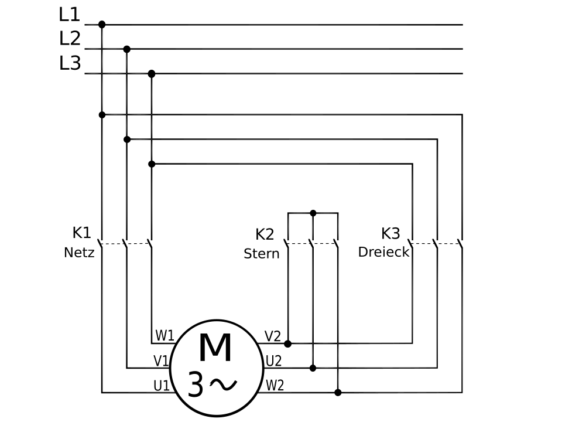

*Rys. 20.2a — Obwód mocy Y/Δ: K1 = stycznik sieciowy (Netz), K2 = gwiazdowy (Stern), K3 = trójkątowy (Dreieck), M 3~ = silnik 6-zaciskowy. Źródło: Wikimedia Commons, Public Domain*

**Tabliczka zaciskowa silnika — gwiazda (Y) i trójkąt (Δ):**

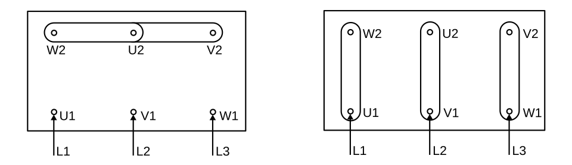

*Rys. 20.2b — Tabliczka zaciskowa: lewo = Y (mostki pionowe), prawo = Δ (mostki skośne). Źródło: Wikimedia Commons, Public Domain*

*[PRAWDOPODOBNE] — na podstawie wiedzy domenowej, EN 60204-1 §9*

---

### 20.3. Jak czytasz schemat rewersji silnika (zmiana kierunku obrotów) i co MUSISZ sprawdzić?

**Rewersja** = zamiana dwóch faz (np. L1↔L3). Na schemacie widzisz dwa styczniki z krzyżowym połączeniem.

**Identyfikacja na schemacie:**

| Oznaczenie | Element | Schemat połączeń |
|------------|---------|-----------------|
| **KM_F** (KM1) | Stycznik Forward | L1→U, L2→V, L3→W (kolejność prosta) |
| **KM_R** (KM2) | Stycznik Reverse | L3→U, L2→V, L1→W (L1↔L3 zamienione) |

**3 warstwy blokady (ZAWSZE na schemacie):**
1. **Mechaniczna** — symbol sprzęgła między KM_F i KM_R (Siemens: `3RA1934-1A`)
2. **Elektryczna** — styk NC KM_F w obwodzie cewki KM_R i odwrotnie
3. **Programowa (PLC)** — wzajemne wykluczenie w logice

**Czas martwy przy zmianie kierunku** (widoczny jako timer na schemacie sterowania):
- Min. 100–300 ms między wyłączeniem jednego a włączeniem drugiego
- Rozpad łuku + demagnetyzacja uzwojeń

**Co sprawdzasz na schemacie przy commissioning:**
- Czy krzyżowanie faz jest na **schemacie mocy** (nie w sterowniku!)
- Czy **blokada mechaniczna** jest narysowana — sam styk NC NIE wystarczy wg EN 60204-1
- Czy jest **feedback** (styk pomocniczy) do PLC — potwierdzenie prawdziwego stanu stycznika
- Gotowe zestawy Siemens `3RA2` / `3RA1` mają blokadę fabryczną

**Schemat kompletnego układu rewersyjnego:**

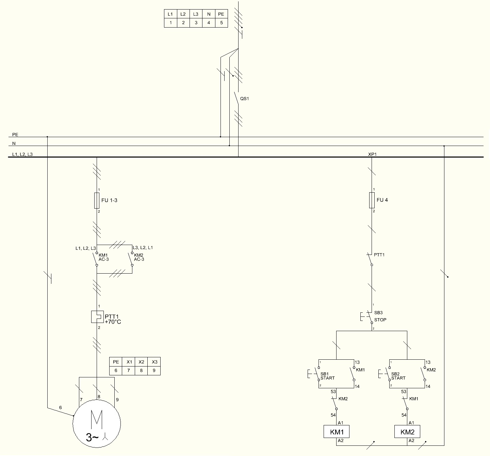

*Rys. 20.3a — Układ rewersyjny: QS1 = rozłącznik, FU = bezpieczniki, KM1/KM2 = styczniki z krzyżowaniem L1↔L3, blokada elektryczna wzajemna (styki NC). Źródło: Wikimedia Commons, CC BY-SA 3.0*

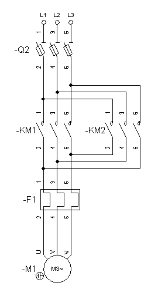

*Rys. 20.3b — Obwód mocy rewersji: Q2 = rozłącznik, KM1/KM2, F1 = termiczny, M = silnik. Źródło: Wikimedia Commons, CC BY-SA 3.0*

*[PRAWDOPODOBNE] — na podstawie wiedzy domenowej, EN 60204-1 §9.3*

---

### 20.4. Co to jest układ samopodtrzymania na schemacie i jak go rozpoznajesz?

**Układ samopodtrzymania** (latching / self-holding) to podstawowy obwód sterowania — impuls START uruchamia stycznik, a jego własny styk pomocniczy NO podtrzymuje zasilanie cewki po zwolnieniu przycisku.

**Schemat klasyczny — jak go czytasz:**

```
L (24V) ─── [S1 STOP NC] ─┬─ [S2 START NO] ─── [Cewka KM]
                           └─ [KM styk NO] ──┘
N (0V) ──────────────────────────────────────────────────
```

**Identyfikacja na schemacie:**
- **S1 (STOP)** = styk NC — normalnie zamknięty, przerywa obwód po naciśnięciu
- **S2 (START)** = styk NO — normalnie otwarty, zamyka obwód na chwilę
- **KM (styk pomocniczy NO)** = równolegle do S2 — to on „trzyma" po zwolnieniu START
- **Cewka KM** = symbol prostokąta z oznaczeniem na końcu obwodu

**Dlaczego STOP jest NC (normalnie zamknięty):**
- EN 60204-1 + EN ISO 13849-1: stan bezpieczny = brak sygnału
- Zerwanie przewodu do STOP → obwód otwarty → maszyna staje (fail-safe)
- Na schemacie: STOP ZAWSZE jest pierwszy w łańcuchu (przed START)

**Realizacja w PLC (LAD):**
```
|  I0.0    I0.1         Q0.0  |
|--[START]--+--[STOP NC]--(KM)|
|  Q0.0     |                 |
|--[KM]-----+                 |
```

**Co sprawdzasz:**
- Czy STOP jest NC i jest PRZED START w obwodzie
- Czy styk samopodtrzymania jest równoległy do START (nie szeregowy)
- Czy jest tylko JEDEN styk samopodtrzymania (dwa = pułapka logiczna)

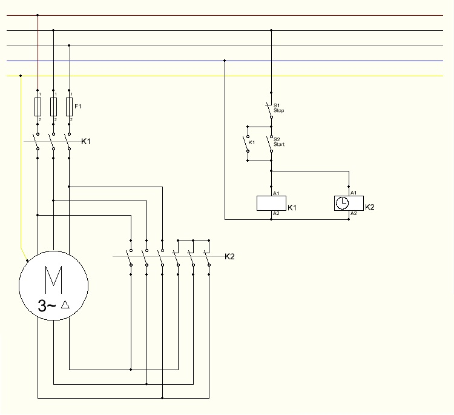

*Rys. 20.4 — Obwód sterowania z samopodtrzymaniem: S1=STOP NC, S2=START NO, K1=stycznik z samopodtrzymaniem, K2=timer. Źródło: Wikimedia Commons, CC BY-SA 3.0*

*[PRAWDOPODOBNE] — na podstawie wiedzy domenowej, EN 60204-1*

---

### 20.5. Jak czytasz schemat Dahlandera (silnik dwubiegowy) i czym różni się od Y/Δ na schemacie?

**Silnik Dahlander** = 2 prędkości (stosunek 1:2) przez zmianę konfiguracji uzwojeń. Na schemacie wygląda podobnie do Y/Δ, ale logika jest inna.

**Kluczowa różnica Y/Δ vs Dahlander:**

| Cecha | Rozruch Y/Δ | Dahlander |
|-------|-------------|-----------|
| Cel | Łagodny rozruch → pełna prędkość | Dwie prędkości robocze |
| Styczniki | 3 (liniowy + Y + Δ) — sekwencja | 3 (główny + wolny + szybki) — wybór |
| Timer | Tak (przełączenie po rozruchu) | Nie (operator wybiera prędkość) |
| Silnik | 6 zacisków, jedna prędkość | 6 zacisków, dwie prędkości |

**Identyfikacja na schemacie Dahlandera (3 styczniki):**

| Oznaczenie | Funkcja | Połączenie |
|------------|---------|------------|
| **KM1** | Główny (zawsze zamknięty) | L1/L2/L3 → silnik |
| **KM2** | Wolna (Δ) | Zasila U1/V1/W1, U2/V2/W2 otwarte |
| **KM3** | Szybka (YY) | Zasila U2/V2/W2, zwiera U1/V1/W1 |

**Co sprawdzasz na schemacie:**
- Blokada między KM2 i KM3 (jak w rewersji — mechaniczna + elektryczna)
- Osobny przekaźnik termiczny dla każdej prędkości (różne prądy znamionowe)
- Przerwa 50–100 ms przy zmianie biegu (timer na schemacie sterowania)

**Schemat Dahlander z wentylacją:**

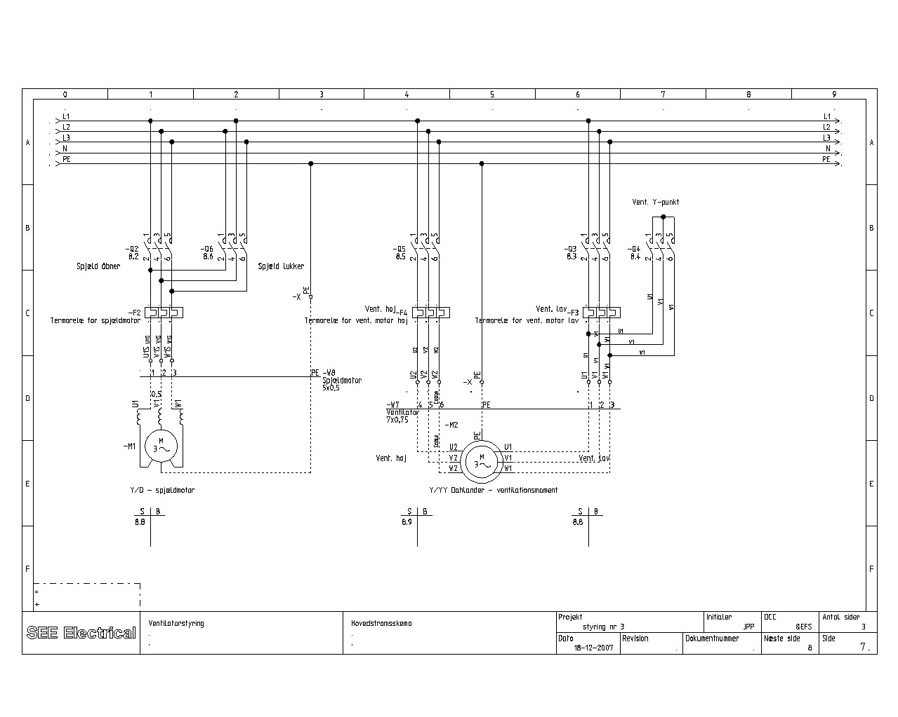

*Rys. 20.5a — Schemat mocy Dahlander Y/YY z wentylacją. Źródło: Wikimedia Commons, CC BY-SA 4.0*

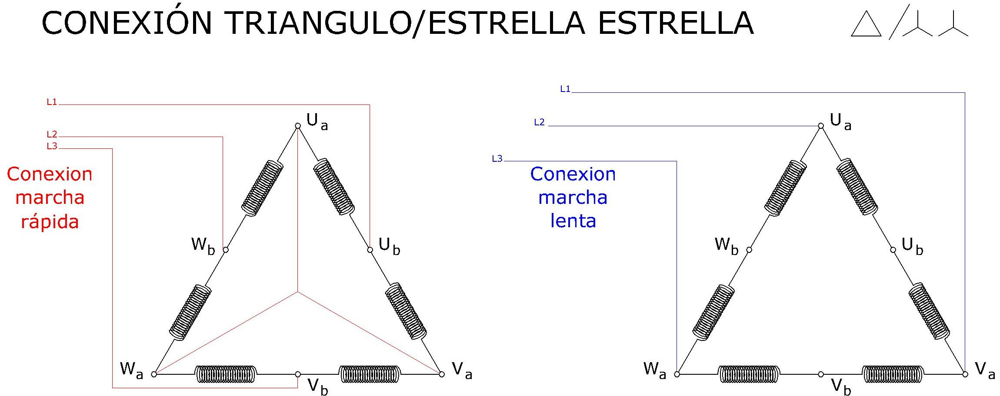

*Rys. 20.5b — Połączenia uzwojeń Δ/YY. Źródło: Wikimedia Commons, CC BY-SA 4.0*

*[PRAWDOPODOBNE] — na podstawie wiedzy domenowej, EN 60034-8*

---

### 20.6. Jak wygląda na schemacie blokada elektryczna i mechaniczna między stycznikami i po co ją sprawdzasz?

**Blokada wzajemna** to zabezpieczenie przed jednoczesnym zadziałaniem dwóch wykluczających się styczników — jej brak = zwarcie lub uszkodzenie silnika.

**Jak rozpoznajesz na schemacie:**

**1. Blokada elektryczna:**
- Styk NC jednego stycznika w obwodzie cewki drugiego
- Na schemacie: w linii cewki KM_R widzisz styk opisany KM_F (NC) — i odwrotnie

```
Obwód cewki KM_F:  ──[S1 START_F]──[NC KM_R]──(Cewka KM_F)
Obwód cewki KM_R:  ──[S2 START_R]──[NC KM_F]──(Cewka KM_R)
```

**2. Blokada mechaniczna:**
- Symbol sprzęgła/dźwigni między dwoma stycznikami (przerywana linia łącząca)
- Siemens: `3RA1934-1A` (dla 3RT1), `3RA1944-2A` (dla 3RT2)
- Na schemacie montażowym: blok mechaniczny między obudowami

**3. Blokada programowa (PLC):**
- Wzajemne wykluczenie w kodzie — ale NIGDY jako jedyna warstwa

**Gdzie blokada jest obowiązkowa:**
- Rewersja silnika (KM_F / KM_R)
- Rozruch Y/Δ (KM_Y / KM_Δ)
- Przełączanie źródeł zasilania (sieć / agregat)
- Dowolne dwa styczniki, których jednoczesne załączenie powoduje zwarcie

**Co sprawdzasz na obiekcie:**
1. Otwórz szafę — czy fizycznie widzisz moduł blokady między stycznikami?
2. Schemat: czy styki NC są narysowane w obu obwodach (wzajemnie)?
3. PLC: czy program ma wykluczenie + czy jest timer martwej strefy?

> ⚠️ Przy audycie Safety: sam schemat elektryczny nie wystarczy — sprawdź fizycznie czy moduł mechaniczny jest zamontowany. EN 60204-1 §9 wymaga blokady sprzętowej.

*[PRAWDOPODOBNE] — na podstawie wiedzy domenowej, EN 60204-1 §9.3, IEC 60947-4-1*

---

### 20.7. Jak na schemacie rozpoznajesz obwód bezpieczeństwa (Safety) i czym różni się od standardowego obwodu sterowania?

**Obwód Safety** na schemacie jest wyraźnie oddzielony od standardowego sterowania — rozpoznajesz go po:

**Oznakowanie na schemacie:**
- Linia przerywana lub kolorowe obramowanie wydzielające strefę Safety
- Symbole z oznaczeniem „F-" (F-DI, F-DO, F-CPU)
- Dwukanałowe podłączenie czujników (dwie linie do jednego elementu)
- Oznaczenie PL/SIL przy elementach (np. „SIL 3", „PL e")

**Typowe elementy Safety na schemacie:**

| Element | Oznaczenie | Jak wygląda na schemacie |
|---------|------------|--------------------------|
| E-Stop | -S_ES / -SB1 | Przycisk z symbolem grzyba + dwukanałowe NC |
| Kurtyna | -B1 / AOPD | Blok z OSSD1/OSSD2 (dwa wyjścia) |
| Elektrorygiel | -S_LOCK | Styk NC + cewka ryglowania |
| F-DI | -A_FDI | Moduł z kanałami Ch0/Ch1 (dwukanałowe) |
| F-DO | -A_FDO | Moduł z wyjściami + PP/PM switching |
| Przekaźnik Safety | -K_SF | Podwójny styk (kanał 1 + kanał 2) |

**Kluczowe różnice od standardowego obwodu:**

| Cecha | Standard | Safety |
|-------|----------|--------|
| Okablowanie czujnika | 1 przewód → 1 wejście | 2 kanały → 2 wejścia (1oo2) |
| Sygnał STOP/E-Stop | NC (1 styk) | NC dwukanałowy (2 styki rozdzielone fizycznie) |
| Feedback stycznika | Opcjonalny | Obowiązkowy (EDM — External Device Monitoring) |
| Zasilanie czujników | Wspólne | Rozdzielone T1/T2 (test pulses) z F-DI |

**Co sprawdzasz na obiekcie:**
1. Dwukanałowość: na schemacie dwa osobne przewody od e-stop do F-DI (nie wspólny!)
2. Feedback: styk NO stycznika wraca do F-DI jako potwierdzenie otwarcia
3. Separacja tras kablowych: kanał 1 i kanał 2 prowadzone osobno (nie w jednym kablu)
4. Oznaczenia: numery F-address na schemacie muszą zgadzać się z konfiguracją TIA Portal

**Przykładowy schemat Safety — E-Stop SIL 3 z F-CPU 1516F:**


*Rys. 20.7a — Okablowanie E-Stop do systemu Safety: CPU 1516F + DI/DQ (standard) + F-DI (dwukanałowe wejście NC E-Stop) + F-DQ (wyjścia Q1/Q2 z feedbackiem). START/STOP/ACK przez standardowe DI. Źródło: Siemens Application Example 21064024, V7.0.1*

**Schemat okablowania F-DI/F-DO — PM-switching (ET200SP):**


*Rys. 20.7b — Architektura PM-switching: rozdzielone zasilanie elektroniki (P/M Electronic supply) i obciążenia (24V DC Load supply), izolacja galwaniczna przez Isoface. Źródło: Siemens Wiring Example 39198632, V2.7*

> 💡 **Schemat Safety jest dowodem** — audytor TÜV/UDT porównuje schemat z fizycznym okablowaniem i konfiguracją TIA Portal. Niezgodność = blokada odbioru maszyny.

*[PRAWDOPODOBNE] — na podstawie wiedzy domenowej, EN 60204-1, IEC 62061*
## 21. SICAR@TIA — STANDARD AUTOMATYKI AUTOMOTIVE

### 21.1. Co to jest SICAR@TIA i do czego służy?  🟢

**SICAR@TIA** (Siemens Automation Platform for CAR Plants) to gotowa platforma automatyki Siemensa przeznaczona do **sterowania sekwencyjnego** w fabrykach automotive (linie spawalnicze, montażowe, klejenie, studwelding). Składa się ze skoordynowanego oprogramowania PLC (S7-1500/1500F) i HMI (WinCC Advanced).

**Dwa pakiety oprogramowania:**
- **SICAR@TIA** — bazowy pakiet: tryby pracy (operation modes), interfejs HMI, dane produkcyjne, Tec Units, diagnostyka fieldbusowa, PLC Webserver z topologią sieci
- **DiagAddOn** — rozszerzenie: sterowanie sekwencyjne (255 sekwencji × 228 kroków), diagnostyka online kroków w LAD/STL na HMI, ekrany ruchów ręcznych, synchronizacja, historia komunikatów, RSS-Feed

**Główna korzyść:** ujednolicona filozofia obsługi i diagnostyki na wszystkich liniach — maintenance z różnych fabryk i dostawców szybko lokalizuje błędy, bo interfejs i struktura programu są wszędzie takie same.

**Wymagane licencje:** TIA Step7 Professional + WinCC Advanced + opcjonalnie TIA Safety Advanced. DiagAddOn nie wymaga osobnej licencji.

> 💡 Na rozmowie podkreśl: SICAR to nie biblioteka bloków — to **cały framework** z ustalonym standardem folderów, nazewnictwa, trybów pracy i diagnostyki. Programista nie buduje struktury od zera, tylko programuje sekwencje w gotowym szkielecie.

*[ZWERYFIKOWANE] — źródło: 10_Introduction SICAR@TIA DiagAddOn, Edition 2022-04*

### 21.2. Jak wygląda struktura programu PLC w SICAR?  🟡

Program PLC w SICAR ma **ściśle zdefiniowaną strukturę folderów** — każdy projekt wygląda tak samo, co ułatwia orientację na nowej linii:

**Foldery bazowe (00–07)** — wspólne dla wszystkich projektów:
- **00_Organization blocks** — OB1 (Main), OB cykliczne
- **01_Initialization** — FC1981 (CallInit) z blokiem GlobalInfo_FB — tu ustawiasz liczbę HMI i OPModes
- **02_HMI_OperationModes** — FC1983 (bazowy) i FC983 (DiagAddOn) — wywołania paneli i trybów pracy
- **04_User** — folder na bloki użytkownika (kopie z 08_Zz jeśli trzeba zmodyfikować)
- **07_Diagnosis** — diagnostyka PROFINET, alarmy systemowe

**Folder 08_ZzComponents** — gotowe komponenty (napędy, roboty):
- Prefix „Zz" = bloki **których NIE WOLNO modyfikować**
- Jeśli musisz zmienić blok → kopiujesz go do **04_User** z własnym wersjonowaniem

**Folder 10_Sequence & Messageblocks** — tu programujesz sekwencje linii:
- Podział na OPMode areas: `++0` (globalne komunikaty), `++1` (area 1), `++2`…`++8`
- Nazewnictwo stacji: `++1.010 FX1` = OPMode area 1, stacja 10, Fixture 1; `++1.020 IR1` = area 1, stacja 20, Robot 1

**Zasoby systemowe (nie wolno zmieniać):**
- FB/FC/DB 900–1299, UDT 900–999 — zarezerwowane dla DiagAddOn
- MB1 = clock memory byte, MB2 = system memory byte — obowiązkowe w konfiguracji PLC

> 💡 Na rozmowie: „Kiedy dostaję nowy projekt SICAR, zaczynam od 10_Sequence — tam jest logika linii. Foldery 00–07 to szkielet, 08_Zz to gotowe komponenty — tych nie ruszam."

*[ZWERYFIKOWANE] — źródło: 10_Introduction sekcja 6 Structure PLC-program, 40_User_Guideline sekcja 1.1*

### 21.3. Jakie tryby pracy (Operation Modes) obsługuje SICAR i jak je uruchamiasz?  🟡

SICAR zarządza do **8 niezależnych obszarów trybów pracy** (OPMode areas) na jednym PLC. Każdy area może działać w innym trybie jednocześnie (np. area 1 w Auto, area 3 w Manual).

**Trzy tryby pracy:**
- **Automatic** — sekwencje wykonują się automatycznie; spełnienie warunku `transAuto = 1` → przejście do następnego kroku
- **Inching (krokowy)** — jak Auto, ale krok po kroku z potwierdzeniem; można krokować jedną sekwencję lub wszystkie w area
- **Manual** — ruchy ręczne przez ekrany ruchów (movement screens) na HMI; przycisk ruchu → interlock + limit sprawdzane dla danego kroku

**Warunki uruchomienia trybu (memory word MW10–MW24 per area):**
- `M x.0` = E-Stop aktywny (wymagany dla WSZYSTKICH trybów)
- `M x.1` = drzwi Safety zamknięte (wymagany dla Auto i Inching)
- `M x.2` = warunki bazowe Manual OK
- `M x.4` = warunki bazowe ogólne OK

**Procedura przełączenia (np. Manual → Auto):**
1. Naciśnij przycisk „AUTO" w nagłówku WinCC
2. Potwierdź zmianę (popup lub bez — zależy od stałej `WITH_POPUP`)
3. Przycisk „AUTO" miga → naciśnij „START" (lub klucz zewnętrzny)
4. Trzymaj „START" aż przycisk przestanie migać → tryb aktywny

**Funkcje specjalne (dostępne w Auto):**
- **Stop** — zatrzymanie sekwencji natychmiast (`DBB24=0`) lub po bieżącym kroku (`DBB24=255`)
- **Initial Position** — żądanie pozycji wyjściowej przed startem
- **Stop End of Cycle** — zatrzymanie po zakończeniu cyklu
- **Empty Line** / **Ghost Run** — praca bez detali / symulacja

> 💡 Na commissioning: zawsze zaczynaj od Manual → sprawdź każdy ruch osobno → przełącz na Inching → dopiero potem Auto.

*[ZWERYFIKOWANE] — źródło: 31_Initialization and Operation modes, Edition 2022-07*

### 21.4. Jak działa sterowanie sekwencyjne (Sequence Control) w SICAR?  🔴

Sterowanie sekwencyjne to serce SICAR — blok **FB1000** zarządza do 255 sekwencji równolegle, każda do 228 kroków. Struktura jest liniowa (z możliwością rozgałęzień).

**Numeracja bloków — prosta reguła (numer sekwencji + 1000):**
- Sekwencja 4 → FC1004 (wywołanie + wyjścia), FB1004 (logika kroków), DB1004 (dane sekwencji)

**Budowa bloku sekwencji (FB100x):**
- **Network 1: Branch distributor** — skok do aktywnego kroku (programowany w STL: `JU PERM`, `JU S001`, `JU S002`…)
- **Permanent step (PERM)** — warunki obowiązujące dla WSZYSTKICH kroków (np. crash interlocks wspólne dla całej sekwencji)
- **Selective steps (S001, S002…)** — warunki konkretnego kroku, wykonywany jest tylko aktywny krok

**Każdy krok (selective step) ma dwie części:**
1. **Interlock (ILOCK)** — warunki bezpieczeństwa / crash interlocks (czy ruch jest bezpieczny?)
2. **Transition / Limit** — w Auto: `transAuto` = warunek przejścia do następnego kroku; w Manual: `limitManual` = feedback że ruch się zakończył

**Kluczowe zmienne w #sequence:**
- `ilockManual` / `ilockAuto` — interlocki per tryb
- `transAuto` — warunek przejścia (Auto)
- `limitManual` — feedback ruchu (Manual)
- `twdSetpoint` — czas watchdog (monitoring)
- `setError` — natychmiastowy błąd
- `motionButton` — przycisk ruchu z ekranu HMI (Manual)

**Wyjścia (akcje)** programujesz w **FC100x** — po wywołaniu FC998 używasz flag kroków z DB do sterowania Tec Units i napędami.

**Reguła diagnostyki:** w blokach sekwencji (FB/FC 1001–1255) wolno używać **tylko** wejść/wyjść, merkerów i bitów z **nieoptymalizowanych** DB — inaczej DiagAddOn nie pokaże diagnostyki na HMI.

> 💡 Na rozmowie: „W SICAR nie piszę sterownika od zera — programuję warunki interlocków i tranzycji per krok. FB1000 sam zarządza przełączaniem kroków, synchronizacją i diagnostyką."

*[ZWERYFIKOWANE] — źródło: 34_1 Sequence- and messageblocks, Edition 2022-06*

### 21.5. Co to są Tec Units w SICAR i jak ich używasz?  🟢

**Tec Units** to gotowe, parametryzowalne bloki funkcjonalne w folderze **08_ZzComponents** dla typowych urządzeń na linii: silnik, zawór, napęd SINAMICS, robot (ABB IRC5, KUKA KRC4, FANUC R-30iB, Yaskawa YRC1000).

**Każdy Tec Unit zawiera:**
- FB z logiką sterowania (tryby Auto/Manual/Local)
- Ekrany HMI
- Definicje alarmów
- Interfejs do sekwencji (wywoływany z FC100x po flagach kroków)

**Zasada „Zz":** bloki w folderach z prefixem „Zz" **nie wolno modyfikować**. Jeśli musisz zmienić Tec Unit → kopiujesz do **04_User** i kontynuujesz jako blok użytkownika z własnym wersjonowaniem w bibliotece.

**Typowe wywołanie w programie:**
1. W sekwencji FC1004, po wyjściu kroku (step flag z DB1004), wywołujesz Tec Unit napędu lub zaworu
2. Tec Unit sam obsługuje logikę ruchu, feedback, alarmy i ekran HMI

> 💡 Na linii spawalniczej typowe Tec Units: interfejs robota (goProcess/goAck), napęd podnośnika/przenośnika, zawory pneumatyczne gripperów, czujniki RFID do identyfikacji karoserii.

*[ZWERYFIKOWANE] — źródło: 10_Introduction sekcja 6.1.3, 40_User_Guideline sekcja Configuration of movements*

### 21.6. Jak działa synchronizacja i diagnostyka w SICAR DiagAddOn?  🟡

**Synchronizacja** rozwiązuje kluczowy problem: po ręcznych ruchach (Manual) lub awarii — jak wrócić do produkcji automatycznej bez resetowania całej linii?

**Mechanizm:**
1. Po wybraniu trybu OFF, naciśnij „Synchronize" (dla jednej sekwencji lub wszystkich)
2. DiagAddOn analizuje KAŻDY krok sekwencji sprawdzając: `ilockAuto = 1` AND `transAuto = 0`
3. Jeśli dokładnie **jeden krok** spełnia ten warunek → sekwencja jest zsynchronizowana do tego kroku
4. Przełączasz na Auto → produkcja kontynuuje natychmiast od zsynchronizowanego kroku

**Diagnostyka na HMI (DiagAddOn):**
- Ekran diagnostyczny pokazuje **online** stan każdego bloku sekwencji: aktywny krok, warunki interlocków i tranzycji w formie LAD/STL
- **Watchdog time** (`twdSetpoint`) — monitoring czasu kroku; po przekroczeniu → diagnostyka automatycznie pokazuje, który warunek (interlock/transition) nie jest spełniony
- **Automatyczny pomiar watchdog** — przy pierwszym przebiegu Auto system sam mierzy i zapisuje czasy kroków
- **Message blocks** — komunikaty alarmowe z kategoryzacją i historią, wyświetlane na dedykowanym ekranie HMI
- **Cross reference** — z ekranu diagnostycznego możesz przejść bezpośrednio do szczegółów blokującego warunku

**Narzędzie DiagGen:**
- Generator danych diagnostycznych uruchamiany na PG/PC
- Wykorzystuje TIA Openness do przygotowania danych dla ekranów DiagAddOn na HMI
- Uruchamiasz po zmianach w blokach sekwencji → regeneruje powiązania krok↔HMI

> 💡 Na rozmowie: „Największa wartość DiagAddOn to diagnostyka — maintenance widzi online na HMI, który dokładnie warunek w którym kroku blokuje sekwencję. Nie muszą otwierać TIA Portal."

*[ZWERYFIKOWANE] — źródło: 10_Introduction sekcja 1.2.2 DiagAddOn for PLC, 34_1 Sequence- and messageblocks sekcja Watchdog/Synchronization*

### 21.7. Czym różni się ilockExtSync od ilockExtInt i jak działa synchronizacja zewnętrzna między sekwencjami?  🔴

W SICAR każdy krok sekwencji oprócz `ilockAuto` dysponuje dwoma dodatkowymi warunkami: **ilockExtSync** i **ilockExtInt** — oba zatrzymują watchdog gdy = 0, ale różnią się udziałem w synchronizacji.

**ilockExtSync — zewnętrzny warunek synchronizacji:**
- **Uczestniczy w synchronizacji** (Participation in synchronization = Yes) — to kluczowa różnica
- Służy do synchronizacji **między sekwencjami** (np. robot czeka na fixture, fixture czeka na robota)
- Gdy `ilockExtSync = 0` → watchdog jest zatrzymany (nie generuje alarmu)
- Preset = 1 (jeśli nieprogramowany → nie blokuje)
- Programujesz sygnały z **innych sekwencji** — typowo wyniki FC975/FC976

**ilockExtInt — zewnętrzny warunek procesu:**
- **NIE uczestniczy w synchronizacji** (Participation in synchronization = No)
- Służy do warunków **procesowych zewnętrznych** (pozycje narzędzi, sygnały z urządzeń peryferyjnych)
- Również zatrzymuje watchdog gdy = 0
- Sygnały powinny być programowane w innym module z własną diagnostyką

**Bloki pomocnicze do synchronizacji:**
- **FC975 (SeqCheckStep_FC)** — sprawdza czy podany krok jest aktywny (Auto/Inching) lub zsynchronizowany (tryb Off, dokładnie jeden krok zsynchronizowany) → zwraca `extSync`
- **FC976 (CheckIlock_FC)** — sprawdza czy `ilockAuto` kroku PERM **i** `ilockAuto` wybranego kroku selektywnego oba = 1 → zwraca `extSync`
- Oba bloki **muszą być wywołane PO FC998** w sekwencji

**Typowy scenariusz na linii spawalniczej:**
1. Sekwencja robota (FB1020) w kroku S005 czeka na fixture
2. W sekwencji fixture (FB1004) wywołujesz FC975 z parametrem „step = 8" → sprawdza czy krok 8 fixture jest aktywny
3. Wynik `extSync` podajesz do `ilockExtSync` w kroku S005 robota
4. Robot rusza dopiero gdy fixture jest w pozycji (krok 8 aktywny)

> 💡 Na rozmowie: „extSync używam do koordynacji robot-fixture — robot nie ruszy dopóki fixture nie potwierdzi pozycji. extInt używam do sygnałów procesowych jak czujniki narzędzi."

*[ZWERYFIKOWANE] — źródło: 34_1 Sequence- and messageblocks, Edition 2022-06, sekcje 2.3.9–2.3.10, strony 15–18*

### 21.8. Jak działają rozgałęzienia (branching) i funkcja Stop/Hold w sekwencjach SICAR?  🔴

**Branching — #sequence.stepNplus1:**
Pozwala na **warunkowe rozgałęzienie** sekwencji liniowej — zamiast przejścia do kolejnego kroku, FB1000 przeskakuje do wskazanego numeru kroku.

**Mechanizm:**
1. W aktualnym kroku sprawdzasz warunek (np. typ karoserii)
2. Jeśli warunek spełniony → ładujesz numer docelowego kroku do `#sequence.stepNplus1`
3. Przy następnym `transAuto = 1` → FB1000 przechodzi do kroku z `stepNplus1` zamiast do kolejnego liniowo
4. Wartość `stepNplus1` jest ładowana **niezależnie** od stanu `transAuto` — ważne, by sprawdzać warunek rozgałęzienia **tylko gdy transAuto jest spełniony**

**Przykład (STL):**
```
S002:
  AN  #sequence.transAuto     // sprawdź tylko gdy trans spełniony
  JC  E006
  AN  M 600.2                 // warunek: typ karoserii
  JC  E006
  L   5                       // skok do kroku 5
  T   #sequence.stepNplus1
E006: BEU
```
Jeśli `M600.2 = 1` → następny krok = 5 (pomija 3 i 4). Jeśli `M600.2 = 0` → normalnie krok 3.

**Stop/Hold — #sequence.stopInStepN:**
Kontroluje zachowanie sekwencji po naciśnięciu przycisku „Stop" na HMI w trybie Auto.

**Wartości programowalne:**
- `255` (domyślna) — bieżący krok zostaje dokończony, potem sekwencja przechodzi do trybu Off
- `0` — **natychmiastowe zatrzymanie** sekwencji (przerwanie kroku)
- `1–228` — sekwencja kontynuuje do podanego kroku, dopiero tam się zatrzymuje

**Sygnały statusu w I-DB sekwencji:**
- `#sequence.OM_SB_Hold_request` — Stop (Hold) został aktywowany
- `#sequence.OM_SB_Hold_Pos_reached` — pozycja Stop (Hold) została osiągnięta

**holdPosExternReached:**
- Dodatkowy sygnał potwierdzenia — jeśli `holdPosExternReached = 0`, aktywny krok zostanie dokończony **niezależnie** od `stopInStepN = 0` czy `twdRun = 0`
- Preset = 1 (jeśli nieprogramowany → nie wpływa na zachowanie)

**Wartość domyślną** `stopInStepN` (255) można zmienić globalnie w FC980, Network 3, parametr `Hold_Init_Value`.

> 💡 Na commissioning: „Dla robotów programuję stopInStepN = 255 (dokończ ruch), dla prostych siłowników zostawiam 0 (zatrzymaj natychmiast). Na linii z wieloma stacjami — programuję warunkowe stopInStepN per krok, żeby robot dojechał do bezpiecznej pozycji."

*[ZWERYFIKOWANE] — źródło: 34_1 Sequence- and messageblocks, Edition 2022-06, sekcje 2.3.11–2.3.12, strony 30–33*

### 21.9. Co to jest DB1000 (UiDiagAddOn_DB) i jak wykorzystujesz go w programowaniu?  🔴

**DB1000 (UiDiagAddOn_DB)** to centralny blok danych stanowiący **interfejs między oprogramowaniem użytkownika a oprogramowaniem DiagAddOn**. Wszystkie informacje potrzebne do sterowania z poziomu kodu użytkownika są dostępne w DB1000.

**Struktura DB1000 — główne sekcje:**

**1. OM_Seq[1..255] — status per sekwencja (1 bajt na sekwencję):**
- `.0` = Automatic (sekwencja w trybie Auto)
- `.1` = Inching (tryb krokowy)
- `.2` = Manual (tryb ręczny)
- `.3` = Inching_Step_plus1 / Hold in Step 1
- `.4` = Start (sekwencja wystartowana)
- `.5` = Acknowledge (restart watchdog)
- `.6` = Clock (sygnał zegarowy)
- `.7` = Synchronize (sekwencja zsynchronizowana)

**2. Common — sygnały ogólne:**
- Informacja czy istnieje aktywny komunikat błędu lub błąd sekwencji
- Typowe zastosowanie: sterowanie lampą błędu na kolumnie sygnalizacyjnej

**3. OPMode[1..8] — status per obszar trybów pracy:**
- Informacje o aktywnym trybie, warunkach startowych, alarmach per area
- Przykład: sterowanie syreną przy aktywacji Auto w danym area

**4. Lock Movements — blokada ekranów ruchów:**
- `Panel[x].movButtonActive` — na HMI x naciśnięto przycisk ruchu
- `Panel[x].activeMovScreen` — który ekran ruchów jest otwarty (1–64)
- `Panel[x].lockMovScreens` — zablokuj WSZYSTKIE ekrany ruchów na HMI x
- `Panel[x].OPMode[y].lockMovements` — zablokuj ruchy w danym OPMode area na HMI x

**5. Reset — przycisk resetowania per HMI:**
- Od wersji V14.4.0 dostępny przycisk „Reset" w nagłówku DiagAddOn
- Sygnał per HMI + sygnał zbiorczy wszystkich aktywnych HMI
- Przypisanie w FC1983

**Typowe zastosowania programistyczne:**
- Wymuszenie trybu Auto dla wybranej sekwencji niezależnie od OPMode area → nadpisz bity `OM_Seq[x]` w DB1000 **przed** wywołaniem FC998
- Sterowanie lampami/syrenami na podstawie stanu trybów z `OPMode[x]`
- Blokada ruchów przy pracy wielopanelowej (use case: ruch na HMI1 → blokada HMI2)
- Nawigacja między ekranami WinCC a DiagAddOn przez FC978 (Screenselect)

> 💡 Na rozmowie: „DB1000 to mój główny punkt dostępu do stanu linii — stamtąd odczytuję tryby sekwencji, steruje blokadami ruchów między panelami i nadpisuję tryby dla sekwencji systemowych jak RFID."

*[ZWERYFIKOWANE] — źródło: 40_User_Guideline SICAR@TIA DiagAddOn, Edition 2022-04, sekcja 4 User interface*

### 21.10. Jak działają ekrany ruchów (Movement Screens) i blokada ruchów (Lock Movements) w SICAR?  🟡

**Movement Screens** to ekrany HMI w DiagAddOn umożliwiające **ręczne sterowanie ruchami** maszyny w trybie Manual. Każda sekwencja/krok może mieć przypisany ruch na dedykowanym ekranie. System obsługuje do **64 ekranów ruchów** per HMI.

**Parametryzacja ekranu ruchu (w narzędziu DiagGen):**
- **Tekst ruchu** (movement text) — najważniejszy parametr; usunięcie tekstu kasuje cały wiersz ruchu
- **Aktywna indykacja** — operand sygnalizujący wykonywanie ruchu (np. wyjście zaworu)
- **Indykacja pozycji granicznej** — do 8 operandów feedback (np. czujniki krańcowe)
- **Kaskada i krok** — powiązanie z `#sequence.motionButton` (ruch aktywuje konkretny krok sekwencji)
- **Wartość pozycji** — parametryzacja DB i DBD dla wyświetlania pozycji (format: `DBx.DBDy`)
- Jeśli nie podano operandów indykacji → system generuje je automatycznie z `limitManual` i `ilockManual`

**motionButton — klucz ruchu:**
- Zmienna `#sequence.motionButton` = 1 gdy operator naciśnie przycisk ruchu na ekranie HMI
- Ustawiana **osobno per sekwencję** — ruch na jednym ekranie nie wpływa na inne sekwencje
- **Zawsze programowana jako pierwszy warunek** w `ilockManual`: `A #sequence.motionButton`
- Przejście z Manual do Auto możliwe natychmiast przez synchronizację (bez resetowania)

**Lock Movements — blokada przy wielu panelach HMI:**
Gdy na linii pracuje kilka paneli HMI jednocześnie, **ruch na jednym panelu musi blokować pozostałe** — to wymóg bezpieczeństwa.

**Sygnały w DB1000 per HMI (Panel[x]):**
- `movButtonActive` — czy przycisk ruchu jest naciśnięty na dowolnym ekranie HMI x
- `activeMovScreen` — numer otwartego ekranu ruchów (1–64)
- `lockMovScreens` — zablokuj WSZYSTKIE ekrany ruchów na HMI x
- `OPMode[y].lockMovements` — zablokuj ruchy tylko w wybranym OPMode area na HMI x

**Typowe use case'y blokady:**
1. **Wzajemna blokada paneli** — ruch na HMI1 → `lockMovScreens` na HMI2 (i odwrotnie)
2. **Blokada wybranych ekranów** — zablokuj ekrany 2+3 na HMI2 jeśli są otwarte na HMI2
3. **Blokada per OPMode area** — HMI2 może sterować tylko area 2, area 1 zablokowany (linia z HMI1=area 1+2, HMI2=area 2)
4. **Nawigacja z WinCC** — FC978 (Screenselect DiagAddOn) pozwala przejść z dowolnego ekranu WinCC bezpośrednio do konkretnego ekranu ruchu w DiagAddOn

> 💡 Na commissioning: „Przy uruchamianiu linii z dwoma panelami — najpierw konfiguruję Lock Movements w DB1000, żeby operatorzy na dwóch HMI nie mogli jednocześnie ruszać tym samym urządzeniem. To kwestia bezpieczeństwa."

*[ZWERYFIKOWANE] — źródło: 40_User_Guideline SICAR@TIA DiagAddOn, Edition 2022-04, sekcje 2.2.1 Configuration of movements, 4.4 Lock Movements, 5 External Screen select*
